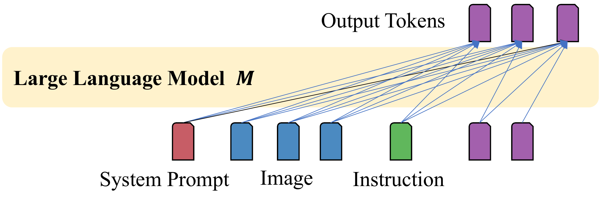
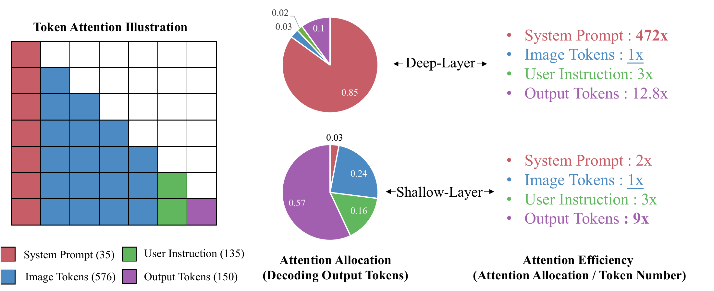
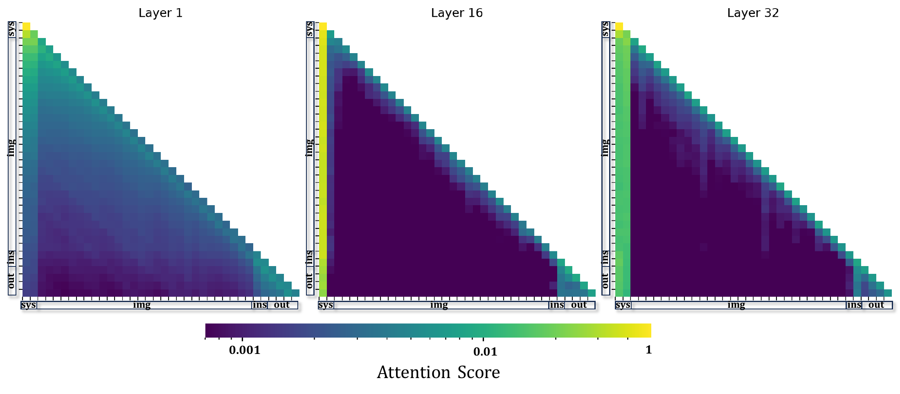

# FastV：An Image is Worth 1/2 Tokens After Layer 2: Plug-and-Play Inference Acceleration for Large Vision-Language Models

[所属章节](../index.md) · [来源与阅读状态](../../../../sources/papers.json)


作者：Liang Chen、Haozhe Zhao、Tianyu Liu、Shuang Bai、Junyang Lin、Chang Zhou、Baobao Chang。年份：2024。固定版本：arXiv:2403.06764v3（2024-09-02 修订版）。原始链接：[arXiv:2403.06764v3](https://arxiv.org/abs/2403.06764v3)，许可证元数据为 [CC BY 4.0](http://creativecommons.org/licenses/by/4.0/)。

实际阅读范围：固定 PDF 的摘要、正文 §1–§6、正文表 1–7 和图 1–7；补读 TeX 工程中的 `content/appendix.tex`、`tables/*.tex`、`content/phenomena.tex`、`content/fastv.tex` 与 `content/experiment.tex`，并检查附录图 8 的全层注意力图。没有把外部博客或后续论文当作证据；作者实现仓库只在论文中给出 URL，本次没有把它当成实现细节来源。正文 PDF、固定文本和 TeX 源保存在本任务 `source/`，原始图复制到 `assets/`。

## 1. 问题：视觉 token 很多，但深层真正使用它们很少

LVLM 通常先用 CLIP-ViT 一类视觉编码器得到视觉特征，再把空间维度线性化，用线性投影或 Q-Former/cross-attention 映射到 LLM 的隐藏维度；文本则经 tokenizer 和 embedding lookup 得到文本 embedding。两者拼成 decoder-only Transformer 的上下文，模型按自回归方式生成答案。论文把 embedding 也称为 visual/text token，所以这里的 token 是 LLM 内部的连续表示，不等同于最终用户账单里的输入 token。

对图像—问题对 $(d,t)$ 和输出 $\hat y$，论文写成：

```math
p(\hat y)=\prod_{i=1}^{N}p_M(\hat y_i\mid \hat y_{1\sim i-1};d;t).
```

在每一个解码步，输入/历史序列按来源分成 system prompt（sys）、图像 token（img）、用户指令（ins）和已生成 output token（out）。LLaVA-1.5 的 336×336 图像有 576 个视觉 token；Video-LLaVA 的示例把 8 帧压成 $8\times256=2048$ 个视觉 token。图像 token 因而常占上下文的大头，但每层自注意力仍需在这些位置上计算 MHA 和 FFN。

论文的观察实验从 Flickr30K、PCA-Bench、A-OKVQA、MMMU 混合抽取 1000 个图像—文本样本，使用 LLaVA-1.5-7B，按原模型的生成配置生成答案，并记录所有输出 token 在各层的注意力。对第 $i$ 个输出 token、第 $j$ 层，按来源聚合注意力：

```math
\alpha^{i,j}_{sys}+\alpha^{i,j}_{img}+\alpha^{i,j}_{ins}+\alpha^{i,j}_{out}=1.
```

某类 token 在一层收到的总注意力分配为（论文式 (3)）：

```math
\lambda^j_{sys}=\sum_{i=1}^{n}\alpha^{i,j}_{sys},
```

其他类别同理；$n$ 是一条回答的输出 token 数。为排除“某类 token 只是数量多”的影响，论文定义 attention efficiency，即每个该类 token 的平均收到注意力：

```math
\epsilon^j_{img}=\frac{\sum_{i=1}^{n}\alpha^{i,j}_{img}}{|img|}.
```

最终统计在样本和注意力头上平均。LLaVA-1.5-7B 共 32 层，前 2 层称 shallow，后 30 层称 deep。浅层的 attention allocation 较均衡，输出 token 主要看先前输出；深层则有明显的垂直强线，注意力集中到少量 system/instruction/output 位置。图 3 给出的代表性比例是：深层 system prompt 约占总注意力的 0.85，图像约 0.03、instruction 约 0.02、output 约 0.10；按每 token 效率归一化，system 是图像约 472 倍，instruction 是约 3 倍，output 是约 12.8 倍。浅层的示意比例约为 system 0.03、image 0.24、instruction 0.16、output 0.57，效率相对图像约为 2×、1×、3×、9×。

作者提出的解释是：视觉信号高度冗余，浅层把与图像及指令有关的信息聚合到少数“anchor”位置；深层输出更偏向读取这些 anchor，因此直接再读取全部视觉位置的边际收益很低。这是对注意力统计的解释，而不是因果证明；论文并未证明每个低注意力视觉 token 都可独立删除，也没有给出信息瓶颈或任务条件下的理论保证。



图 2（TeX 标签 `fig:mllm-struct`，资产 `assets/MLLM_0306.pdf`）把数据流画成 CLIP-ViT/投影器→图像 token，与 system prompt、instruction 一起进入 LLM decoder，再生成 output token。它明确了 FastV 操作的位置：视觉编码器本身不变，剪枝发生在 LLM 的层间。



图 3（`assets/attention_effi.pdf`）左侧是一个 35 个 system、576 个 image、135 个 instruction、150 个 output 的因果注意力布局；中间是 decoding output tokens 的总分配，右侧是除以类别 token 数后的效率。读图时必须区分“总注意力多”与“每 token 有效性高”：图像总量最大，但深层每 token 效率最低。



图 4（`assets/attention_map.pdf`）展示同一个 LLaVA-1.5-7B 回答在 Layer 1、16、32 的注意力热图。颜色条是对数式注意力分数，横纵轴按 sys/img/ins/out 分段并受因果 mask 限制。Layer 1 的图像区仍较平滑；到中后层，system 左侧形成强的竖条，而 image 区大面积变暗、仅有稀疏热点。附录图 8（`assets/merged_image.pdf`）补充了每层全图，但正文结论仍是统计相关性。

## 2. FastV：在浅层读完视觉后，重排并删除低分视觉位置

FastV 是 inference-only、无需重新训练的 plug-and-play 插件。它有两个显式参数：过滤层 $K$ 和过滤比例 $R\%$；另有一个排名函数 $f_\phi$。在第 $K$ 层，$f_\phi$ 对输入序列中的视觉 token 按重要性排序，随后删除排名末尾的 $R\%$ 视觉 token，后续层只接收剩余视觉 token。论文实验的准则是 $\phi_{attn}$：一个视觉 token 从其他 token 收到的平均 attention score；也就是用前向到第 $K$ 层已经产生的注意力作为任务条件的 saliency。删除对象严格限定为视觉 token，system、instruction 和 output 不被 FastV 过滤。

这里的“after layer K”容易有实现歧义。论文公式把前 $K$ 层记为完整长度 $n$，后 $T-K$ 层记为缩短长度 $\hat n$，因此本文按作者的 FLOPs 记法把过滤理解为完成第 $K$ 层后、从下一层开始生效；图 5 也画成 Transformer Block K 输出注意力并经过 `FastV Re-rank & Filtering`，然后进入 K+1。标题中的“after Layer 2”对应常用 $K=2$ 配置。

一个可跟踪的例子：第 2 层结束后有 8 个视觉 token，按所有相关 query 对每个位置收到的平均注意力算分，分数为 `[0.11, 0.04, 0.28, 0.02, 0.19, 0.06, 0.23, 0.07]`。若 $R=50\%$，保留分数最高的第 3、5、7、1 个位置，删除其余四个；从第 3 层开始，文本和这四个视觉 token 继续进入每个 Transformer block。这个排序数组是教学构造，不是论文样本；论文只规定按平均 attention 排序，没有发布每个实例的 token 索引。

若 $K=0$，视觉 token 在进入语言模型前就被过滤，因此论文不能使用模型产生的 attention 排名，只能使用随机 ranking（$\phi_{rand}$）。这解释了 $K=0$ 配置更容易损失性能：它既没有浅层适应，也会随机删掉可能的关键 patch。


图 5（`assets/fastv_0306.pdf`）以 Video-LLaVA 为例：8 帧共 2048 个视觉 token 先和问题进入 decoder；在 K 层基于 attention 重排，橙色 token 被过滤，K+1 之后的 block 只处理剩余视觉位置。示例中无 FastV 为 100% FLOPs，$(K=2,R=50\%)$ 约 52%，$(K=5,R=75\%)$ 约 38%，$(K=2,R=75\%)$ 约 33%；前三种输出逐字相同，最激进配置出现了措辞变化。作者用绿色标出了四个回答共同包含的正确事实，这个图是示意案例，不是独立准确率估计。

### FLOPs 与 token 数的关系

作者只把 MHA 与 FFN 放进理论计算。单层 token 数为 $n$、隐藏维度为 $d$、FFN 中间维度为 $m$ 时，估计为：

```math
C(n)=4nd^2+2n^2d+2ndm.
```

总层数为 $T$，剪枝后 $\hat n=(1-R\%)n$，前 $K$ 层保持完整长度，后 $T-K$ 层使用短序列，则理论 FLOPs reduction 为：

```math
1-\frac{K C(n)+(T-K)C(\hat n)}{T C(n)}.
```

这个量同时包含 FFN 的线性项和 attention 的二次项，所以删除视觉 token 的收益不止是少算 attention matrix，也会跳过深层对应 token 的 QKV/投影、输出投影以及 FFN。它是“相对原始完整视觉序列”的模型计算估计，不是 GPU kernel 实测 FLOPs，也不等于最终文本 token 数、图像 API 计费 token 或训练成本。由于文本和视觉 token 都在同一层的序列中，表格里的 FLOPs 不是只计算视觉分支；作者按完整序列 n 与缩短序列 $\hat n$ 估计整层开销。

图 6（`assets/reduction_ratio.pdf`）是 $K$ 和 $R$ 的理论热图：更早过滤、更多删除会得到更大的 reduction，但没有在图中编码任务精度。正文图 1（`assets/fastv_tradeoff_v1.png`）把 reduction ratio 与四任务平均分数（Nocaps CIDEr、Flickr30k CIDEr、A-OKVQA accuracy、MMMU accuracy）画成性能—计算折衷曲线；它展示的是若干离散 FastV 配置，不是完整的输入长度—输出长度成本前沿。

### KV-cache、prefill 和真实部署边界

论文明确讨论的是“forward process of input tokens”和深层 token 计算，但正文没有给出 KV-cache 的数据结构、缓存压缩、prefill kernel、decode kernel、batch padding 或删除后位置索引的实现。TeX 中关于 “Work with KV-Cache” 的段落也是注释掉的草稿，不能当作已验证算法。因此可以确定的只有：视觉 token 在 $K$ 层之后不再参与后续层计算；不能从论文断言它已在某个 vLLM/TensorRT kernel 中实现了无拷贝 KV compact。

架构层面的必要条件如下，属于推论而非作者报告：如果在 prefill 中完成第 $K$ 层并删除视觉位置，后续层的输入序列和这些位置的 K/V 都应同步缩短，或者用等价的 mask/索引视图跳过它们；若只是把视觉 K/V 留在 cache 中，理论 token 数减少未必转化成等比例实际延迟和显存下降。自回归 decode 时，新输出 token 的 query 仍需读取保留的 system、instruction、output 以及未删视觉 K/V；FastV 的收益主要来自每个后续层的序列长度变短。论文没有测量 prefill 与 decode 的分项时间、KV-cache 读写带宽、缓存碎片、batch 变长开销、CUDA kernel launch 或 paged attention 影响，这些都是把理论 FLOPs 变成端到端吞吐的部署变量。

## 3. 正文实验与结果

所有实验使用 greedy search。图像模型为 LLaVA-1.5-7B、LLaVA-1.5-13B、QwenVL-Chat-7B；视频模型为 Video-LLaVA；额外模型为 InstructBLIP-Vicuna-13B。作者采用各基线论文的设置。图像任务包括 Nocaps、Flickr30K、A-OKVQA、MMMU、PCA-Bench、OCR-VQA；视频任务包括 TGIF-QA、MSVD-QA、MSRVTT-QA；细粒度基准包括 AI2Diagram、SciQA-IMG、SeedBench、MMVet、MME。附录说明：Nocaps/Flickr30K prompt 是“Describe the image in one sentence.”；A-OKVQA 用选项字母输出；OCR-VQA 用官方问题；视频每个数据集取前 1K 样本，用 Video-ChatGPT 的 GPT 评估脚本；MMMU、PCA-Bench 使用官方默认 prompt。

### 主表：图像任务的计算—性能折衷

正文表 1（TeX `tables/main_exp.tex`）同时报告理论 FLOPs(B)、FLOPs Ratio、Nocaps/Flickr30K CIDEr、A-OKVQA/MMMU accuracy，以及四列简单平均。LLaVA-1.5-7B baseline 是 99.3B、100%、平均 69.8；$K=2,R=50\%$ 是 54.6B、55%，平均 69.7，四项为 99.7/67.5/77.0/34.4。$K=0,R=50\%$ 更便宜（51.6B、52%）但平均降到 69.0，Nocaps 100.9、Flickr30K 65.5、A-OKVQA 75.3、MMMU 34.3，说明随机预删并非等价于基于浅层 attention 的剪枝。

LLaVA-1.5-13B baseline 为 154.6B、平均 73.6；$K=2,R=50\%$ 为 84.6B、55% ratio，平均仍为 73.6，四项 103.1/73.4/81.0/36.7。$K=2,R=75\%$ 仅 50.2B、32%，平均 73.0，但 MMMU 为 38.1；$K=2,R=90\%$ 29.7B、19%，平均降到 65.3。QwenVL-Chat-7B baseline 71.9B、平均 69.7；$K=2,R=50\%$ 为 39.5B、55%，平均 69.2。由此作者的“约 45% FLOPs reduction 几乎无平均损失”主要对应 $K=2,R=50\%$ 的 LLaVA 配置；不是所有模型和任务在极端压缩下都无损。

### 实际延迟与细粒度视觉能力

表 4 在单张 A40 上用 A-OKVQA（只输出选项，以排除输出长度差异）测实际时间。7B baseline 总时间 6:34、GPU memory 19G、score 76.7、每例 0.344s；$K=0,R=50\%$ 为 4:23、16G、75.3、0.230s。13B baseline 为 10:17、38G、82.0、0.539s；FastV 为 6:30、30G、80.5、0.341s。因此“13B 像 7B 一样快”是这个 A40/A-OKVQA 设置下的实测延迟比较，不是所有硬件和 batch 的保证；该实测配置还是 K=0 的随机预删，不应与 K=2 attention 排名配置混写。

表 5 的 PCA-Bench 同时给 perception/cognition/action 及要求三者全对的 G-PCA，分别报告 open/closed test，另有 OCR-VQA Rouge-L。LLaVA-13B baseline FLOPs 154.6B，open P/C/A/G-PCA 为 0.530/0.460/0.503/0.333，closed 为 0.563/0.550/0.573/0.353，OCR Rouge-L 0.55。$K=2,R=50\%$ 用 84.6B，open 为 0.533/0.423/0.513/0.340，closed 为 0.581/0.545/0.580/0.368，OCR 仍 0.55；$K=2,R=75\%$ 用 50.2B，open G-PCA 0.320、closed 0.323、OCR 0.54。$K=0,R=50\%$ 则 OCR 0.49。也就是说正文支持的是在适中剪枝下细粒度分数大致维持，强剪或随机剪会伤害能力。

表 2 对更多模型/基准：LLaVA-13B 的 AI2Diagram/SciQA-IMG/SeedBench/MMVet/MME 为 59.45/72.99/68.23/30.55/1827.75，FastV $K=2,R=50\%$ 为 58.96/73.23/68.03/31.25/1849.68。InstructBLIP baseline 为 45.46/61.15/52.11/24.19/1143.5；K=2 后降至 43.12/61.23/50.41/22.15/1129.8，K=5 后为 44.39/62.33/51.69/23.51/1140.5。作者解释 InstructBLIP 的 Q-Former 已经先压缩图像 token，因此再次早剪损失更明显，增加 K 到 5 可部分弥补；这是作者解释，不是专门的中介变量实验。

表 3 的 MME 细粒度结果显示，总分 LLaVA-13B 1827.75→FastV 1849.68。存在/计数/位置保持 185/155/133.33；颜色 170→175，OCR 125→132.5，scene 161.25→161.75，text 77.5→82.5，code 47.5→57.5；poster 160.72→159.77、landmark 170.5→168.25、art 118.5→117、commerce 128.41→126.43。总分上升来自多个子项的混合，不能说视觉理解的每个细粒度维度都提高。

### 视频理解

表 6 用 Video-LLaVA，输入视觉序列约 2048 token，并用 GPT 评分。baseline 100% FLOPs，TGIF/MSVD/MSRVTT accuracy 为 0.18/0.70/0.56，score 为 2.5/3.9/3.5，平均 0.48/3.3。$K=2,R=50\%$ 用 52.3% FLOPs，准确率 0.21/0.71/0.55，score 2.6/3.9/3.5，平均 0.49/3.3。$K=5,R=50\%$ 用 57.1% FLOPs，准确率 0.20/0.71/0.57，score 2.6/4.0/3.5，平均 0.49/3.4。作者认为视频的跨帧冗余更高，所以适度剪枝有时反而改善结果；但视频评估只取每个数据集前 1K，且 GPT 评分有外部评估噪声，不能推出普遍视频质量提升。

### 消融：为什么要在视觉位置上按 attention 剪

表 7 以重新训练的 LLaVA1.5-7B 为参照，baseline 100.3/70.2/78.5/34.5。训练时在 CLIP 输出后加 stride=2 average pooling，使训练视觉 token 减半，结果 98.5/68.5/76.8/33.5，说明“从训练开始用更少视觉 token”会掉分。FastV $K=2,R=50\%$ 为 100.1/70.0/78.4/34.6，几乎保留重训模型性能，支持“先完整读浅层、再剪”比静态降低图像分辨率更有利。

随机删除视觉 token 的同配置为 99.5/68.3/78.2/34.2，低于 attention 排名。剪 system prompt 的结果为 89.2/64.3/69.2/33.8；只剪 system 的前半段更糟，为 17.5/27.8，A-OKVQA 和 MMMU 失败；剪 instruction 为 77.3/50.1/56.5/29.5。StreamingLLM 式保留头部 attention sink、局部注意力的结果为 13.2/21.4，A-OKVQA 和 MMMU 失败。故“深层平均注意力低”不等于可把对应的文本位置删掉：system 的头部 token 可能是关键锚点，而视觉 token 的冗余性质不同。

图 7（`assets/ablation_kr.png`）在 LLaVA-13B OCR-VQA 上扫描 $K\in\{1,2,5,10,15,20\}$ 和 $R\in\{0.875,0.75,0.5,0.25\}$。左图 Rouge-L：$K$ 小时降低 $R$（少删）能明显恢复性能；$K$ 大时不同 $R$ 曲线更靠近 No FastV。右图 FLOPs reduction 随 $R$ 和 $K$ 增加而提高。作者据此认为深层视觉 token 冗余更高，但该实验只覆盖 OCR-VQA 和一个模型，不能证明所有任务的最佳 K 都相同。

## 4. token 目标、局限与推理研究意义

FastV直接减少的是 LLM 内部后续层处理的视觉 token 数，主要测量对象是理论 FLOPs，另有单 A40 上的总时间、每例 latency 和 GPU memory；实验还报告各任务输出质量。它没有减少图像编码器已经产生的视觉 embedding 数，也没有减少用户最终看到的自然语言输出 token；论文未报告输入/输出账单 token、prefill/decode 分项成本、吞吐、KV-cache 字节数、能耗、训练 FLOPs 或失败轨迹长度。图像/视频的视觉序列变短是内部表示计算节省，不应直接写成“最终 prompt token 减半”。

论文的关键局限是：理论 FLOPs 依赖 $n,d,m,T$，实际收益取决于硬件、CUDA kernel、框架和 cache layout；仅一个 A40 配置有真实延迟。模型覆盖仍有限，未覆盖百万视觉 token 的极长上下文；InstructBLIP 的早剪敏感性说明 Q-Former/视觉接口会改变最佳参数；OCR、图表、细小控件、否定关系、跨帧定位等细粒度场景可能把低平均 attention 的位置误判为无关。论文没有逐实例保留率、位置可视化、剪枝错误案例或按目标大小/文字密度的失败分层，也没有给出对 attention score 的 head/layer 聚合细节、阈值校准或动态 batch 的实现。

与推理时 token 效率的关系是：FastV 是“内部视觉位置 N→M、输出文本分布尽量不变”的层间压缩；它改善的是后续大模型层的计算和部分显存/延迟，而不是 speculative decoding 式减少串行解码步，也不是把答案输出压缩成更少文本。研究成本时应至少分别记录视觉 token 数、总上下文长度、prefill/decode 时间、KV-cache 占用、最终生成 token 数和任务成功率。若部署实现使用 mask 而非真实 compact，理论 FLOPs reduction 可能不会兑现；若保留了视觉 KV 但只跳过 FFN，收益又会偏离论文公式。论文没有测量这些变量，所以不能把 45% 理论 FLOPs reduction 外推成 45% 通用端到端成本下降。

## 5. 图像资产与复用记录

以下文件均从固定版本 TeX 工程原样复制，没有裁剪或重绘；源 URL 统一为 [arXiv v3](https://arxiv.org/abs/2403.06764v3)，许可证按 source-manifest 的 CC BY 4.0 记录，复用时应保留作者、论文题目和 arXiv 链接。

- `fig-1-pareto`: `assets/fastv_tradeoff_v1.png`，正文摘要图 1，FLOPs reduction ratio—四任务平均性能折衷；原资产，允许在 CC BY 条件下复用。
- `fig-2-architecture`: `assets/MLLM_0306.pdf`，正文图 2，LVLM 的视觉/文本 token→LLM→输出架构；原资产，允许复用。
- `fig-3-attention-efficiency`: `assets/attention_effi.pdf`，正文图 3，token 数量、总 attention allocation、per-token attention efficiency；原资产，允许复用。
- `fig-4-attention-map`: `assets/attention_map.pdf`，正文图 4，Layer 1/16/32 的注意力热图；原资产，允许复用。
- `fig-5-fastv`: `assets/fastv_0306.pdf`，正文图 5，Video-LLaVA 2048 视觉 token 与 K/R 剪枝流程和输出示例；原资产，允许复用。
- `fig-6-flops-map`: `assets/reduction_ratio.pdf`，正文图 6，K/R 理论 FLOPs reduction 热图；原资产，允许复用。
- `fig-7-kr-ablation`: `assets/ablation_kr.png`，正文图 7，OCR-VQA 上 K/R 的 Rouge-L 与 FLOPs reduction 曲线；原资产，允许复用。
- `fig-8-full-attention`: `assets/merged_image.pdf`，附录图 8，各层全注意力图；原资产，允许复用，但只作为正文必要的补充证据。

## 6. 定位式结论

1. FastV 的直接机制是第 $K$ 层后按已收 attention 的视觉 token 排名，删除末尾 $R\%$，后续层从更短的序列继续计算（§4.1，图 5）。
2. 其经验动机是 LLaVA-1.5-7B 的深层视觉 per-token attention efficiency 极低；图 3 报告深层 system 约占 85% 总分配且效率约为 image 的 472×（§3.2–3.4）。
3. LLaVA-13B 在 $K=2,R=50\%$ 下由 154.6B 降至 84.6B 理论 FLOPs，四任务平均 73.6→73.6（表 1）；该比例不是文本输出 token 或所有部署场景的端到端成本。
4. 单 A40、A-OKVQA 上 K=0、随机删 50% 使 13B latency/example 0.539→0.341s、显存 38G→30G，但分数 82.0→80.5（表 4）；这是特定硬件、任务和配置的实测。
5. 训练时静态减半视觉 token、随机视觉删除、删除文本位置和直接套 StreamingLLM 都明显不同，表 7 支持“视觉位置专门处理、文本位置保护”的设计动机；但不提供对细粒度场景的完备失效边界。
