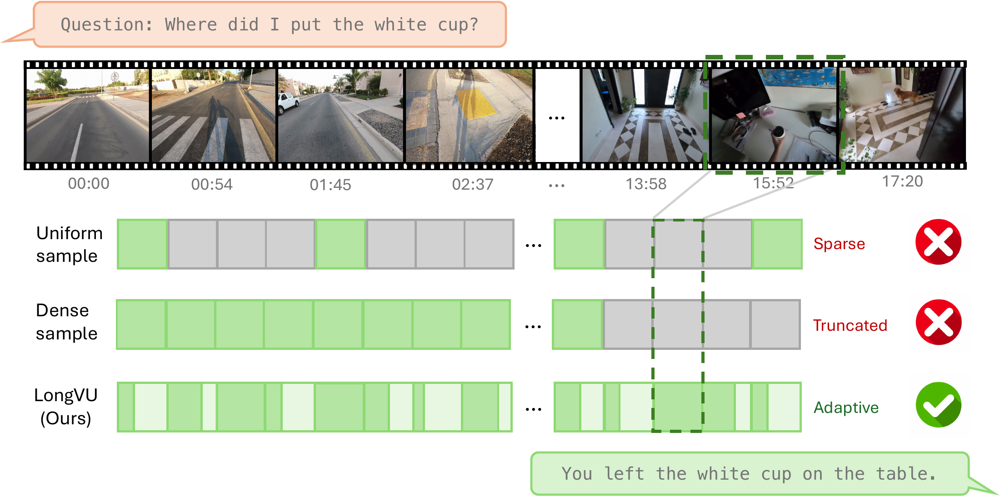
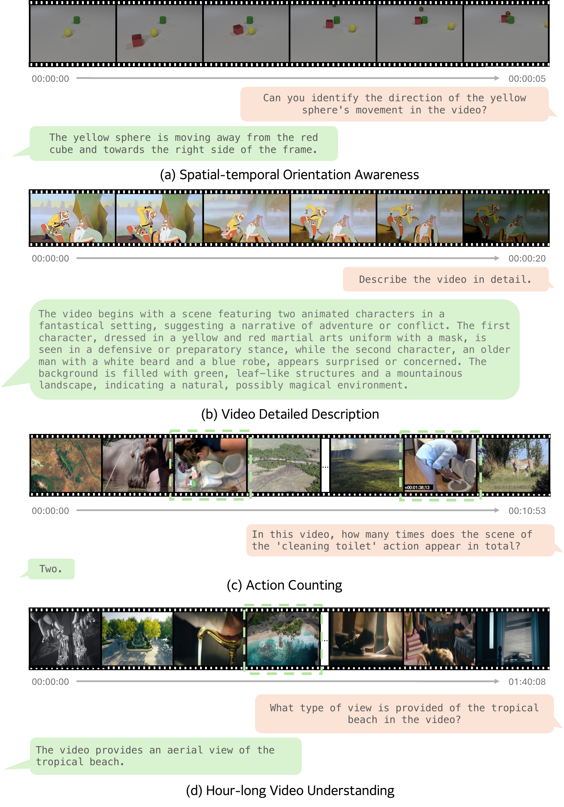
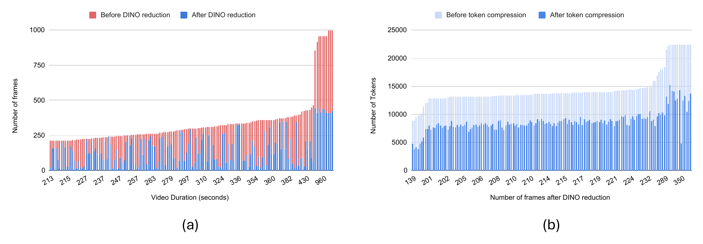
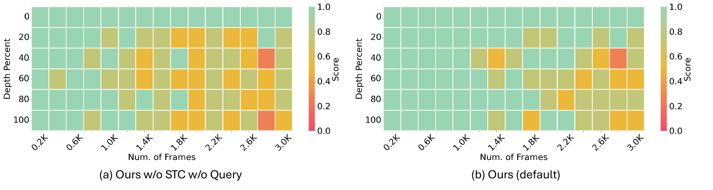

# LongVU：面向长视频语言理解的时空自适应压缩

[所属章节](../index.md) · [来源与阅读状态](../../../../sources/papers.json)


- **作者**：Xiaoqian Shen、Yunyang Xiong、Changsheng Zhao、Lemeng Wu、Jun Chen、Chenchen Zhu、Zechun Liu、Fanyi Xiao、Balakrishnan Varadarajan、Florian Bordes、Zhuang Liu、Hu Xu、Hyunwoo J. Kim、Bilge Soran、Raghuraman Krishnamoorthi、Mohamed Elhoseiny、Vikas Chandra；Meta AI、KAUST、Korea University。
- **年份/固定版本**：2024；arXiv:2410.17434v1，提交日期 2024-10-22。
- **原始链接**：[arXiv 论文 v1](https://arxiv.org/abs/2410.17434v1)，[代码仓库](https://github.com/Vision-CAIR/LongVU)，[项目页](https://vision-cair.github.io/LongVU)。
- **实际阅读范围**：固定 PDF 全文第 1–13 页的引言、相关工作、方法、第 4 节实验和结论；同时读取作者 TeX 中第 5 节补充材料，用于训练数据、帧位置编码、DINOv2/SigLIP 相似度、needle 实验和局限。参考文献未逐条核查；未声称复现。

## 要解决的约束

长视频的问题不是“有没有视频编码器”，而是 1 fps 密集采样后，所有帧的视觉 token 无法同时塞入 LLM 的上下文。论文用两个数量级说明这个矛盾：LLaVA-1.6 每幅图约用 576–2,880 token，LLaVA-OneVision 可用 7,290 token；常见的 8k 多模态上下文即使按 64 token/帧也只容纳约 125 帧，而一小时、1 fps 的视频有 3,600 帧，理论输入量会超过 200k token（引言，第 1–2 页）。

固定数量的均匀采样把所有时间段看成同样重要：稀疏采样会跳过“白杯放到桌上”这类短事件；增加采样密度又可能超出上下文，最后截去恰好包含答案的帧。作者把目标定义为：在通常的 8k LLM 上尽可能保留 1 fps 视频的时间覆盖和空间细节，并按视频内容和用户问题自适应分配 token。

这里的“压缩”是输入视觉表示的压缩，不是对模型输出文本做 token 剪枝。论文主要报告准确率以及帧/token 减少率；没有报告端到端延迟、显存、能耗或每个问题的实际输入 token 曲线。因此，不能把准确率提升直接解释为完整的推理成本前沿。



图 1（TeX 资产 `assets/teaser.pdf`）用一段约 17 分钟视频说明三种输入：Uniform sample 的绿色块很稀疏，可能漏掉 15:52 左右与白杯相关的片段；Dense sample 全部保留但被上下文截断；LongVU 的块宽度随帧重要性变化，最后回答“你把白杯放在桌上”。图示是解释性示意，论文没有把这些块宽度作为独立实验量化。

## 整体执行顺序

LongVU 的实际流水线是：

1. 视频按 1 fps 得到 $N$ 帧。先对**全部候选帧**运行 DINOv2，按 8 帧非重叠窗口的帧间相似度移除时间冗余，留下 $T$ 帧。
2. 只对留下的 $T$ 帧运行 SigLIP，并把 SigLIP 和 DINOv2 特征送入 Cambrian 的 Spatial Vision Aggregator（SVA）融合，得到每帧空间网格特征 $V^t$。
3. 若融合后的高分辨率视觉 token 可能超出上下文，则把用户文本问题编码到 LLM 空间，用跨模态注意力给帧排序；最相关的 $N_h$ 帧保留高分辨率，其余帧空间池化为低分辨率。
4. 若连低分辨率序列仍然过长，则以 $K=8$ 为窗口，对每个窗口的第一帧和后续帧逐空间位置比较余弦相似度，删除高相似位置的后续 token；窗口首帧保留全分辨率。


图 2（TeX 资产 `assets/main.pdf`）把顺序画成从底部 1 fps 胶片到 `SigLIP + DINOv2`、Temporal Reduction，再到文本问题驱动的高/低分辨率 token，最后接入 LLM。左侧小网格表示：一个窗口内的首帧作为空间锚点，后续帧只留下与锚点不同的位置。图中 $V_3$ 的灰色虚框是被时序筛掉的帧；右侧橙色箭头表示文本问题参与跨模态选择。

### 第一步：DINOv2 帧去冗余

设 1 fps 视频为 $I=\{I^1,\ldots,I^N\}$，DINOv2 为每帧产生全局/视觉特征 $V^i_{\rm dino}$。在每个不重叠的 $J=8$ 帧窗口内，作者为第 $i$ 帧计算与其余帧的平均相似度：

```math
\mathrm{sim}^{i}=\frac{1}{J-1}\sum_{j=1,\;j\ne i}^{J}
\mathrm{sim}(V^i_{\mathrm{dino}},V^j_{\mathrm{dino}}),\qquad J=8.
```

高相似度表示这个帧与窗口内其他帧重复，因而被删掉；窗口内保留若干低冗余帧，原始 $N$ 帧变成 $T$ 帧。正文说明这一阶段平均约保留一半，但没有给出“保留几帧”或一个固定相似度阈值，也没有在公式后说明并列分数的处理方式；因此它是一个关键实现缺口，不能自行补成 top-k 或阈值算法。

DINOv2 的角色是视觉中心的“变化探测器”，而不是最终语言对齐器。作者认为 SigLIP/CLIP 的视觉—语言对比学习更擅长语义对齐，却会把低层细微变化视为相同；DINOv2 的自监督视觉特征更能区分动作或小物体位置变化。图 6 的体操运动员序列给出这个动机的直观证据：SigLIP 对六个后续帧的相似度约为 0.938–0.976，DINOv2 的相似度约为 0.836–0.973，DINOv2 对动作变化的相似度下降更明显。论文把该图称作补充图，但正文方法第 3.1 节依赖这一解释。

保留下来的 $T$ 帧再用 SigLIP `so400m-patch14-384` 编码；随后用 SVA 的可学习 query 跨编码器空间聚合，形成融合特征

```math
V=\{V^1,\ldots,V^T\}\in\mathbb{R}^{T\times(H_hW_h)\times D_v}.
```

这意味着 DINOv2 被重复利用：先参与帧筛选，之后也作为融合视觉编码器之一；SigLIP 则主要提供语言对齐的视觉表示。DINO 前置计算全部 $N$ 帧，后续 SigLIP/SVA 只处理 $T$ 帧，作者承认前者对很长视频可能昂贵，但没有给出其时间或显存成本。

### 第二步：文本相关的空间选择

每帧高分辨率网格为 $H_h\times W_h$，低分辨率池化网格为 $H_l\times W_l$。实现中高分辨率是 $12\times12=144$ token/帧，低分辨率是 $8\times8=64$ token/帧。给定问题的 LLM embedding

```math
Q\in\mathbb{R}^{L_q\times D_q},
```

先检查时序筛选后的视觉序列是否超过上下文。如果 $T H_hW_h\ge L_{\max}$，则把每一帧经多层感知器适配器 $\mathcal F(V)$ 后与 $Q$ 做跨模态注意力。按空间位置和问题 token 平均得到每帧分数，选出 $N_h$ 个最相关帧保留 144 token，其余帧做空间池化，变成 64 token。

```math
\mathrm{Top}_{N_h}\left(\frac{1}{H_hW_hL_q}
\sum_{h,w,l}\mathcal F(V)Q^\top\right),
\qquad
N_h=\max\left(0,\frac{L_{\max}-L_q-T H_lW_l}
{H_hW_h-H_lW_l}\right).
```

式中分母把每个低分辨率帧升级到高分辨率所多出的 token 数量，分子是扣除问题 token 后还能使用的预算；作者在简化式中省略了 system prompt。实际部署应取整数帧数并受序列边界约束，论文没有交代取整方式。若 $N_h=0$，直接把所有帧池化到低分辨率，不计算注意力分数。

这个阶段的关键不是“检索后只送最相关帧”，而是保留所有时段的粗粒度上下文，同时把问题相关帧的空间细节从 64 token 提高到 144 token。问题涉及某一动作或物体时，它有机会得到原始网格；无关帧仍贡献低分辨率的长程时间线。

**小型例子。** 假设 DINO 后有 $T=6$ 帧，$H_hW_h=4$（$2\times2$ 网格），低分辨率为 $H_lW_l=1$，问题占 $L_q=2$ token，可用视觉上下文为 $L_{\max}=14$。全低分辨率需要 $6\times1=6$ 个 token；剩余预算 $14-2-6=6$，每提升一帧多 $4-1=3$ token，因此 $N_h=2$。跨模态分数最高的两帧送 4 个空间 token，其余四帧各送 1 个，总视觉 token 为 $2\times4+4\times1=12$，连问题共 14。这个算例只演示预算公式，不代表论文的实验尺寸。

### 第三步：跨帧空间压缩（STC）

当 $T H_lW_l\ge L_{\max}$ 时，即使所有帧都已降到 64 token 仍超长，LongVU 再将帧序列划成大小为 $K<T$ 的非重叠窗口（实现 $K=8$）。每个窗口第一帧保留完整低分辨率网格；对该窗口后续帧，在**同一 $(h,w)$ 空间位置**计算与首帧 token 的余弦相似度：

```math
v_i^*(h,w)\leftarrow
\begin{cases}
v_i(h,w),&\mathrm{sim}(v_1(h,w),v_i(h,w))\le\theta,\\
\emptyset,&\mathrm{otherwise},
\end{cases}
\quad h\in[1,H_l],\;w\in[1,W_l],\;i\in[2,K].
```

默认阈值 $\theta=0.8$。静态背景在相邻帧的对应位置通常相似，于是只删除后续帧的背景 token；发生动作、物体位移或场景变化的位置仍然保留。它不是把 token 合并成一个新向量，而是直接让高相似位置的后续 token 为空，因此这是结构性稀疏化，可能丢失局部信息。首帧策略依赖 DINOv2 已经先去掉了重复帧，作者也试过窗口中间帧和“相邻帧变化最大”的帧，压缩率相近，首帧略优且实现简单。

伪代码（仅将论文公式整理为可跟踪的教学版本；论文没有给出完整工程伪代码）：

```text
frames = sample(video, fps=1)
dino = DINOv2(frames)
kept = remove_high_similarity_frames(dino, window=8)  # 论文未给出精确阈值/保留数
v = SVA(DINOv2(kept), SigLIP(kept))
if token_count(v, high=144) > context:
    scores = cross_modal_score(adapter(v), question_embedding)
    n_high = budget_formula(context, question_len, T, low=64, high=144)
    v = pool_all_but_top_frames(v, scores, n_high)
if token_count(v) > context:
    for window in split(v, K=8):
        anchor = window[0]
        for frame in window[1:]:
            drop positions where cosine(anchor[pos], frame[pos]) > 0.8
return LLM(v, question)
```

一个 $2\times2$ 低分辨率网格的例子：若首帧和下一帧在四个位置的余弦相似度为 $[0.95,0.40,0.87,0.20]$，则在 $\theta=0.8$ 下只保留后续帧第 2、4 个位置；第 1、3 个位置的后续 token 被删除。若变化对象从位置 2 移到位置 3，下一帧就会同时保留这两个变化位置。该例说明 STC 的空间位置必须对齐，不能把跨帧 token 任意排序后比较。

## 训练设置与比较公平性

训练分两阶段。图像—语言阶段把 LLaVA-OneVision 的 3.2M single-image 数据用于对齐和指令训练，合并了通常分开的两步；每幅图 576 token，1 epoch、global batch 128、AdamW、cosine schedule、学习率 $10^{-5}$、warmup 0.03。视频—语言 SFT 使用 VideoChat2-IT 的子集（TextVR、YouCook2、Kinetics-710、NExTQA、CLEVRER、EgoQA、TGIF、WebVidQA、DiDeMo）并加入 ShareGPT4Video 和 MovieChat 长视频补充：captioning 43K、classification 1K、VQA 424K、instruction 85K；1 epoch、global batch 64，其他优化器设置相同，训练在 64 张 NVIDIA H100 上完成。只对自回归文本生成算 cross-entropy loss。

主模型使用 SigLIP so400m-patch14-384、DINOv2、Qwen2-7B；高分辨率上限 144 token/帧，低分辨率最多 64 token/帧，$\theta=0.8,K=8$。小模型实验把语言骨干换成 Llama3.2-3B。评测用 greedy decoding（`num_beams=1`），数据集为 EgoSchema（约 180 秒）、MVBench（约 16 秒）、MLVU（3–120 分钟）和 VideoMME（1 分钟–1 小时；Long 子集 30–60 分钟）。基线的帧数和上下文差异很大，表 1 原样列出这些条件，不能把所有数字视为严格同预算比较。

## 正文主结果

### 7B 模型的跨基准结果

表 1（第 6 页，`Table 1`）在 8k 上比较 7B 模型。LongVU 以 1 fps 输入，EgoSchema 67.6、MVBench 66.9、MLVU 65.4、VideoMME Overall 60.6、VideoMME Long 59.5。相对 LLaVA-OneVision（7B、8k、32 帧）的差值分别为 +7.5、+10.2、+0.7、+2.4、+12.8 个百分点；相对 VideoChat2（7B、8k、16 帧）在五列上为 +13.2、+6.5、+17.5、+6.0、+20.3。作者特别强调：LongVU 使用较小的视频训练集，而 LLaVA-OneVision 的 OneVision-1.6M 多图/视频训练集在投稿时未公开，因此训练数据规模存在不对称。

表中 proprietary GPT-4o（1 fps、未知上下文）在 EgoSchema 72.2、MVBench 64.6、MLVU 66.2、VideoMME Overall 77.2、Long 72.1；LongVU 只在 MVBench 66.9 高于它，其他列仍低于 GPT-4o。LongVA 的 224k 上下文和 128 帧属于完全不同预算，不能只按模型名比较。

### 3B 轻量模型

表 2（第 7 页）把语言模型降为 Llama3.2-3B，LongVU 得到 EgoSchema 59.1、MVBench 60.9、VideoMME Overall 51.5、Long 47.2、MLVU 55.9。相对 Phi-3.5-vision-instruct 4B 的 VideoMME Long 43.8，提升 3.4 个百分点；相对 InternVL2 1.8B 的 MVBench 60.2 略高。这个实验支持压缩机制在较小语言骨干上仍有帮助，但模型、训练数据和输入条件并未全部统一，所以不能单独归因于压缩模块。



图 3（`assets/qual.pdf`）是四个定性例子：(a) 5 秒动画中判断黄色球远离红方块并向右移动；(b) 20 秒动画的详细叙述；(c) 10 分 53 秒视频中数“cleaning toilet”出现两次；(d) 1 小时 40 分 08 秒视频中判断热带海滩是航拍视角。绿色虚框标出问题相关帧，图示支持“跨时间检索和回答”的可行性，但不是独立准确率评测。

## 消融：哪些步骤贡献了什么

### token/上下文预算与 DINOv2

表 3（第 9 页的 `Table 3`）固定各自设置后比较：

| 方法 | 上下文 | 每帧 token | EgoSchema | VideoMME | MLVU |
|---|---:|---:|---:|---:|---:|
| Uniform | 16k | 144 | 67.12 | 60.01 | 64.70 |
| DINO | 16k | 144 | 67.34 | 61.25 | 64.83 |
| Uniform | 8k | 64 | 66.84 | 57.56 | 60.87 |
| Uniform | 8k | 144 | 66.28 | 58.84 | 63.28 |
| SigLIP | 8k | 64 | 66.04 | 58.63 | 62.17 |
| DINO | 8k | 64 | 66.20 | 59.90 | 62.54 |
| DINO + Query | 8k | 64/144 | 67.30 | 60.08 | 65.05 |
| DINO + Query + STC（默认） | 8k | dynamic | **67.62** | **60.56** | **65.44** |

均匀采样下 8k 的 144 token/帧在 VideoMME（58.84 对 57.56）和 MLVU（63.28 对 60.87）高于 64 token，但 EgoSchema 反而低（66.28 对 66.84），说明空间细节和时间覆盖存在任务依赖的取舍；144 token/帧在 8k 下最多容纳约 60 帧。16k 同为 144 token 时，DINO 相对 Uniform 只带来 +0.22/+1.24/+0.13，说明 DINO 先验在较长上下文上有小幅收益。

在 8k/64 token 的公平条件下，SigLIP 时序筛选比 DINO 低 0.16/1.27/0.37（EgoSchema/VideoMME/MLVU），DINO 比 Uniform 高 0.16/2.34/1.67；这支持作者关于 DINO 更适合发现低层帧变化的解释，但结果仍是相关性证据，不是对特征空间因果机制的证明。

### Query 与 STC 的增量

Query 把相关帧从 64 提到 144 后，三项相对 DINO 8k/64 变成 67.30、60.08、65.05，分别 +1.10、+0.18、+2.51。它对 MLVU 子任务的帮助集中在需要找特定帧的任务：表 4 的 `needle` 从 DINO 68.16 到 DINO+Query 78.87，`count` 从 24.15 到 28.98，平均从 62.54 到 65.05；`ego` 反而从 59.09 降到 55.39。

加入 STC 后，EgoSchema/VideoMME/MLVU 为 67.62/60.56/65.44，相对 Query 为 +0.32/+0.48/+0.39；在表 4 中平均到 65.44，`ego` 从 55.39 回到 59.37，`order` 从 56.37 到 58.30，`anomaly` 从 75.50 到 76.00，但 `needle` 从 78.87 降到 76.33，`plotQA` 从 72.35 降到 71.61。STC 的作用不是所有子任务都单调提升，而是在节省 token 的同时大体保持检索和时序推理。

在 16k/144 的静态高预算下，Uniform/DINO 是 60.01/61.25 VideoMME；默认 8k 动态压缩为 60.56，作者据此称其达到或略优于 16k 的结果。但这不是相同 token 数和相同上下文的成本等价比较，只能说明该测试设置下压缩后准确率未明显损失。

### STC 锚点策略

表 5 在 VideoMME 上比较窗口首帧（默认）、第 $K/2$ 帧和相邻变化最大的帧。短/中/长/总体/减少率分别为：首帧 64.7/58.2/59.5/60.9/55.47%；中间帧 64.7/58.7/58.6/60.7/54.97%；高变化帧 64.7/58.2/58.3/60.4/55.62%。三者压缩率接近，首帧总体最好，因此作者选最简单的方案。这里“reduction rate”是作者对视觉 token 的报告，正文没有给出每个数据集的置信区间或运行时间。

### 正文之外但必要的 FPE 和图像能力补充

补充材料提出 frame-level positional encoding（FPE），用共享正弦位置编码表示帧的绝对时间 $t$：

```math
PE(t,2i)=\sin(t/10000^{2i/d}),\qquad
PE(t,2i+1)=\cos(t/10000^{2i/d}).
```

它试图弥补删帧、动态 token 后仅拼接 token 会弱化帧边界的问题。但默认不使用 FPE：表中 DINO+Query+STC 为 67.62/60.56/65.44，加入 FPE 为 67.87/60.89/64.56；MLVU 平均从 65.44 降到 64.56，子任务表中 needle 从 76.33 降到 74.08，因而作者认为总体影响不大并去掉。

视频 SFT 只使用视频数据，也损害图像能力：补充表在 SQA-IMG/MMVP/POPE/RealWorldQA 上从 SFT 前 95.44/51.33/86.65/61.06 变为 SFT 后 83.94/32.00/81.23/47.65。作者把混合图像、多图和视频训练留作后续工作。这是论文明确的局限，说明“长视频效果好”不等价于统一图像—视频模型能力完整。

## 压缩量与长上下文分析



图 4（`assets/reduce.pdf`）随机抽取数百个视频。左图横轴视频时长（约 213 秒到 960 秒），红柱是 DINO 前帧数、蓝柱是 DINO 后帧数；平均只有约 45.9% 的帧保留。右图横轴 DINO 后帧数（约 139 到 350），浅蓝为 STC 前 token 数，深蓝为 STC 后 token 数，平均约减少 40.4%。柱状图展示视频间差异很大，尤其长视频的压缩后数量仍可能上万；论文没有把这些分布转换成端到端 LLM latency 或显存节省。



图 5（`assets/needle.pdf`）是作者的 video Needle-in-a-Haystack。实验从 MLVU 随机取一段一小时视频，把 VQA 图片插入为 needle，1 fps 输入，帧数从 200 到 3.6k，needle 深度从 0% 到 100%，8k 上比较“DINO 后但无 Query/无 STC”和默认方案。作者称默认方案可在约 1k 帧内准确解题，平均分从 0.80 提到 0.88，并且帧数增加时优势更明显。热图横轴帧数、纵轴插入深度、颜色是 score；左图 w/o STC w/o Query 在深度和长序列上出现更多橙/红，右图默认整体保持绿色/黄绿色。

补充图 `needle1.pdf` 又将三种配置分别画成 w/o STC w/o Query、w/o STC、default；作者文字指出，当总帧数低于约 1.4k 时，Query 对定位关键帧的增益特别明显，帧数继续增加时 STC 进一步提升 VQA。图中 score 的具体聚合方式和每个格子的样本数没有在正文交代，因此“0.80 到 0.88”应读作作者报告的平均结果，而非可由热图手工复算的统计量。

## 如何理解 token 效率

这篇工作的 token 目标有三层：

1. **输入覆盖**：从固定 8/16/32 帧提高到 1 fps，使 30–60 分钟、乃至小时级视频可见；时间冗余由 DINOv2 处理。
2. **空间预算分配**：在同一个 8k 上，不再给每一帧相同 64 或 144 token；问题相关帧优先拿 144，其他帧拿 64。
3. **跨帧结构稀疏化**：静态位置在后续帧不重复发送，动态位置保留。

因此作者的 token 预算是视觉输入 token，加上问题/系统 prompt 后不超过 $L_{\max}$；不是训练 token、输出 token 或 FLOPs。论文明确的数字包括 144/64 token 的高低分辨率、8k/16k context、平均 45.9% 帧保留、平均 40.4% STC token 减少，以及引言中“小时视频平均约 2 token/帧”的概括性能力陈述。没有报告 DINO 全帧预处理的成本、跨模态打分成本、池化/稀疏 token 的实际 KV cache 节省、输出长度、GPU 推理时间或每个任务的 token—准确率曲线。尤其 DINO 要先看完所有 1 fps 帧，压缩节省发生在后续 LLM 输入端，不能把它表述成从原始视频到答案的总计算等比例下降。

## 作者图资产清单与许可

论文 PDF 的 `source-manifest.json` 标注版本许可 URL 为 [CC BY 4.0](http://creativecommons.org/licenses/by/4.0/)。以下文件从固定 TeX 工程原样复制到本目录 `assets/`，没有裁剪或重绘；来源 URL 均为论文 arXiv 页面，复用时应保留论文标题、作者和许可证归属。

| figure-id | 原图/说明 | source_url | license | local_file | reuse_allowed |
|---|---|---|---|---|---|
| teaser | Fig. 1，均匀、密集与 LongVU 自适应采样示意 | https://arxiv.org/abs/2410.17434v1 | CC BY 4.0（manifest） | `assets/teaser.pdf` | true，按许可证归属 |
| main | Fig. 2，LongVU 三阶段架构 | https://arxiv.org/abs/2410.17434v1 | CC BY 4.0（manifest） | `assets/main.pdf` | true，按许可证归属 |
| qual | Fig. 3，四种视频理解定性例子 | https://arxiv.org/abs/2410.17434v1 | CC BY 4.0（manifest） | `assets/qual.pdf` | true，按许可证归属 |
| reduce | Fig. 4，DINO 帧压缩和 STC token 压缩分布 | https://arxiv.org/abs/2410.17434v1 | CC BY 4.0（manifest） | `assets/reduce.pdf` | true，按许可证归属 |
| needle | Fig. 5，一小时视频 needle 热图 | https://arxiv.org/abs/2410.17434v1 | CC BY 4.0（manifest） | `assets/needle.pdf` | true，按许可证归属 |
| dinosim | Fig. 6（补充），SigLIP 与 DINOv2 相似度 | https://arxiv.org/abs/2410.17434v1 | CC BY 4.0（manifest） | `assets/dinosim.pdf` | true，按许可证归属 |
| needle1 | 补充 Needle-In-A-Video-Haystack 三配置热图 | https://arxiv.org/abs/2410.17434v1 | CC BY 4.0（manifest） | `assets/needle1.pdf` | true，按许可证归属 |

## 与推理时 token 目标的关系和局限

LongVU 给出的可迁移思想是把“token 保留”作为一个带问题条件的资源分配问题：先用与问题无关的视觉先验删时间重复，再用问题相关性决定哪些帧值得高分辨率，最后利用空间位置的跨帧稳定性删重复 token。它对需要长时间检索、动作计数、needle 定位的任务尤其有针对性；单纯统一降到 1 token/帧会丢掉空间细节，单纯均匀抽帧会丢掉短事件。

局限必须保留。DINO 全帧计算和跨模态打分成本未测；DINO 帧删除的精确规则、整数取整、最后一个不足 $K$ 的窗口、空 token 如何在实现中拼接，正文未完整说明。STC 依赖同一空间网格对齐和阈值 $0.8$，快速运动、镜头切换、遮挡或对象尺度变化可能使余弦相似度不能准确代表语义冗余。表 1 的基线模型、帧数、上下文和训练数据不完全同预算，不能把全部提升归为压缩；针对于输入 token 的平均减少率也不是端到端延迟或总成本。最后，视频 SFT 后图像能力明显下降，且作者没有报告统一多图/视频训练来消除该退化的结果。
