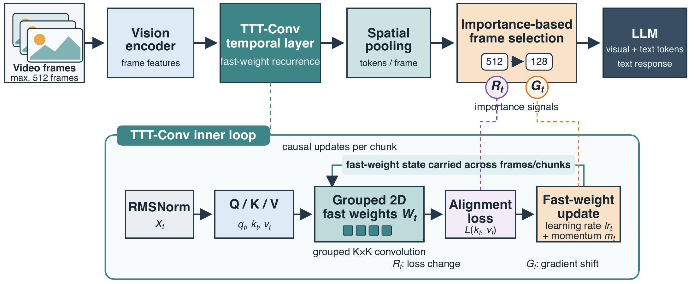
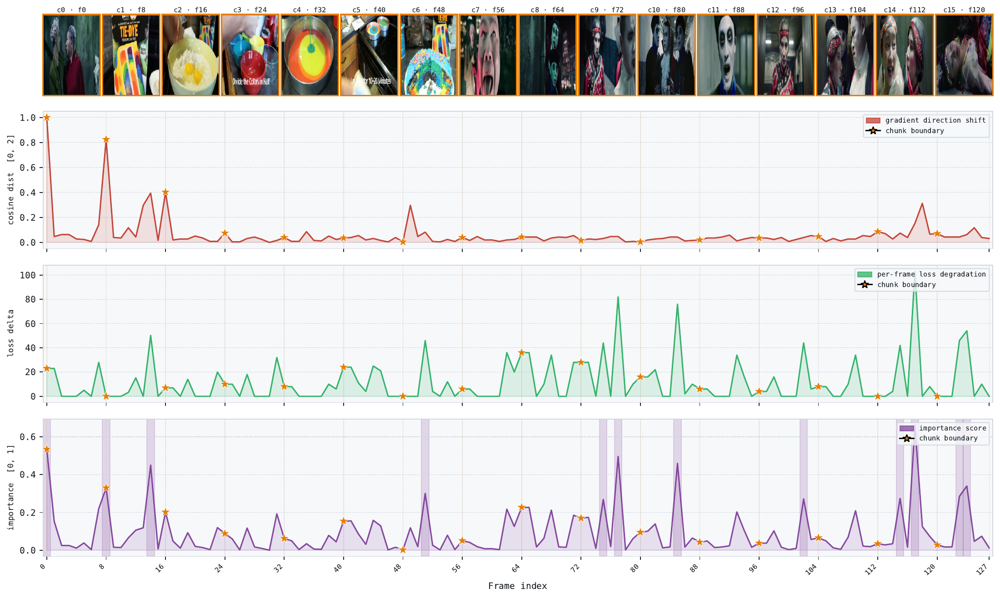
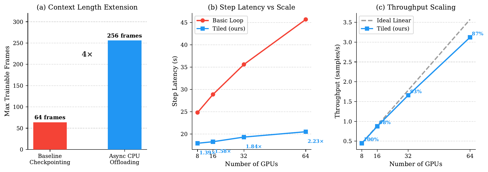

# LongVU-TTT: Causal Test-Time Training for Visual Resampling in Long Video Understanding

[所属章节](../index.md) · [来源与阅读状态](../../../../sources/papers.json)


**作者**：Mahmoud Ahmed、Sameh Abdulah、Olatunji Ruwase、Sam Ade Jacobs、Mathis Bode、Mohamed Elhoseiny <br>
**年份**：2026（arXiv v1，2026-08-26） <br>
**固定版本**：2608.25729v1 <br>
**原始链接**：[arXiv:2608.25729v1](https://arxiv.org/abs/2608.25729v1)；本文使用任务目录中的固定 PDF、纯文本和 LaTeX 源。 <br>
**实际阅读范围**：完整阅读正文第 1–5 节、正文 Figure 1–2 与 Tables 1–4；为解释正文结论补读附录 A.1–A.8（训练数据、初始化/伪代码、变体定义、输入长度、速度和两个定性图）。参考文献未逐篇追读，未精读附录之外的外部实现或代码。

## 1. 这篇论文解决什么问题

视频 MLLM 通常把每一帧独立送进 ViT，再把所有帧的视觉 token 交给 LLM。这样做把时间建模推给了 LLM：视频越长，视觉 token 近似线性增加，而 LLM 注意力的计算和显存代价仍然昂贵。另一类方法先做空间池化、token merge、差分丢帧或均匀采样，但通常在帧特征尚未传播时间上下文之前就压缩，因此无法直接根据“发生了什么变化”选择帧。LongVU-TTT 的位置很明确：它不改 LLM 的注意力，而是在 ViT 与现有 MLP projector 之间插入一个时间层，先让输入帧通过带有可更新快权重的卷积 TTT 层获得上下文，再做空间池化和帧选择，最后只把固定预算的显式视觉证据送给 LLM（正文 §1、§3.1）。

论文要检验的不是“一个模型在所有 benchmark 上是否 SOTA”。作者强调，Table 1 的模型使用不同 backbone、训练数据和采样策略，主要用来提供背景；真正的因果比较是同一 Qwen2-7B/LLaVA-Video pipeline、同一插入位置、同一训练设置下，比较不同 projector-stage temporal operator（正文 §1、§4.2–§4.3）。论文的两个核心主张是：第一，因果的帧内更新顺序和保持 2D 空间局部性的 grouped convolution 对 projector-stage TTT 有帮助；第二，TTT 快状态主要是时间聚合器而不是可靠的长程 episodic memory，所以仍需保留显式帧证据。

这里的“causal”只指快权重更新：第 $`t`$ 帧的表示只使用第 $`t`$ 帧之前的更新。重要的次序区别是：视频必须先完整处理，才能得到所有帧的 importance 分数；归一化和固定预算选择在全视频之后进行。因此，**快权重更新是因果的，最终选择不是在线因果选择，而是先聚合全段，再全局选择**（正文 §1、§3.4.2）。

## 2. 模型流程：从帧到 LLM 的固定预算

设 ViT 对 $`T`$ 帧的输出为

```math
X \in \mathbb{R}^{T \times (H W) \times C}, \qquad H=W=27.
```

也就是说，正文把每帧保留成 $`27\times27`$ 的空间网格，共 729 个视觉位置，每个位置宽度为 $`C`$。模型首先对这个输入做 RMSNorm，然后以残差方式接入 TTT-Conv：

```math
X_{out}=X+\operatorname{TTT\mbox{-}Conv}(\operatorname{RMSNorm}(X)).
```

TTT-Conv 输出的是已经看到前面帧更新的上下文特征。随后才做空间 pooling，并依据 TTT 内循环产生的分数选择帧；选中的视觉特征再通过原有 MLP projector 对齐到 LLM embedding width，与文本 token 拼接生成答案（Figure 1、正文 §3.1）。论文没有报告空间 pooling 后每帧究竟保留多少 token，因此不能把“128 帧”直接换算成最终 LLM 的视觉 token 总数；可以确认的是帧级预算为 128，且模型的视觉编码阶段最多处理 512 帧。

### 2.1 grouped 2D fast weights

TTT 的状态不是一个固定 hidden vector，而是一组随当前视频变化的卷积核 $`(W_{1,t},W_{2,t})`$。把通道划分成 $`N_g`$ 组，记每组输入宽度为 $`d=C/N_g`$、中间宽度为 $`D_{int}=4d`$，则两组快权重为

```math
W_1\in\mathbb{R}^{(N_gD_{int})\times d\times K\times K},\qquad
W_2\in\mathbb{R}^{C\times D_{int}\times K\times K}.
```

每帧通过线性头产生 key $`k_t`$、value $`v_t`$、query $`q_t`$，以及每组两个学习率门 $`lr_t\in(0,1)^{N_g\times2}`$ 和动量门 $`m_t\in(0,1)^{N_g}`$；学习率和动量都经 sigmoid。学习率 logits 零初始化，所以初始步长为 $`0.5`$。附录 A.4 给出实际设定：$`K=3`$、$`N_g=4`$、中间扩展倍数 4、chunk size $`C_{size}=8`$。$`W_1`$ 用 Kaiming uniform，$`W_2`$ 用标准差 $`1/\sqrt C`$ 的正态初始化；momentum projection 的 bias 为 $`+3`$，使初始 $`m`$ 接近 1，鼓励早期积累历史更新。

内循环不用答案标签，而是用当前帧的 key/value 做自监督 alignment：

```math
\mathcal{L}(k_t,v_t)=-\left\langle f_W(k_t),v_t\right\rangle.
```

最小化它会让当前快权重把 key 映射到与 value 对齐的表示。外循环训练 projection、初始权重以及整个 MLLM；部署时每个视频边界都把快权重和 momentum 重置为学习到的初始状态，只用该视频中的 alignment loss 适配。于是 TTT 的“测试时训练”是无标签的输入适应，而不是用问题答案更新模型。

### 2.2 并行实现仍保持因果顺序

纯逐帧更新会牺牲 GPU 利用率，整块 minibatch 更新又会使一个 chunk 内所有帧共享同一个状态。论文用 Parallel Causal Materialization：先用 chunk 初始状态并行计算每帧 raw gradient，再用 prefix sum 构造每个帧的因果状态。

令 $`g_t=-\nabla_W\mathcal{L}(k_t,v_t)`$，$`u_t=lr_t\cdot g_t`$。若上一 chunk 携带的 momentum 为 $`p_{init}`$，则第 $`t`$ 帧在看到自己之前的历史时有

```math
h_t=p_{init}+\sum_{i=1}^{t-1}u_i,
\qquad
\delta_t=u_t+m_t\cdot h_t.
```

真正供第 $`t`$ 帧查询的状态排除当前帧自己的 update：

```math
W_t=W_{init}+\sum_{i=1}^{t-1}\delta_i.
```

因此同一 chunk 中可以同时 materialize 所有 $`W_t`$，但第 8 帧不会偷看第 8 帧自己的梯度。chunk 末尾的最终增量作为下一个 chunk 的 $`p_{init}`$；最终权重也携带到下一个 chunk。附录算法还对每个 materialized kernel 做目标范数归一化，再并行 apply 查询：

```math
z_t=\operatorname{SiLU}(\operatorname{Conv2d}(q_t,W_{1,t})),
\qquad
\hat{x}_t=\operatorname{Conv2d}(z_t,W_{2,t}).
```

教学化地看，一段 8 帧先各自产生“当前帧需要怎样改写卷积映射”的梯度；第 1 帧用旧状态，第 2 帧用第 1 帧前的增量，第 8 帧用前 7 帧的增量。并行只是把这些前缀状态一次性算出，不改变这个依赖关系。异步 activation checkpointing 在反向时重算这些状态，避免把每帧状态全部常驻 GPU（正文 §3.3、附录 A.3–A.4）。

这也解释了为什么 2D locality 可能有用：TTT-MLP 与 Mamba 等把特征展平为 1D；TTT-Conv 直接在每帧 $`27\times27`$ 网格上做 grouped $`3\times3`$ 局部运算。ViT 已经提供全局表征，卷积快权重补充局部邻域的变化模式。这个解释是结构上的合理性，不能单凭结构推导出语义提升；正文的支持证据来自 Table 2 的 shuffled-grid、$`1\times1`$ 和 TTT-MLP 对照。

## 3. 从更新信号得到 frame importance

TTT 内循环本来是为了更新快权重，但它同时给出两个不需要额外 learned scorer 的变化信号。

第一类是 Gradient-Direction Shift。比较相邻帧 alignment loss 对快权重的梯度方向：

```math
G_t=1-
\frac{\nabla_W\mathcal{L}_t\cdot\nabla_W\mathcal{L}_{t-1}}
{\|\nabla_W\mathcal{L}_t\|\,\|\nabla_W\mathcal{L}_{t-1}\|}.
```

$`G_t\in[0,2]`$，当更新方向突然转变时变大，适合发现镜头/场景级切换。第二类是 Alignment-Loss Delta：

```math
R_t=\max(0,\mathcal{L}_t-\mathcal{L}_{t-1}).
```

它只保留 loss 的正增量，表示当前帧比前一帧更难被已有映射对齐，适合发现同一场景内部持续出现的新内容。论文令 $`G_1=R_1=0`$。对两者分别在全 $`T`$ 帧上做 min-max normalization，并以 $`\epsilon`$ 防止信号恒定时分母为零，再用 $`\alpha=0.4`$ 合成：

```math
I_t=\alpha\frac{G_t-\min_tG_t}{\max_tG_t-\min_tG_t+\epsilon}
+(1-\alpha)\frac{R_t-\min_tR_t}{\max_tR_t-\min_tR_t+\epsilon}.
```

这里的全视频 min/max 是理解“因果 vs 选择”边界的关键：更新本身不读未来，但归一化必须等所有帧的信号出现后才完成。

### 3.1 Hybrid sampling：先突出变化，再补时间覆盖

给定目标选择数 $`N_{sel}`$，先取 $`I_t`$ 最高的 top-$`k`$ 帧构成 highlight set $`S`$；然后从剩余索引中均匀取 $`N_{sel}-k`$ 帧构成 $`U`$。最终按原时间顺序排序：

```math
\mathcal{F}_{final}=\operatorname{Sort}(S\cup U),
\qquad |\mathcal{F}_{final}|=N_{sel}.
```

这不是单纯的 top-$`N`$：uniform 部分保留没有显著梯度峰值的时间区间，避免只围绕场景切换取样而丢掉稳定段中的证据。也不是在线 streaming selector，因为 $`S`$ 的排名和 normalization 需要完整视频。原文明确把最后选择放在所有 temporal processing 之后；所以整条链是“最多 512 帧进入 ViT/TTT → 因果快权重在全段传播 → 计算全部 $`G,R,I`$ → 选 128 帧 → spatial pooling/MLP projector/LLM”。

## 4. 长视频训练的系统条件

长视频的限制不只来自 LLM attention。ViT 的大量独立帧激活、TTT materialization 和 LLM packed sequence 共同造成显存峰值。作者实现两项系统优化，这些是实验能处理 256/512 帧的工程条件，而不是新的视频建模目标。

**Batch-tiled ViT processing。** 将 frame batch 分成 8 个 tile，独立处理各 tile，直到最后一个 tile 才做 ZeRO-3 reduce-scatter。由于 ViT 帧之间在该阶段独立，拼接 tile 输出可保持未切 tile 的 forward 和 gradient。8 到 64 张 GPU 时，相比标准 per-shard loop，step speedup 从 1.39× 增至 2.23×；64 GPU 时 InfiniBand 通信是主要瓶颈。

**异步 CPU activation offloading。** 对于 28 层、hidden dimension $`D=3584`$、序列长 $`L=25{,}088`$、16-bit 的 LLM，作者用每层约

```math
6\cdot L\cdot D\cdot2\approx1.08\text{ GB}
```

估计选择性 checkpointing 后要保留的归一化、attention projection 输入和 MLP 中间激活，28 层 LLM 单独就约 30.2 GB，还没有算 ViT 和 TTT 状态。于是 forward 中在消费者结束后把激活通过专用 CUDA stream 送到 CPU，backward 反向层序预取并与计算重叠。固定 8-GPU/A100 40GB 设置下，最大可训练帧数从 64 增至 256，即 4×；Figure 2(c) 报告 256 帧、8 tile 的吞吐缩放效率在 8/16/32/64 GPU 分别约 100%/98%/93%/87%。这不是把视觉 token 预算扩大到无限，而是让训练阶段能承受更长输入。



**Figure 1（`assets/architecture_proposed.pdf`）**：图从左到右展示 Video frames（最多 512）→ 独立 vision encoder → TTT-Conv temporal layer（chunk 内 causal fast-weight recurrence）→ spatial pooling → importance-based frame selection（512→128）→ 原有 MLP projector/LLM。下方展开一帧的 inner loop：RMSNorm 后产生 $`Q/K/V`$，grouped 2D fast weights $`W_t`$ 计算 alignment loss，梯度与学习率、momentum 形成 update，再把状态带到后续帧/chunk。图中“causal updates per chunk”和“state carried across frames/chunks”不能解读成选择在线完成；最终 importance signals 仍在整个视频上形成后才选帧。原图来自论文 LaTeX `figures/architecture_proposed.pdf`，CC BY 4.0，未裁剪，局部复用允许并应署名。

## 5. 训练设置与公平比较

评测使用 MLVU、LongVideoBench、Video-MME、NExT-QA、LVBench 五个 benchmark。架构 ablation 只使用 Stage 2 mixture 的固定 30% 子集，所有变体共用同一个 base model、插入位置、feature width、frame input、LLM budget 和训练设置（正文 §4.1）。

Stage 1 训练 TTT layer 和 MLP projector：LLaVA-CC3M-Pretrain-595K 加 20 万条 LLaVA-Video-178K 短视频 instruction，视频最多 16 帧；16 GPU、1 epoch、global batch 512，学习率 $`5\times10^{-4}`$。Stage 2 对所有组件联合训练：LLaVA-Video-178K 与 LLaVA-OneVision image dataset 共 150 万样本，视频 1 fps、最少 32、最多 512 帧；64 GPU、1 epoch、global batch 128。学习率分别是 LLM $`2\times10^{-5}`$、MLP projector/TTT $`10^{-4}`$、ViT $`2\times10^{-6}`$。两阶段均 cosine decay、3% linear warmup、bfloat16；Stage 2 开启 8-tile ViT 和所有 LLM 层异步 offload（附录 A.1–A.2）。

控制比较包含：无 temporal layer 的 LLaVA-Video baseline；bidirectional Mamba2（state size 288，展平空间网格，前后扫描）；Gated DeltaNet（状态预算匹配 Mamba2，因果扫描）；temporal Transformer（每个空间位置沿 frame 维做 causal attention，quadratic）；TTT-MLP（4 heads、4× expansion，chunk 内 joint update）；causal TTT-MLP（只改成帧级 prefix state）；以及 TTT-Conv 的 causal/non-causal、静态卷积、$`1\times1`$、$`3\times3`$ 和 shuffled-grid 对照。除专门注明外，TTT chunk size 为 8（附录 A.5）。

## 6. 主结果：五个 benchmark 的上下文比较

正文 Table 1 的 LongVU-TTT 使用最多 512→128 帧，结果为：MLVU **71.80**、LongVideoBench **60.40**、Video-MME **64.43**、NExT-QA **83.50**、LVBench **44.30**。同表训练/管线最接近的 LLaVA-Video（64 帧）为 70.8、58.2、63.3、83.2、42.2；因此 LongVU-TTT 相对这个参照在五项上都提升，最大绝对提升在 LongVideoBench（+2.20）和 LVBench（+2.10）。表中其他模型的帧政策差异很大，例如 LongVA 128、InternVL2 16、LongVILA 256、Qwen2-VL 256、Video-XL 2048、LongVU/Vamba 1 fps，所以不能把列中最高分理解为严格公平的全领域排名。作者的表述是 competitive/contextual comparison，而不是新的跨模型 SOTA。

Table 1 也暴露出一个需要谨慎看的例外：LongVU-TTT 的 NExT-QA 83.50 只比 LLaVA-Video 83.2 高 0.3；这不支持“时间压缩在所有任务上收益相同”。表中的 token/帧预算是 frame policy，不是每个模型统一的最终 LLM token 数；论文没有给出输入、输出或总 token 的实际计量，也没有将这些分数换算为 cost-quality 曲线。

## 7. 控制的 temporal-operator study（Table 2）

在同一 fixed 30% Stage 2 子集上，Table 2(a) 的三列结果如下：

| temporal operator | MLVU | LongVideoBench | Video-MME |
|---|---:|---:|---:|
| LLaVA-Video baseline | 60.35 | 52.54 | 58.20 |
| bidirectional Mamba2 | 62.46 | 53.55 | 60.80 |
| Gated DeltaNet | 62.92 | 53.96 | 61.31 |
| TTT-MLP | 63.38 | 54.23 | 61.14 |
| TTT-MLP (causal) | 64.38 | 55.16 | 61.73 |
| temporal Transformer | 63.94 | 54.84 | 61.67 |
| TTT-Conv (non-causal) | 61.52 | 53.46 | 61.08 |
| TTT-Conv (ours) | **65.50** | **56.17** | **62.11** |

所有 temporal modules 在多数设置超过独立帧 baseline；TTT-Conv 三项均最高。TTT-MLP 从非因果 63.38/54.23/61.14 到 causal 64.38/55.16/61.73，支持“chunk 内按帧 prefix ordering”有独立作用。TTT-Conv 的 non-causal 反而降到 61.52/53.46/61.08，说明“只加卷积”不足以解释收益，更新顺序与卷积参数化的组合都重要。这里的 non-causal 对照按 chunk 聚合一次更新并把同一更新后的权重给该 chunk 所有 query，不等同于泄露 benchmark 答案，但失去了论文所定义的帧内 causal state。

Table 2(b) 将 TTT-Conv 拆开：

| variant | MLVU | LongVideoBench | Video-MME |
|---|---:|---:|---:|
| no temporal layer | 60.35 | 52.54 | 58.20 |
| static grouped Conv | 62.11 | 53.48 | 60.12 |
| reset every frame | 62.84 | 53.91 | 60.55 |
| reset every chunk | 64.21 | 55.08 | 61.44 |
| TTT-Conv, $`1\times1`$ | 64.36 | 55.02 | 61.52 |
| TTT-Conv, shuffled grid | 63.77 | 54.46 | 60.98 |
| TTT-Conv, $`3\times3`$ | **65.50** | **56.17** | **62.11** |

静态 grouped Conv 只到 62.11/53.48/60.12，说明学习到固定卷积不能替代输入驱动的快权重。reset every frame 或 every chunk 均低于跨帧/跨 chunk carry；$`1\times1`$ 降至 64.36/55.02/61.52，shuffled grid 降至 63.77/54.46/60.98，支持空间网格顺序和 $`3\times3`$ 局部邻域确实参与效果。严格说，这些是同一子集上的局部架构证据，不能单独证明机制对所有 backbone 或数据集普遍成立。

## 8. “先聚合再选择”是否真的有用（Table 3）

Table 3(a) 把“temporal module 处理多少帧”和“LLM 最终收到多少帧”分开：

| 模型 | temporal input | selection / LLM frames | MLVU | LongVideoBench |
|---|---:|---|---:|---:|
| LLaVA-Video | 64 | uniform / 64 | 70.80 | 58.20 |
| LLaVA-Video | 512 | uniform / 128 | 65.40 | 55.14 |
| LongVU-TTT | 512 | uniform / 64 | 68.42 | 58.46 |
| LongVU-TTT | 512 | hybrid / 128 | **71.80** | **60.40** |
| LongVU-TTT | 512 | uniform / 256 | 70.80 | 59.42 |
| LongVU-TTT | 128 | all / 128 | 71.50 | 61.02 |

最直接的比较是同为 512→128：没有 temporal propagation 的 LLaVA-Video uniform 65.40/55.14，而 TTT-Conv 先处理 512 再 hybrid 选择到 128，为 71.80/60.40，MLVU +6.40、LongVideoBench +5.26。TTT 的 512→64 也达到 68.42/58.46，说明上下文增强即使在更小 LLM 帧预算下也有价值；但 128→128 all 为 71.50/61.02，LongVideoBench 反而高于 512→128 的 60.40，说明更长的 pre-aggregation 不是单调收益，也不能说 512 帧“记住”了全部证据。

Table 3(b) 固定 TTT-Conv checkpoint、512 输入和 128-frame LLM budget：random 69.66/58.74，uniform 70.63/59.72，单独 $`G_t`$ 71.19/60.07，单独 $`R_t`$ 71.30/60.16，hybrid $`I_t`$ **71.80/60.40**。因此两类信号都超过 uniform，组合最好。解释必须与信号定义对应：$`G_t`$ 在突变处有尖峰，$`R_t`$ 更能抓住同一场景中持续的新内容；并非“梯度越大就越重要”的单一排序。

附录 Table 5 对固定 128-frame LLM budget 的 pre-aggregation sweep 是 MLVU/LongVideoBench：128 帧 71.50/61.02，256 帧 71.72/60.86，512 帧 71.80/60.40。MLVU 小幅上升，但 LongVideoBench 非单调下降，进一步限制了“多看前文总是更好”的说法。



**Figure 3（`assets/grad_norm_scene_change.pdf`）**：代表视频的上、中、下三行分别是 $`G_t`$（纵轴 [0,2] 的 cosine distance）、$`R_t`$（per-frame loss degradation）和归一化后的 $`I_t`$（[0,1]）；星号标出每 8 帧一个 chunk 边界，阴影表示被选帧。读图时应看到 $`G_t`$ 的孤立峰更像场景切换，而 $`R_t`$ 的峰可持续出现在同一场景；$`I_t`$ 把两者和 uniform coverage 结合。该原图位于 LaTeX `figures/grad_norm_scene_change.pdf`，CC BY 4.0，未裁剪。

## 9. 反例：快状态不是长期 episodic memory（Table 4）

作者在 LongVideoBench temporal subset 中定位每个问题所需的 source evidence，把该证据时间窗口从显式送入 LLM 的帧中删除，只保留上下文化但没有显式证据的帧。按被删证据与问题时间戳的 normalized gap 分成 0–25%、25–50%、50–75%、75–100%。比较三种 evidence-withheld 方法和一个保留证据的上界：

| method | 0–25% | 25–50% | 50–75% | 75–100% |
|---|---:|---:|---:|---:|
| no temporal layer | 53.18 | 50.81 | 48.95 | 48.31 |
| TTT-Conv, reset every 8 frames | 54.37 | 51.22 | 49.10 | 48.42 |
| TTT-Conv, state carried | **56.42** | **53.07** | **49.84** | **48.66** |
| TTT-Conv + explicit evidence（upper bound） | 61.35 | 58.68 | 55.29 | 53.11 |

carry state 相对 reset 的优势在短/中 gap 最大：0–25% +2.05，25–50% +1.85，50–75% +0.74，75–100% +0.24。随着证据距离拉长，优势衰减；无论哪一种 evidence-withheld 方法，都显著低于显式保留证据的上界。因此快权重更合理的解释是“在邻近时间范围内聚合上下文、帮助压缩前的表示”，而不是可靠地把很早的具体帧存进一个可检索的 episodic memory。这里的“证据距离”是 benchmark diagnostic 的时间分箱，不是对 memory capacity 的完整理论测量；它支持的是衰减现象和设计边界。

## 10. 推理速度与 token/计算成本边界

论文没有报告输入 token 数、输出 token 数、总 token、每答案失败轨迹或端到端美元成本。它实际报告的是：帧级输入/输出预算（最多 512 帧、最终 128 帧）、projector temporal module latency，以及训练的 step latency/吞吐缩放。因此“512→128”应写成视觉帧预算和显式 LLM 帧数预算，不能写成已测量的 4× token reduction；空间 pooling 后的每帧视觉 token 数也未给出。

附录 Table 6 在单张 A100 40GB、相同 feature dimensions、TTT chunk size 8 下测 isolated projector-stage temporal latency（ms）：

| frames | TTT-Conv | TTT-MLP | Gated DeltaNet | temporal Transformer |
|---:|---:|---:|---:|---:|
| 64 | 123.97 | 26.98 | 13.83 | 217.85 |
| 128 | 247.99 | 45.82 | 27.37 | 862.42 |
| 256 | 496.60 | 91.76 | 54.23 | 3448.04 |
| 512 | 993.15 | 184.60 | 108.89 | 13704.77 |
| 1024 | 1987.31 | 369.38 | 219.25 | 54921.84 |

TTT-Conv 在此阶段约随帧数线性增长，但比 TTT-MLP 和 DeltaNet 慢，因为它维护 2D grouped fast weights；它仍远快于 temporal Transformer 的 quadratic attention。这个结果只代表 isolated projector-stage latency，不能等同于完整视频问答端到端 latency，也没有包含 LLM 生成时间。TTT 的 inner-loop gradient、prefix state materialization、权重归一化和 carry 状态是隐藏计算，需单独记录；最终 LLM 少看到帧并不代表这些适配计算免费消失。



**Figure 2（`assets/system_optimizations.pdf`）**：面板 (a) 在固定 8 GPU 上将标准 checkpointing 的最大 64 帧与异步 CPU offloading 的 256 帧相比，标注 4×；面板 (b) 在 256 帧、8 tile 下比较 8/16/32/64 GPU 的 step latency，tile loop 在 64 GPU 达到 2.23×；面板 (c) 给相对理想线性 scaling 的吞吐，64 GPU 约 87%。原图来自 LaTeX `figures/system_optimizations.pdf`，CC BY 4.0，未裁剪。它证明的是训练可扩展性，不是 token 质量前沿。

## 11. 论文结论、可推出解释与局限

作者结论是：grouped 2D convolutional fast weights 加 causal update 能在视觉 token bottleneck 之前做时间上下文化；内循环梯度自然产生的 $`G/R`$ 信号配合 uniform sampling 可把最多 512 帧压到 128 帧；控制实验和 retention diagnostic 说明它是有效 temporal aggregator，但不能替代长程 episodic storage。系统上，batch-tiled ViT 与异步 CPU offload 让 40GB GPU 能训练更长序列，并把 64-GPU step time 降低最多 2.23×。

由公式直接可以推出的设计约束是：$`W_t`$ 排除第 $`t`$ 帧自己的 update，所以 current frame 的表示不会看到自己的 inner-loop 梯度；$`G_t`$ 的 cosine distance 需非零梯度范数，实际实现/归一化必须处理常量信号和零范数边界；$`R_t`$ 的正部意味着 loss 下降不会形成 novelty 峰。教学上可把快权重称为“会随上下文改写的卷积滤波器”，但这不等于它有可寻址记忆地址，也不等于每个更新都对应一个人类可解释事件。

限制包括：Table 1 不是公平的统一模型排名；严格的架构证据集中在固定 Stage 2 的 30% mixture、三个 benchmark；LongVideoBench retention 只是在删证据诊断上观察到距离衰减，不能给出普遍的记忆容量定理；LongVU-TTT 的 TTT-Conv temporal latency 高于 MLP/DeltaNet；512→128 是帧预算而非论文测得的总 token 或端到端成本；训练的 CPU offload 还依赖足够 host memory。最后，论文没有报告问题级失败轨迹、不同 $`\alpha`$ 或 $`k`$ 的系统敏感性、完整任务级性能—token—延迟曲线，也没有公开代码/模型的固定版本可供本稿独立复现。因此不能宣称已复现或已经证明在所有长视频分布上更高效。

## 12. 与推理时 token 效率的关系

这篇工作和推理 token 效率的直接联系在于**先用额外的 projector-stage temporal computation 聚合，再将显式视觉帧预算固定到 128**。它试图避免把 512 帧的全部视觉证据送给 LLM，同时用梯度变化信号补充均匀采样。对研究推理而言，最重要的可迁移区分是：压缩前的隐藏计算和压缩后的 LLM 输入 token 是两个预算；快权重对远处证据的帮助会衰减，所以减少显式 token 必须和证据保留策略一起评估。其报告的 +6.4 MLVU（相对 512→128 uniform、无 temporal propagation 的基线）是局部控制证据，不是完整的性能—实际 token/延迟前沿。

如果将它用于推理系统研究，应至少同时记录：输入帧数 $`T`$、最终帧数 $`N_{sel}`$、每帧空间 pooling 后 token 数、TTT inner-loop 更新/卷积 FLOPs、projector 与 LLM latency、CPU offload/显存代价、显式证据是否被 selector 删除，以及答案所需证据与被删帧的时间距离。只有这样才能判断“少了多少 LLM 视觉 token”是否抵消了 pre-aggregation 的隐藏计算，并避免把 temporal aggregator 错当成可替代显式证据的 episodic memory。
