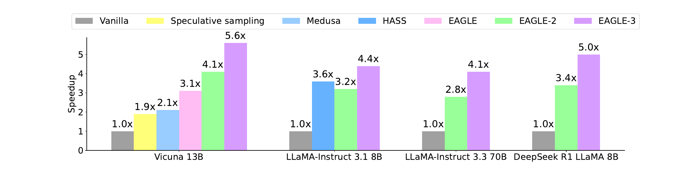
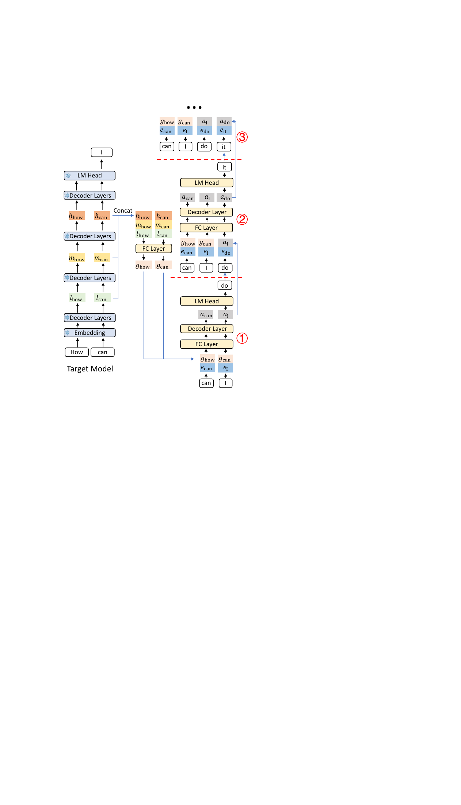
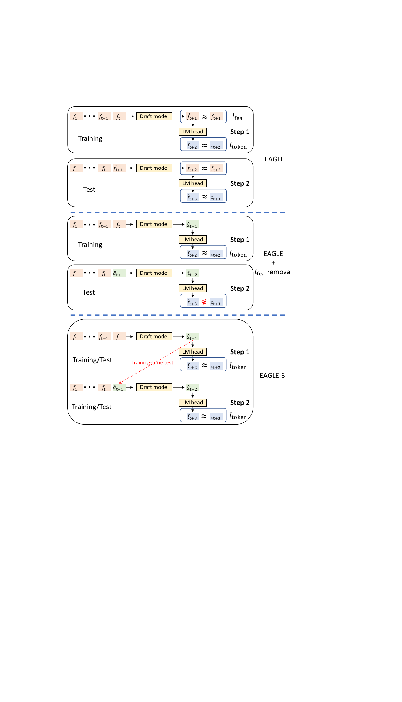
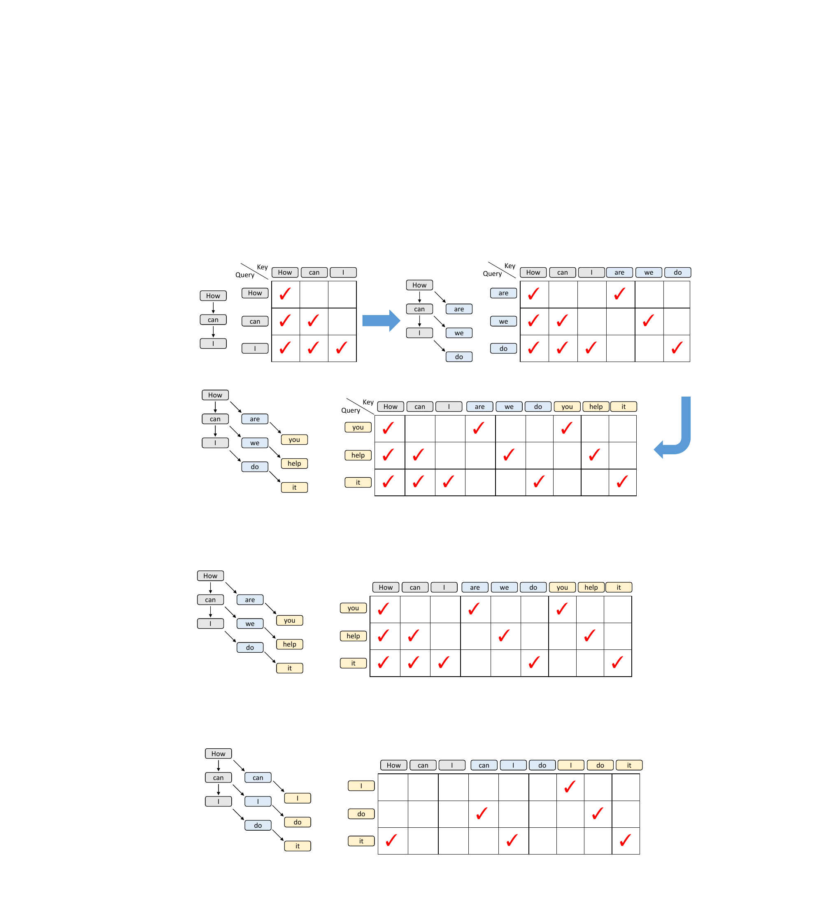
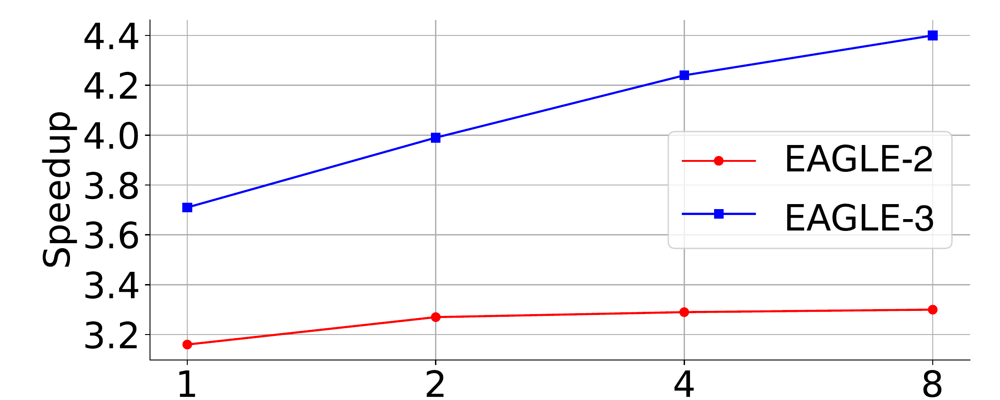
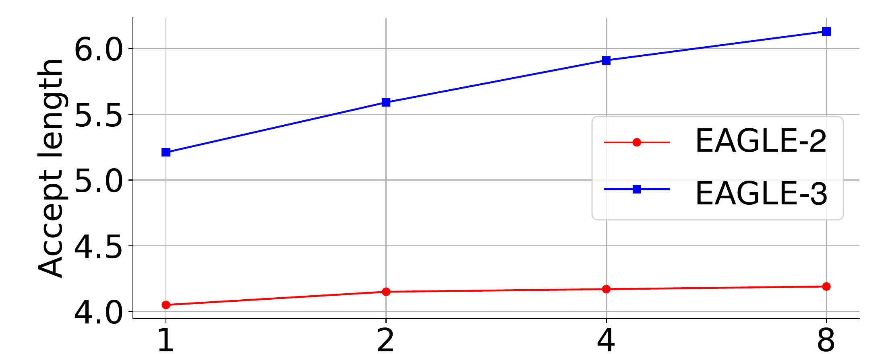
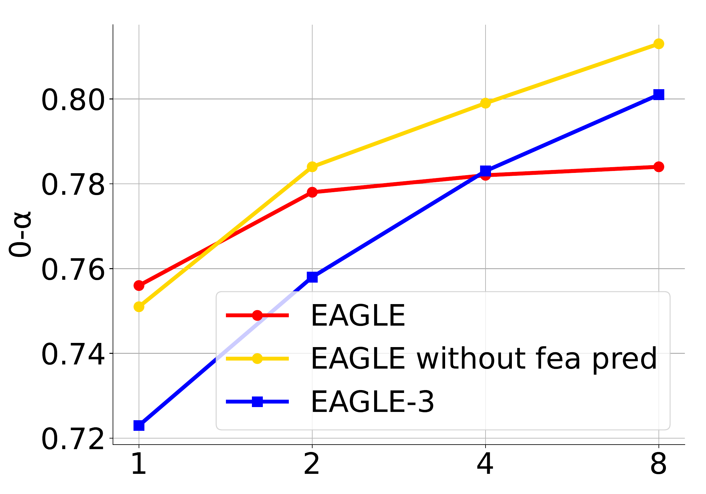
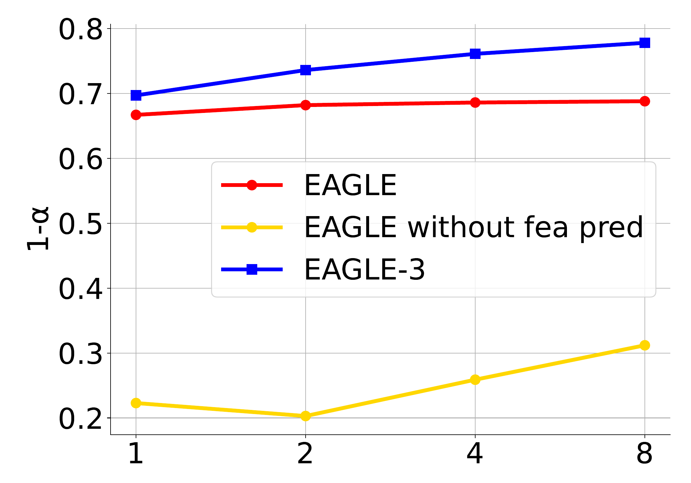

# EAGLE-3：通过训练时测试扩展大语言模型推理加速

[所属章节](../index.md) · [来源与阅读状态](../../../../sources/papers.json)


- **作者**：Yuhui Li、Fangyun Wei、Chao Zhang、Hongyang Zhang
- **年份与固定版本**：2025；arXiv:2503.01840v3（2025-04-23）
- **原始链接**：[arXiv:2503.01840v3](https://arxiv.org/abs/2503.01840v3)；作者代码：[SafeAILab/EAGLE](https://github.com/SafeAILab/EAGLE)
- **固定版本材料**：缓存的 `source/paper.pdf`、`source/paper.txt` 与作者 LaTeX 工程 `source/tex/paper.tex`（manifest 标注 v3）。
- **实际阅读范围**：正文第 1--6 节（Introduction、Speculative Sampling、EAGLE/EAGLE-2、EAGLE-3 方法、Experiments、Related Work、Conclusion）及附录 A Implementation Details；正文 12 页中与方法、主表、图和部署实验相关的全部内容均已核对，参考文献未作逐篇精读。

## 1. 这篇论文要解决什么

大语言模型的自回归解码每生成一个 token 都要访问目标模型的全部参数；当模型达到数十亿乃至数千亿参数时，计算之外的显存访问和串行依赖成为主要延迟来源。推理时扩展（例如让模型先进行较长的思维）进一步提高了生成 token 数，因此降低每个 token 的实际解码成本变得更重要。EAGLE-3 属于 speculative sampling（推测采样）家族：一个便宜的 draft model 先提出一批候选 token，目标模型一次并行前向计算这些候选，随后严格逐 token 验证。只要保留标准接受/拒绝规则，输出分布与目标模型的普通自回归采样一致；加速来自一次目标模型前向中接受了多个 token，而不是把生成文本删短或压缩 token。

论文研究的问题是：已有 EAGLE/EAGLE-2 使用目标模型最后一层特征帮助 draft model，为什么增加训练数据后收益有限，怎样让 draft model 从扩大数据中继续受益并提升推测接受长度。核心诊断是两个耦合限制：

1. EAGLE 要求 draft model 自回归预测“下一步目标特征”，再把该特征送入目标模型 LM head 产生 token。特征回归损失是为多步推测提供稳定接口，却给最终目标（预测 token）加了额外约束。
2. 只用 LM head 之前的顶层特征，信息天然最直接地对应“下一个 token”的 logits，却不一定适合预测 next-next token。移除特征约束后，若仍在训练时只喂真实特征，部署时第一个自生成向量会改变后续输入分布，造成训练--推理失配和误差累积。

EAGLE-3 的回答是两点同时改变：用 **training-time test** 在训练中模拟 draft 自己的多步输出，并改为直接预测 draft token 所需的自由向量；在可用的目标模型信息上，把低层、中层、高层特征融合成输入，而不是只复用顶层特征。作者报告的最高 speedup 为 6.5x，且在 SGLang、batch size 64 时仍有 1.38x throughput。




图 2（LaTeX 标签 `fig:speedup`，原图资产 `assets/r1.pdf`）在温度 0 下给出若干方法的 speedup 子集：Vicuna-13B、LLaMA-Instruct 3.1 8B、LLaMA-Instruct 3.3 70B 和 DeepSeek-R1-Distill-LLaMA 8B。它不是完整主表，而是便于看到 EAGLE-3 相对标准 speculative sampling、Medusa/Hydra、EAGLE/EAGLE-2 的总体位置；对聊天模型使用 MT-bench，对 reasoning 模型使用 GSM8K。

## 2. 先把推测采样的对象说清楚

设已确认前缀为 $`T_{1:j}=t_1,ldots,t_j`$。draft model 自回归地产生 $`k`$ 个候选 $`hat T_{j+1:j+k}`$，并保存每个候选在 draft 分布中的概率 $`hat p_{j+i}(hat t_{j+i})`$。目标模型并行评估这条候选序列，得到概率 $`p_{j+i}`$。从前向后，候选 token $`hat t_{j+i}`$ 以如下概率接受：

```math
\alpha_{j+i}=\min\left(1,\frac{p_{j+i}(\hat t_{j+i})}{\hat p_{j+i}(\hat t_{j+i})}\right).
```

拒绝时，不是简单返回目标模型的 argmax，而是从

```math
\operatorname{norm}\!\left(\max(0,p_{j+i}-\hat p_{j+i})\right)
```

采样一个替代 token，并丢弃该位置之后的候选。接受则继续检查下一个候选。Leviathan 等人的证明说明这套修正后的采样与目标模型普通自回归分布一致。EAGLE-3 没有改目标模型权重，也没有放宽接受条件，因此论文不再报告生成质量；速度和接受长度是其主要评估对象。需要区分三个量：

- **speedup ratio** 是实测总解码速度相对于 vanilla 自回归的比值，包含 draft、target verification 和系统实现开销；
- **平均接受长度 $`τ`$** 是每轮 draft--verification 中平均从 draft 接受的 token 数；
- **$`n`$-$`\alpha`$** 是在前面已有 $`n`$ 个 draft 自预测值且它们都被接受的条件下，下一位置的接受率。它专门测量误差是否随自回归深度积累，且论文的这项图实验使用 chain-like draft，不等同于最终树解码吞吐。

因此，这里的 token 目标是“每轮验证实际接受多少新 token、端到端每秒产生多少 token”，不是将输入/输出 token 压缩成更少的语义 token；目标模型仍验证生成结果，失败候选也可能被丢弃。

## 3. EAGLE 到 EAGLE-3 的结构变化

### 3.1 EAGLE/EAGLE-2 的基线思路

普通 speculative sampling 使用一个独立的小语言模型作为 draft。EAGLE 利用目标模型已计算出的顶层 hidden feature，在 feature level 自回归，然后用目标模型的 LM head 把预测特征转成 token 分布。由于采样 token 的随机结果在 feature 回归中并不显式可见，EAGLE 还把上一个时间步的 token 序列作为输入。EAGLE-2 沿用这一路径，但根据 draft model 的置信度动态构建和裁剪 draft tree；静态树在容易或困难的上下文中都可能浪费节点。EAGLE-3 保留 EAGLE-2 的 context-aware dynamic tree，并将 draft tree 的深度从 6 增至 8，同时保持相同节点数（附录 A）。

### 3.2 推理时的多层特征融合与三步 draft

考虑前缀 “How can”。目标模型的 prefill 或上一轮 verification 已经计算了各位置的低层、中层和高层 hidden feature，记为 $`l,m,h`$，每个向量维度为目标模型 hidden size $`k`$。对每个位置，把三者串接成 $`3k`$ 向量，再通过 FC 层压回 $`k`$ 维：

```math
g_t = W_g[l_t;m_t;h_t]+b_g,\qquad g_t\in\mathbb R^k.
```

这里的 $`g_t`$ 是多层语义信息的融合表示。它并不是新的目标模型层，也不是 draft model 预测出的目标特征。




图 5（LaTeX 标签 `fig:pipline`，`assets/method.pdf`）把一个 draft round 展成三个步骤。目标模型先给出下一个真实已采样 token “I”，但在 draft 阶段只掌握其 token embedding $`e_\mathrm I`$，而不能得到尚未被 target 检查的 $`g_\mathrm I`$。draft model 将融合特征与采样 token embedding 拼接，经 FC 降维后输入一个 Transformer decoder layer，输出自由向量 $`a`$；再把 $`a`$ 送入目标模型 LM head，得到 draft token “do”。具体地：

1. **Step 1**：使用前缀 “How can” 的 $`g_\mathrm{how},g_\mathrm{can}`$ 和已采样 token “I”的 embedding $`e_\mathrm I`$，输出 $`a_\mathrm I`$，经 LM head 得到 draft token “do”。
2. **Step 2**：这时 “I” 尚未由 target 验证，不能得到 $`g_\mathrm I`$，于是用上一阶段的 draft 输出 $`a_\mathrm I`$ 替代 $`g_\mathrm I`$；再拼接下一个采样结果的 embedding $`e_\mathrm{do}`$，得到 $`a_\mathrm{do}`$。
3. **Step 3**：同样用 $`a_\mathrm{do}`$ 替代未知的 $`g_\mathrm{do}`$，拼接 $`e_\mathrm{it}`$，继续生成。更深位置都沿用“已知目标融合特征 + 自己生成的自由向量”的混合输入。

用伪代码表示其因果关系如下（省略批量、树分支和 KV cache）：

```text
g[known positions] = FC(concat(low, mid, high))
for depth = 1 ... D:
    x = concat(previous_context_vectors, embedding(sampled_token))
    a = one_decoder_layer(x, causal_context)
    draft_token, draft_prob = sample(target_LM_head(a))
    append(a, draft_token, draft_prob)
    # 后续位置把 a 当作尚未可获得的 g 的替代
target_logits = target_model(prefix + drafted_tree)   # tree attention 并行验证
accept_or_resample_left_to_right(target_logits, draft_probs)
```

伪代码中的 `a` 是直接为 token 预测服务的 unconstrained vector；它不需要逼近某个目标层的真实 hidden state。目标模型只在 verification 中重新计算并验证树中候选，因而 draft 的任意误差不会改变最终输出分布，只会影响接受长度与速度。

### 3.3 为什么要 training-time test

在原 EAGLE 中，训练主要在 Step 1 上学下一特征，并通过 feature loss $`l_{\rm fea}`$ 帮助模型适应后续步骤。论文的诊断是：$`l_{\rm fea}`$ 虽能稳定特征递归，却把模型限制在“复现顶层 feature”的任务上，而不是直接最大化 draft token 被接受的机会。移除该项并扩大数据后，第一个 draft token 的 0-$`\alpha`$ 接受率上升；但如果训练仍只输入真实 $`f_1,\ldots,f_t`$，部署第二步收到的是模型自身输出 $`\hat a_{t+1}`$，与训练分布严重偏离，1-$`\alpha`$ 反而很低。

Training-time test 把部署中的这种自反馈写入训练：先用真实训练序列执行一个 native training step，得到 draft 输出；接着把该输出作为下一步输入，执行 simulated training step，再继续反馈。损失仍对每一步的真实下一个 token 直接做 token prediction，但输入路径已经包含模型自己的历史输出。这样训练分布与部署分布在“第一个自生成向量之后”对齐。




图 3（`assets/nofe.pdf`）上半部是 EAGLE 的 feature prediction 与 $`l_{\rm fea}+l_{\rm token}`$；中部移除 feature constraint 后只看 token prediction，却仍有 train/test gap；底部是 training-time test：训练阶段也展开 Step 1、Step 2，并在每一步对 token 目标计算 $`l_{\rm token}`$。图中把 EAGLE-3 输入简化画成 feature，论文特别说明真实输入是融合后的 $`g`$ 与反馈的 $`a`$。

注意这与 HASS 的相似处仅在“训练时模拟多步 drafting”。HASS 的目标是缓和 EAGLE 特征预测造成的误差累积，仍保留顶层 feature 输入和 $`l_{\rm fea}`$；EAGLE-3 则删除 feature prediction constraint，把输入改为自由向量和多层融合，目标是扩大表达能力并释放数据规模收益。作者用图 2 报告 EAGLE-3 明显优于 HASS，但正文没有给出 HASS 的完整逐任务表格。




图 6（`assets/train.pdf`，LaTeX 标签 `fig:mask`）画出训练时 attention causal mask：第一列是原始灰色训练 token，后续蓝色、黄色 token 是第一轮和第二轮 draft 预测。原始 token 之间使用标准下三角依赖；模拟 token 之间除与原始 key 的联系外基本是对角结构，因为每个位置的预测只能依赖其对应分支的历史。作者指出若把这类关系直接写成完整矩阵乘法，会有明显计算浪费；对原训练 key 可用向量点积计算对应 attention score。这是训练实现上的自注意力修改，draft 的核心仍是一个 Transformer decoder layer。

### 3.4 为什么融合低、中、高层特征

顶层 feature 在 LM head 满秩时对“下一个 token”的 logits 具有直接且唯一的对应关系，因此适合 EAGLE 的 feature prediction；但 next-next token 需要更宽的上下文语义。EAGLE-3 已经不要求预测结果落在目标顶层 feature 流形上，因此可把低层的局部/词法信息、中层的组合信息和高层的语义/输出信息拼接，再用一个 FC 学习如何压缩到 draft layer 的宽度。这是作者的结构动机与实验支持的解释；论文没有单独证明三种层级各自编码何种语义，也没有报告对不同层选择、融合权重或 FC 深度的系统敏感性。

## 4. Scaling law：数据规模为何现在能带来收益





图 1（`assets/scaale.pdf` 和 `assets/scaletau.pdf`，LaTeX 标签 `fig:sc`）在 LLaMA-Instruct 3.1 8B、MT-bench 上，横轴是相对于 ShareGPT 的训练数据规模，分别画 speedup ratio 与平均接受长度。EAGLE-2 曲线基本没有随数据规模明显上升；EAGLE-3 曲线随数据规模增加而上升。作者把这称作 inference acceleration 的 scaling law，并称约使用 EAGLE 训练数据 8 倍时，batch size 1 的 latency 比 EAGLE-2 提高约 1.4x。

这个结论应精确理解为：在保持目标模型和解码框架不变时，训练 draft model 的更多数据提高了其接受率/接受长度，进而提高实测解码 speedup。它不是目标模型质量 scaling，也不是 token 数压缩规律。图的横轴是数据规模相对 ShareGPT，正文没有提供每个点的完整样本 token 数、训练步数或总训练 FLOPs，因此不应从斜率推导普适的成本最优前沿。数据规模收益的必要解释条件是：架构已移除 feature regression 的表达约束，training-time test 解决了自反馈分布偏移，并且新数据分布与目标任务足够相关；论文没有证明脱离这些条件后仍必然保持比例增长。





图 4（`assets/alpha0.pdf` 与 `assets/alpha1.pdf`，LaTeX 标签 `fig:sc1`）进一步拆开第一和第二个 draft 位置的接受率。扩大数据后，直接移除 feature prediction 的版本的 0-$`\alpha`$ 明显提升，但因为 Step 1 输出远离真实 feature，1-$`\alpha`$ 很低；EAGLE-3 的 training-time test 使后续位置也保持较高接受率。这是对 train/test mismatch 机制的局部证据，不是对所有任务或任意深度的因果证明。

## 5. 正文实验：设置、指标和结果

### 5.1 模型、任务和训练

目标模型包括 Vicuna 13B、LLaMA-Instruct 3.1 8B、LLaMA-Instruct 3.3 70B 和 DeepSeek-R1-Distill-LLaMA 8B；GPU 限制使作者没有测试 405B 和 671B。五个任务与数据集分别是多轮对话 MT-bench、代码生成 HumanEval、数学推理 GSM8K、指令遵循 Alpaca、摘要 CNN/Daily Mail。各任务使用同一套 draft 权重，不对任务单独 fine-tune。

训练数据包括约 68K 条 ShareGPT 和约 464K 条 UltraChat-200K；目标模型被调用来生成响应，而非直接把固定响应数据当作 target labels。针对 DeepSeek-R1-Distill-LLaMA 8B，另加入 OpenThoughts-114k-math。优化器是 AdamW，$`(\beta_1,\beta_2)=(0.9,0.95)`$，learning rate $`5\times10^{-5}`$，gradient clipping 0.5。正文没有提供每个模型的 epoch、batch size、训练步数、总训练 token 数或训练时间。

主实验把 vanilla autoregressive decoding 设为 1.00x 基线；比较标准 speculative sampling、PLD、Medusa、Lookahead、Hydra、HASS、EAGLE 和 EAGLE-2。温度 0 和温度 1 均测 Vicuna 13B、LLaMA 3.1 8B、LLaMA 3.3 70B、DeepSeek 蒸馏 8B，但温度 1 不比较那些放宽接受条件、不能保证 lossless acceleration 的方法（如 Medusa）。Vanilla 使用 HuggingFace Transformers/PyTorch 和预分配 KV cache；其他方法以相同基础模型实现，附录说明 EAGLE-2 对 8B/13B/70B 的 draft token 总数分别为 50/50/48、树深 6、扩展时选 10 个节点；EAGLE-3 保持节点数而把深度增至 8。

### 5.2 五任务主结果

主表 1（`tab:experiments`，tex 行 250--299）报告每个任务的 speedup 和 $`\tau`$，不是模型质量。温度 0 的均值如下：

| 目标模型 | EAGLE-2 mean speedup / $`\tau`$ | EAGLE-3 mean speedup / $`\tau`$ | 观察 |
|---|---:|---:|---|
| Vicuna 13B | 4.22x / 4.83 | **5.51x / 6.62** | HumanEval 最高：6.47x、$`\tau=7.54`$；CNN/DM 较低但仍 5.01x |
| LLaMA-Instruct 3.1 8B | 3.23x / 4.11 | **4.44x / 6.23** | MT-bench 4.40x、HumanEval 4.85x |
| LLaMA-Instruct 3.3 70B | 2.85x / 3.78 | **4.12x / 5.88** | HumanEval 4.79x；70B 上仍保持明显收益 |
| DeepSeek-R1-Distill-LLaMA 8B | 3.26x / 3.92 | **4.16x / 5.84** | GSM8K 5.01x、$`\tau=6.93`$，作者归因于 OpenThoughts 数学数据 |

Vicuna 13B 的 EAGLE-3 逐任务 speedup 为 MT-bench 5.58x、HumanEval 6.47x、GSM8K 5.32x、Alpaca 5.16x、CNN/DM 5.01x；对应 $`\tau`$ 为 6.65、7.54、6.29、6.17、6.47。LLaMA-Instruct 3.1 8B 的 speedup 为 4.40x、4.85x、4.48x、4.82x、3.65x；LLaMA-Instruct 3.3 70B 为 4.11x、4.79x、4.34x、4.30x、3.27x；DeepSeek 蒸馏 8B 为 4.05x、4.59x、5.01x、3.65x、3.52x。作者的总体概括是相对 vanilla 约 3.0--6.5x、相对 EAGLE-2 提升约 20%--40%，但提升幅度随任务和模型变化。

温度 1 下 EAGLE-3 仍优于 EAGLE-2。例如 LLaMA 3.1 8B 的 mean 是 3.45x、$`\tau=4.92`$，相对 EAGLE-2 的 2.80x、3.62；Vicuna 13B 是 4.65x、5.67，相对 EAGLE-2 的 3.76x、4.41。温度升高后所有方法接受率下降，不能把温度 0 的最高数值直接外推到随机采样场景。

HumanEval 的优势与代码中的固定模板较多、draft 较容易有关；这是作者的解释而非独立控制变量实验。DeepSeek 在 GSM8K 上最高，则“可能”来自使用 OpenThoughts-114k-math 训练 draft。论文没有为不同数据混合比例提供单独消融。

### 5.3 接受率分析：训练时测试是否真的解决递归退化

图 7（`fig:alpha`，`assets/alpha.pdf`）在 MT-bench、LLaMA-Instruct 3.1 8B 上比较 EAGLE 与 EAGLE-3 的 chain-like $`n`$-$`\alpha`$。当输入中自预测值数量增加时，EAGLE 的接受率显著下降；EAGLE-3 基本保持平坦且整体更高。由于前面的估计必须先被 target 接受，这项定义正是“误差逐步反馈”的条件接受率，而非无条件平均 token accuracy。它支持 training-time test 减轻多步失配的解释，但图只覆盖一个模型和一个任务。

### 5.4 逐项消融

表 2（`tab:aba`，tex 行 335--354）固定目标为 LLaMA-Instruct 3.1 8B，在 MT-bench 与 GSM8K 上逐步加回两个设计：

| draft 版本 | MT-bench speedup / $`\tau`$ | GSM8K speedup / $`\tau`$ |
|---|---:|---:|
| EAGLE-2 | 3.16x / 4.05 | 3.39x / 4.24 |
| 移除 feature constraint | 3.82x / 5.37 | 3.77x / 5.22 |
| 再加入 fused features（EAGLE-3） | **4.40x / 6.13** | **4.48x / 6.23** |

结果表明在这两个任务上，移除 feature regression 已经带来主要第一段增益，而多层融合再带来一段增益。它证明两个改动都有效，但由于没有报告只换不同层组合、不同 FC 或训练步数匹配的更多对照，不能把表中差值解释为独立的普适贡献比例。

### 5.5 SGLang 与 vLLM：系统吞吐不是单轮接受长度

SGLang v0.4.4 的实验由 SGLang 团队进行，单张 H100、LLaMA-Instruct 3.1 8B、MT-bench；大 batch 实验不使用 tree，chain length=3，无 speculative sampling 的 SGLang 是 1.00x。EAGLE-3 的 throughput improvement 在 batch 2/4/8/16/24/32/48/56/64 分别是 1.81/1.82/1.62/1.48/1.39/1.32/1.38/1.34/**1.38x**；EAGLE 在 batch 24 已降至 0.93x，batch 64 为 0.99x。也就是说在系统并行度高、draft 冗余更难转化成吞吐的场景，EAGLE-3 仍报告 64 batch 的 38% 提升。

SGLang batch 1 的绝对 throughput 是：无 speculative 158.34 tokens/s，EAGLE-2 244.10 tokens/s，EAGLE-3 373.25 tokens/s（表 4，`tab:sglang latency`）。这是 tokens/s 的系统实测，并非只由 $`\tau`$ 换算；硬件、框架和 kernel 开销都包含在内。

vLLM 实验的表注写明 A100、LLaMA-Instruct 3.1 8B、MT-bench、无 speculative 的 vLLM 为 1.00x；正文则称实验使用 RTX3090，存在硬件表述不一致，读者应以表注和原文为准并视作一个需要复核的报告缺口。该实验也不使用 tree，最大 chain length=2。EAGLE-3 相对 baseline 在 batch 2/4/8/16/24/32/48/56 为 1.75/1.68/1.58/1.49/1.42/1.36/1.21/1.01x；EAGLE 在 batch 32 起跌破 1，batch 56 为 0.71x。框架与硬件不同，不能把这些数与 SGLang 表直接排名。

## 6. 论文结论、可推出解释与局限的边界

作者的结论是：training-time test 允许 draft model 直接预测 token、接受自由输入；低中高层融合提供比顶层单一 feature 更丰富的条件信息；扩大训练数据因此能继续提高 EAGLE-3 的接受率和加速。主表、消融和 $`n`$-$`\alpha`$ 图共同支持“多步反馈稳定性和接受长度提高”这一经验结论。

从公式和结构可以推出的解释是：draft model 输出 $`a`$ 不再承担“还原目标 hidden state”的任务，所以优化自由度增加；同时训练中用自己的历史输出继续预测，使部署时的输入分布更接近训练分布。这解释了为何深度增加后 EAGLE-3 的 $`n`$-$`\alpha`$ 下降较少，但不是论文给出的形式化收敛证明。

局限和未报告项包括：

- 论文只把严格 speculative sampling 的分布保持作为理论保证，没有测量质量曲线；因此 speedup 不能改写成“质量不变且 token 数变少”，准确表述应是目标模型分布保持下的解码加速。
- 没有报告 draft 训练的总 token、步数、wall-clock、显存、训练 FLOPs，也没有完整的 latency--训练成本前沿；“约 8x 数据”是相对 EAGLE 的实验描述，不足以给出普适最优数据规模。
- 主测量覆盖四个公开目标模型和五任务，405B/671B 因 GPU 限制未测；$`n`$-$`\alpha`$ 只在一个目标/任务上画出，训练数据与目标任务的匹配效应尚未系统拆分。
- tree 深度、节点数、chain length 在不同实验中不同；SGLang/vLLM 的大 batch 实验不使用最终动态树，因此吞吐结果不能直接等同于完整 EAGLE-2/EAGLE-3 tree decoding。
- vLLM 正文的 RTX3090 与表注的 A100 有不一致；SGLang 表由外部团队测量，硬件和软件版本虽给出部分信息，但缺少更完整的 profiling 与重复方差。
- 论文只报告有限消融，没有对 low/mid/high 具体层位置、融合 FC、采样温度、树预算、训练数据混合和 draft size 做系统敏感性分析。

与推理时 token 效率的关系是：EAGLE-3 优化的是“在保持目标分布的前提下，一次昂贵 target verification 可以确认多少 draft token”，从而降低单位已生成 token 的延迟和部分吞吐成本；它不改变目标任务所需的输入/输出 token 数、也不直接减少 reasoning trace 长度。对推理时 token 预算研究，最相关的可迁移量是接受长度、拒绝后重算比例、tree/chain 预算和端到端 tokens/s，而不是把 4--6x speedup 当成 4--6x token compression。

## 7. 正文图与资产记录

正文使用的作者原始 LaTeX 资产已从固定 `latex-source.tar` 提取到 `assets/`。图中的  标记对应如下：

| 图标记 | 原文图号/标签 | 内容 |
|---|---|---|
| `fig:sc` | Figure 1 | 数据规模与 speedup、平均接受长度 scaling |
| `fig:speedup` | Figure 2 | 温度 0 的方法 speedup 总览 |
| `fig:nofe` | Figure 3 | training-time test 与 EAGLE 对比 |
| `fig:sc1` | Figure 4 | 不同数据规模的逐位置接受率 |
| `fig:pipline` | Figure 5 | How can I 示例的三步推理 pipeline |
| `fig:mask` | Figure 6 | 训练 native/simulated steps 的 attention mask |
| `fig:alpha` | Figure 7 | EAGLE 与 EAGLE-3 的 $`n`$-$`\alpha`$ |

原始论文许可证页面：[arXiv nonexclusive-distrib 1.0](http://arxiv.org/licenses/nonexclusive-distrib/1.0/)。该许可证和作者源工程允许分发论文源文件，但并未在论文中逐图声明独立的图片再利用许可；因此 handoff 中把 `reuse_allowed` 记为 `false`/需主代理复核，不把提取出的 PDF 资产当作已获再发布授权。

## 8. 可作为后续候选、但本稿未精读的论文

- **EAGLE**（[arXiv:2401.10774](https://arxiv.org/abs/2401.10774)）：理解顶层 feature prediction、$`l_{\rm fea}`$ 与 EAGLE-3 的约束来源。
- **EAGLE-2**（[arXiv:2406.16858](https://arxiv.org/abs/2406.16858)）：理解 confidence-driven dynamic draft tree 和节点预算。
- **HASS**（[arXiv:2408.15766](https://arxiv.org/abs/2408.15766)）：比较另一种 training/test mismatch 与 error accumulation 处理。
- **Speculative decoding**（[arXiv:2302.01318](https://arxiv.org/abs/2302.01318)）：核对严格接受/拒绝分布保持证明。
- **SGLang**（[arXiv:2312.07104](https://arxiv.org/abs/2312.07104)）和 **vLLM/PagedAttention**（[arXiv:2309.06180](https://arxiv.org/abs/2309.06180)）：解释部署吞吐和内存访问背景。
