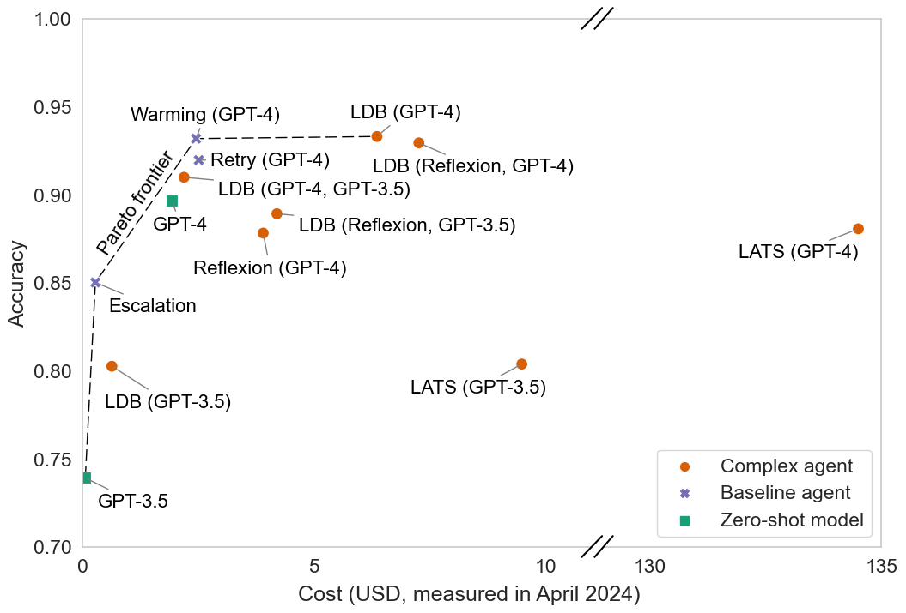
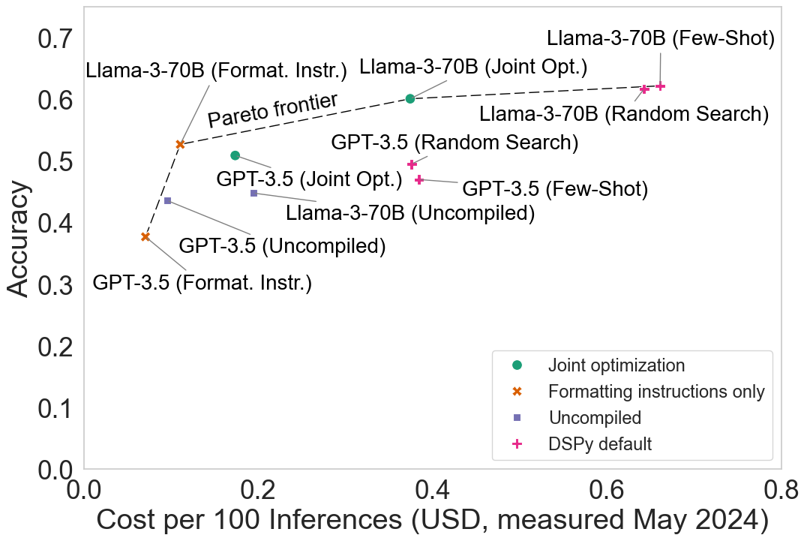
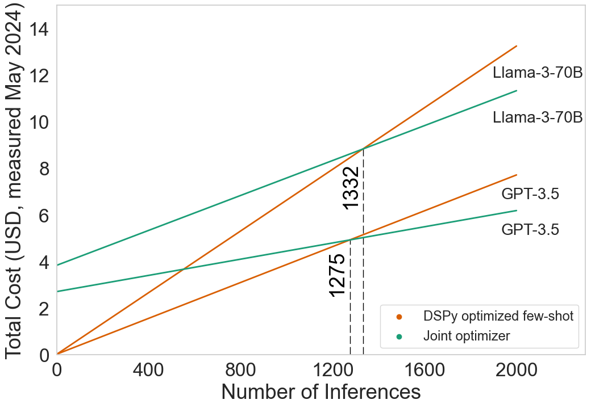

# AI Agents That Matter：把智能体评估从“只看准确率”改成成本、泛化与可复现的工程科学

[所属章节](../index.md) · [来源与阅读状态](../../../../sources/papers.json)


**作者**：Sayash Kapoor、Benedikt Stroebl、Zachary S. Siegel、Nitya Nadgir、Arvind Narayanan（Princeton University） <br>
**年份/固定版本**：2024；arXiv:2407.01502v1（2024-07-02 论文页；PDF 标注 2024-07-01） <br>
**原始链接**：[arXiv:2407.01502v1](https://arxiv.org/abs/2407.01502v1)，[作者代码](https://github.com/benediktstroebl/agent-evals) <br>
**实际阅读范围**：固定版本 `source/paper.pdf`、其文本抽取 `source/paper.txt`、作者 LaTeX `source/tex/main.tex`、正文 Sections 1–7，以及为理解正文实验补读的 Appendices A–I（实验实现、误差条、成本摊销、NovelQA 成本表、WebArena/HumanEval 复现问题、局限与复现声明）。未将参考文献逐篇精读；没有把二手摘要当作论文证据。

## 这篇论文要解决什么问题

论文的中心判断是：LLM 智能体与一次性语言模型调用不同，不能用“排行榜准确率”这一条轴来代表进步。智能体可以在环境中多轮调用模型、运行代码、检索和重试，因此多调用几次往往就能提高成功率；若不控制成本，最容易得到的是极昂贵、难以复现且可能只对基准题目有效的系统。作者把问题拆成五条建议：评估必须控制成本；设计时联合优化准确率和成本；模型开发者与下游采购者的评估需求要分开；holdout 必须匹配希望得到的泛化层级；评估脚本、环境和报告标准要足够统一才能复现（摘要；§1）。

“智能体”在本文不是一个硬边界定义，而是一个连续谱。更复杂的环境和目标（多任务、多领域、多方参与、长时程、变化环境）、更自然语言化且更少人工监督的交互，以及工具使用、规划、反思、子目标分解和由 LLM 动态控制流程，都会使系统更 agentic（§1.1）。这一定义选择很关键：本文讨论的不是某个神秘架构是否“真正是 agent”，而是不同系统在真实使用时增加了哪些可变成本、环境交互和评估风险。

## 1. 准确率最大化会把推理成本推向无界

在 GSM-8K、MATH、Chess、MMLU 等任务上，重复调用并投票可以提升准确率；当环境能立即告诉系统代码是否通过测试时，可以一直重试。论文引用 AlphaCode 的极端例子：从接近 0% zero-shot，到 1,000 次重试时超过 15%，到一百万次重试时超过 30%（§2.1）。这不是说每个任务都应百万次采样，而是说明“准确率更高”本身不能识别科学上有意义的架构进步。

### HumanEval 的二维评估

作者重新运行了 HumanEval 上公开代码的 LDB、LATS、Reflexion，并增加三种简单基线。所有结果使用 LDB 修改版 HumanEval：164 个问题都有可用于重试/调试的示例测试；原始版本只有 161/164 个问题有示例测试（§2.2；Appendix A.1）。比较对象是：

* GPT-3.5、GPT-4 zero-shot；
* **Retry**：温度为 0，若示例测试失败，最多重试 5 次，任何一次通过就停止；
* **Warming**：同样最多 5 次，但温度从 0 逐步升到 0.3、0.5，增加采样多样性；
* **Escalation**：从便宜的 Llama-3 8B 开始，失败后依次升级到 GPT-3.5、Llama-3 70B、GPT-4；
* LDB、LATS、Reflexion：分别用运行时调试、树搜索/反思与内部测试等复杂控制流。

作者将每个 agent 的平均准确率与一次完整评估的平均 API 美元成本画在同一图上。若某点没有另一个点在两个维度都显著更好，则保留在 Pareto 前沿；正文中进一步取凸前沿，因为可以以概率 $`p`$ 运行 agent A、以 $`1-p`$ 运行 agent B，得到两点之间的线性混合（§2.3、Appendix A.1）。这里的“成本”是 API 输入和输出 token 按当时价格折算的美元，不是 token 数，更不是训练 FLOPs；因此价格变化后美元坐标会变化，原始 token 统计应一起发布。



**图 1 读法。** 横轴为平均总 API 成本，纵轴为 164 题平均准确率；正文图为便于看清高准确率区域而使用非标准、截断坐标，完整坐标见 Appendix Figure A2，误差条见 A1。复杂 agent 没有显示出超越简单基线的可靠准确率优势：Warming 的准确率与最好复杂架构无显著差异；LDB 和 Reflexion 的成本比 Warming 高至少约 50%，LATS 高出 50 倍以上，而 Escalation 还比 LDB（GPT-3.5）便宜一半以上且提高准确率（§2.3）。

Appendix Table A1 给出更完整的均值（每个 agent 在 164 题上跑 5 次，括号为最小–最大）：Warming (GPT-4) 93.2% / $`2.45，Retry (GPT-4) 92.0% / `$2.51，LDB (GPT-4) 91.0% / $`2.19，LDB (GPT-4) 的另一配置 93.3% / `$6.36，LDB (GPT-3.5) 80.2% / $`0.63，Reflexion (GPT-4) 87.8% / `$3.90，LATS (GPT-4) 88.0% / $`134.50，GPT-4 zero-shot 89.6% / `$1.93，GPT-3.5 zero-shot 73.9% / $`0.05；Escalation 85.0% / `$0.27。准确率列不是“成本校正后的分数”，而是单独报告的任务结果；美元成本是所有 API 调用的总和。

作者没有据此证明“反思、调试、规划永远无用”。他们证明的是：在 HumanEval 这个任务上，复杂 agent 在和简单的重试、升温、升级基线进行成本公平的对比前，不能归因说提升来自 System 2 机制。更难的 SWE-bench 可能需要这些机制。模型价格与版本也会改变数值，所以论文做了 2023 年 6 月模型的稳健性分析：复杂 agent 仍常常贵几个数量级而没有更好结果；LATS（GPT-3.5）有超过两小时的任务，并因 HumanEval/83 超过 5 小时仍未停止而把该题标错且从时间/成本统计中剔除（Appendix A.2）。

## 2. 以 Pareto 前沿直接联合优化准确率与成本

作者把 agent 的总成本拆成固定成本与可变成本：

```math
C_{total}(N)=C_{fixed}+N\,C_{variable},
```

其中 $`C_{fixed}`$ 是一次性搜索温度、prompt、few-shot 例子等设计超参数的成本，$`C_{variable}`$ 是每次部署运行产生的输入/输出 token API 成本，$`N`$ 是实际任务次数（§3、Appendix B）。这里的固定成本不是训练 LLM 的成本，也不等于一次任务的 token 费；它是为了找到一个更好 prompt/程序而提前付出的搜索费用。

一个教学例子：若未编译 DSPy agent 每次成本为 1 单位，联合优化额外花 100 单位固定成本，但把每次成本降为 0.7，那么在

```math
100+0.7N < 1.0N \quad\Longleftrightarrow\quad N>333.3
```

次使用后才回本。这个例子使用“成本单位”说明摊销，不能把它读成论文美元结果。实际部署还应把输入 token 单价、输出 token 单价、缓存/批量折扣和服务商变化分别记录；token 数是可迁移的底层计量，美元是特定价格时刻的采购成本。

### HotPotQA：联合优化到底优化了什么

HotPotQA 是多跳问答，作者使用 DSPy 默认的简化 Baleen 流程：每一跳由语言模型根据问题和已取上下文生成检索 query；ColBERTv2 从 2017 Wikipedia dump（每篇文章首段）取 top-$`k`$ 段；去重后加入上下文，最多两跳、每跳取两个 passage；最后由语言模型基于问题和检索结果作答（§3.1；Appendix B.1）。实验使用 100 个 HotPotQA 训练样本做优化，200 个 evaluation 样本测试；固定随机种子，并在两个底层模型上重复 5 次：GPT-3.5（Azure，输入/输出 $`0.5/1.5`$ 美元每百万 token）和 Llama-3-70B（Together.ai，输入/输出 $`0.9/0.9`$ 美元每百万 token），价格为 2024 年 5 月（Appendix B.1）。

必须分清本文 HotPotQA 的指标层级：**最终报告的“accuracy”是检索支持文档准确率**，即每道题的所有 ground-truth 文档是否都被检索到；不是通常意义上对最终自然语言回答计算的 EM。DSPy 编译阶段的 metric 同时要求预测答案与 ground truth 匹配、答案出现在检索上下文中、每条生成 query 不超过 100 字符且彼此足够不同；但论文正文的测试表与图以“是否找全指定文档”的 retrieval accuracy 为主。论文没有报告独立的最终答案 EM 曲线，因此不能把 0.509 或 0.601 写成回答 EM，也不能把支持文档召回替换成回答正确率。

五种设计如下：

1. **Uncompiled**：没有 prompt 优化、few-shot 或格式说明；只放任务指令、问题、上下文和推理内容。
2. **Formatting instructions only**：在同一基线中加入 DSPy 的 query 输出格式说明。
3. **Few-shot**：用全部 100 个训练样本找成功 trace，加入格式说明和有效示例。
4. **Random Search**：将 100 个优化样本分成 50/50，用前 50 生成候选示例，在后 50 上随机搜索最佳程序。
5. **Joint optimization**：先用训练集前 50 个收集候选 few-shot trace，后 50 作 validation；用 Optuna 的多目标搜索同时最大化准确率、最小化 prompt 中 few-shot 和格式说明的 token 数，并搜索每个模块温度（0、0.2、0.4、0.6）、示例数、具体示例选择以及是否加入格式说明。16 次 trial、每个 prompt 最多 8 个示例；从 Pareto 有效程序中选 development accuracy 最高者（§3.1；Appendix B.1）。

该设计的直觉是：DSPy 默认最多放 8 个示例，可能为了提高质量而把同样的长 demonstrations 发送到每次调用；联合优化把一次昂贵的 prompt 搜索换成部署期更短的 prompt。它不是端到端训练语言模型，也没有证明某个温度或示例一定因果地带来提升。



**图 2 读法。** 两个面板分别是 GPT-3.5 与 Llama-3-70B；横轴是每 100 次 inference 的可变 API 成本，纵轴是 retrieval accuracy，图中均值为测试集 5 次运行。DSPy 编译确实比 uncompiled baseline 更准，但有 prompt 成本；联合优化在相近检索准确率下把 GPT-3.5 的可变成本降 53%，把 Llama-3-70B 降 41%（§3.2）。

Appendix Table A3 给出必须同时看的三列（均值，准确率括号为最小–最大）：

| 模型/设计 | retrieval accuracy | 可变成本（每 100 次推理，美元） | 固定优化成本（美元） |
|---|---:|---:|---:|
| GPT-3.5 / uncompiled | 0.436 (0.395–0.485) | 0.095 | — |
| GPT-3.5 / formatting only | 0.377 (0.36–0.39) | 0.071 | — |
| GPT-3.5 / DSPy few-shot | 0.470 (0.46–0.48) | 0.384 | 0.029 |
| GPT-3.5 / random search | 0.495 (0.50–0.485，原表如此呈现，括号顺序疑似排版异常) | 0.376 | 2.696 |
| GPT-3.5 / joint optimization | 0.509 (0.475–0.54) | 0.174 | 2.714 |
| Llama-3-70B / uncompiled | 0.448 (0.43–0.46) | 0.194 | — |
| Llama-3-70B / formatting only | 0.527 (0.52–0.535) | 0.111 | — |
| Llama-3-70B / DSPy few-shot | 0.622 (0.615–0.63) | 0.661 | 0.028 |
| Llama-3-70B / random search | 0.617 (0.60–0.63) | 0.643 | 4.820 |
| Llama-3-70B / joint optimization | 0.601 (0.59–0.62) | 0.374 | 3.844 |

表中“准确率”是 support-document retrieval 指标；成本不是把 accuracy 转换成美元。Joint GPT-3.5 相比 DSPy few-shot 的可变成本从 $`0.384 降到 `$0.174（约 55%，正文以 53% 概括），准确率从 0.470 到 0.509；Llama-3-70B 从 $`0.661 降到 `$0.374（约 43%，正文以 41% 概括），准确率从 0.622 降到 0.601。由于候选程序、训练/开发重采样和测试执行都带随机性，图 A5 的 95% 误差条只反映测试集 5 次运行的 in-sample variance，不包括优化和重采样不确定性。

成本摊销图进一步给出转折点：以 5 次运行平均固定成本、200 个 evaluation 任务的平均可变成本作为估计，Llama-3-70B 联合优化在约 1,332 次 inference 后比默认 DSPy 总成本更低，GPT-3.5 在约 1,275 次后更低（Appendix Figure A6；正文 §3.2 近似写为 1,350 个任务）。这里“inference”是一次 HotPotQA agent 运行的计费单位，正文不同位置的 task/inference 表述应保留这一限定；不能把 1,332 误说成 token 数。作者的工程结论是：若 agent 会被调用几千、几百万次，变量成本最终远大于一次性 prompt 搜索成本；若只调用几十次，固定优化可能不划算。



**图 A6 读法。** 横轴是使用次数，纵轴是固定优化成本加变量推理成本；两条线的交点约为 Llama-3-70B 的 1332 和 GPT-3.5 的 1275 次。它展示的是“什么时候更长的前期搜索值得”，不是跨模型的能力曲线。图 A7 则把 Optuna 返回的候选程序本身画成 development-set 的 accuracy–cost Pareto 前沿；GPT-3.5 与 Llama-3-70B 的横轴刻度不同，纵轴裁剪到 0.14–0.32 以看清候选程序（Appendix B）。

## 3. 模型评估与下游采购是两个问题

模型开发者问的是“训练数据、架构或计算预算的变化是否带来能力提升”。此时参数量、训练 FLOPs 或固定训练计算量可以作为科学控制变量；美元价格会随规模、供应商和时间变化，冻结它反而损害可比性。下游开发者问的是“在我的产品中，哪个 agent 以多少真实美元达到所需质量”。此时实际 API 成本就是目标，参数量和 active parameters 只是可能误导的 proxy（§4）。

论文用 Mistral 的 Mixtral 8×22B/8×7B 与 Llama 2 13B 的例子说明：截至 2024 年 6 月，Anyscale 上 Mixtral 8×7B 价格约为 Llama 2 13B 的两倍，但只比较 active parameters 会让它们看起来成本相近。正确的下游报告应同时给每个模型的输入/输出 token 数与美元成本，使读者可以用未来价格重算 Pareto 曲线。作者提供了一个可调价格的示例 web app：[agent-eval-webapp](https://benediktstroebl.github.io/agent-eval-webapp/)（§4、脚注 4）。

### NovelQA：基准的调用形态改变成本结论

NovelQA 的小说长度从 50,000 到超过一百万词，每本有 5–100 个问题；模型评估把整本小说输入后一次性回答该书所有问题，这很适合测长上下文，但不是用户逐题问小说的典型方式。逐个问题都重新处理整本小说时，长上下文成本会重复支付；RAG 则先嵌入小说，每题检索片段。

作者在多选子集上比较 GPT-4 长上下文与 GPT-4+RAG，仅运行一次（成本高，因而没有误差条）：RAG accuracy 67.89、总成本 $`52.8；长上下文 accuracy 67.81、总成本 `$99.8；成本比约 21.86。RAG 88 本小说的 embedding $`2.512、每本 `$0.0285，每题 $`0.0222，新小说首题约 `$0.051；长上下文小说处理约 $`98.09，单小说单题约 `$1.115（Appendix Table A5）。论文说明若把约 2,300 个问题改为逐题重新调用长上下文 GPT-4，估算成本约 $2,590；但这不是 NovelQA 作者实际采用的模型评估流程，不能把这个反事实数字当作实测。

因此，NovelQA 可以用于模型评估，却会误导一个要部署小说问答 bot 的下游开发者：同一准确率下，真实交互调用形态会让 RAG 的成本优势远超排行榜所显示的差距。这个案例也说明“输入 token 数”和“美元”之间不能互换：token 是用于未来价格重算的基础，美元是一次特定价格与批处理方式下的预算。

## 4. 没有匹配层级的 holdout，agent 会学会捷径

智能体基准通常只有几百题，模型知道测试题后甚至可以把答案写入 lookup table；比普通训练污染更严重的是，策略可以直接针对 benchmark 环境编程。论文按期望的泛化层级分四类，并为每类规定 holdout 应改变什么：

| 泛化层级 | 想测什么 | 应留出的内容 | 论文调查中有适当 holdout 的数量 |
|---|---|---|---:|
| Distribution-specific | 固定任务分布 | 同分布样本 | 1/1 |
| Task-specific | 同一任务但可应对分布漂移 | OOD 样本/环境变化 | 3/6 |
| Domain-general | 一个领域中未预先知道的任务 | 新任务 | 1/8 |
| Fully general | 跨领域 agent | 新领域 | 0/2 |

作者调查 17 个 benchmark：7 个没有 holdout 且没有说明未来要加，已有 holdout 的 10 个中只有 5 个达到对应泛化层级（Table 1、Appendix Table A4）。这不是要求每个 benchmark 都测 AGI，而是要求 benchmark 明确承诺测哪一级；若声称 domain-general，却只在固定任务上测试，排行榜就不能支持这个结论。可能的做法包括秘密 test set、未见网站/工具/任务、模拟到真实转移（sim2real），但真实分布漂移本身很难收集。

### WebArena 与 STeP

WebArena 有 GitLab、Reddit、Wikipedia、OpenStreetMap、电商平台、CMS 六类克隆网站，以及 calculator 和 scratchpad，共 812 个任务。若把它视作 task-specific，关键漂移是网站布局/URL/限制随时间变化；若把它视作 domain-general，还要有未见 web 任务或新网站的 holdout。它实际没有 holdout。

排行榜前列的 STeP accuracy 为 35.8%，超过论文 baseline 两倍、比第二名高十多个百分点。但作者检查后发现 STeP 对 WebArena 的具体任务写了硬编码策略：例如 Reddit 任务直接读取 base URL、拼接 `/user/user_name`，网站更新 URL 后策略就会失效。单条策略的失败概率很小，也会在一个任务需要几十次策略调用时累积。对于“固定任务已知、寻找可组合策略”的研究目标，这种设计可能合理；对于采购一个能应对真实网站变化的 web agent，排行榜分数会高估泛化。

更严重的是，作者发现 Reddit 的 rate limit 和 autologin 问题会改变任务完成率；STeP 日志中一个无法发帖的任务把环境错误解释为“应停止”，却仍记录 `reward=1.0, success=1.0`（Appendix Listing 2）。这不是 agent 真正完成了任务，而是评估脚本把失败标成成功。适当的任务 holdout 和正确的环境状态检查必须同时存在。

### 人在环路中的缺位

实际使用从“用户审查 chatbot 每个答案”到“agent 自主执行整个数据分析任务”是连续谱，但 benchmark 往往只测无监督全自动 agent，或只测静态问答。用户可能会指出错误、要求重写或在发邮件/转账等后果性动作前确认。论文引用 Shi 等人的结果：简单反馈可以把 GPT-4 在困难编程题上的表现从 0% 提到超过 86%（§5.2）。因此没有 human-in-the-loop 的评估可能低估产品实用性；反过来，没有 holdout 会高估自动化能力。人工技能、反馈成本和交互协议仍需要单独标准化，论文只把它列为未来方向。

## 5. 不标准化的评估会制造不可复现的 SOTA

作者按“论文公开的代码和数据足以重现报告结果”的定义检查 HumanEval 和 WebArena，归纳五类根因（§6）：

1. 评估脚本假设所有 agent 都有相同架构；动态工具/调试循环不一定满足这些假设。
2. 把 LLM benchmark 改成 agent benchmark 会改变数据和测试流程。HumanEval 的 3/164 题没有示例测试；LDB 添加测试，LATS/Reflexion 删除题目，论文排行榜却把不同子集混在一起。
3. agent 每题可能调用数百或数千次模型，像 SWE-Agent 按 $`4/题、2,000 多题全量跑一次就超过 `$8,000，难以多次运行和报告置信区间。
4. 环境具有外部状态。WebArena Reddit 的发帖 rate limit 使任务顺序影响结果，任务并非独立样本。
5. 代码会把错误状态当成功，或默默删除任务。

HumanEval 的复现表（Appendix Table A7）显示差距不只是模型随机性：LATS GPT-4 报告 94.4%，本文五次全 164 题复现均值 88.0%（0.823–0.915）；Reflexion GPT-4 报告 91.0%，复现 87.8%（0.860–0.909）；LDB GPT-4 baseline 报告 75.0%，复现 89.6%（0.878–0.909）。具体问题包括：LATS 删除 3 个缺示例测试的问题及另 1 个未说明的问题，并只检查部分真实测试，作者估计这造成约 3 个百分点差异；Reflexion 删除 3 题但未报告；LDB 论文声称 Reflexion 用 GPT-3.5 生成代码，但仓库中生成程序实际依赖 GPT-4。作者强调这类差异很多源于 benchmark 标准不足，而非单纯指责 agent 作者。

误差条也必须谨慎解读：HumanEval 与 HotPotQA 主要结果各运行 5 次，用 Student-$`t`$ 计算 95% CI，同时给最小–最大范围；NovelQA 只跑一次，不能假装有误差条；HotPotQA 的 error bars 没包含优化和重采样变异；WebArena 的外部 rate limit 则需要按任务顺序、环境版本和失败日志审计。论文认为应建立专门的 agent evaluation framework，而现有 HELM/LM Evaluation Harness 主要解决静态模型评估问题（§6）。

## 6. 资源、局限与可复现边界

所有 OpenAI 实验通过 OpenAI 或 Azure OpenAI，Llama-3 实验通过 Together.ai；没有用 GPU 做推理，也没有训练 LLM（Appendix F）。代码仓库和交互式价格 web app 公开，作者还提供了 Pareto 前沿示例与各 benchmark 的复现脚本（Appendix I）。

主要局限有三层：第一，美元价格、批量定价和技术约束会随时间变化，所以本文成本排序不是永恒事实；输入/输出 token 数和可调价接口是缓解办法。第二，实验覆盖 HumanEval、HotPotQA、NovelQA、WebArena 和有限 agent，并非所有环境；跨任务的结论是经验性示例，不是所有 agent 的定理。第三，环境影响、数据标注人工成本、维护成本和人工监督成本没有充分纳入，全面经济/环境评估仍缺失（Appendix G）。

## 与推理时 token 效率的关系

这篇论文把“少用 token”放在正确的评估框架里：不能只看单次回答是否正确，而要把 prompt 输入 token、模型输出 token、重试/分支/反思产生的隐藏调用、失败轨迹、等待时间和美元价格一起计量。HumanEval 表明，重复采样可以提高 pass@1/任务成功率，但若不报告每个 agent 的总调用成本，复杂架构的“提升”可能只是预算更大。HotPotQA 表明，设计 prompt 和 few-shot 例子时可以花固定 token/美元做搜索，换取每次部署较短的 prompt；是否值得取决于使用次数的摊销，而非一次 benchmark 分数。NovelQA 表明，同一个 token 总量在“每本小说一次”与“每道问题一次”两种调用形态下代表完全不同的产品成本。

对 token-efficient reasoning 的直接教学规则是：先定义任务成功指标和调用预算，再画 accuracy–input/output-token（或美元）Pareto；将检索支持文档是否找全与最终回答 EM 分开；对 prompt 优化保留独立 validation/holdout，避免把 benchmark 题型硬编码；披露温度、重试上限、停止规则、失败轨迹和每次调用 token。美元不能换算成一个跨供应商永恒的 token 指标，token 也不能单独替代延迟、环境操作、人力和维护成本。

### 论文边界内仍未解决的问题

* 联合优化只在 HotPotQA 的 100 个优化样本、50 个 development 样本和 200 个 evaluation 样本上展示，且最终准确率是 support-document retrieval；它没有报告足够多部署任务的完整准确率–任务成本前沿，也没有单独的最终回答 EM。
* 5 次重复可以展示测试集随机性，却不能覆盖 Optuna 候选选择、数据重采样和模型服务端变化；A5 明确说误差条不含这些变异。
* 成本只覆盖 API 调用。环境托管、检索服务、GPU/CPU、开发维护、人工确认和失败任务的机会成本没有统一纳入。
* WebArena 的适当 holdout、外部网站漂移和真实人机交互如何规模化，论文提出原则但没有给出标准框架。
* 论文的结论依赖 2024 年模型/价格；它提供可调价格 web app 是一种可复核设计，但不构成对未来模型的独立验证。
