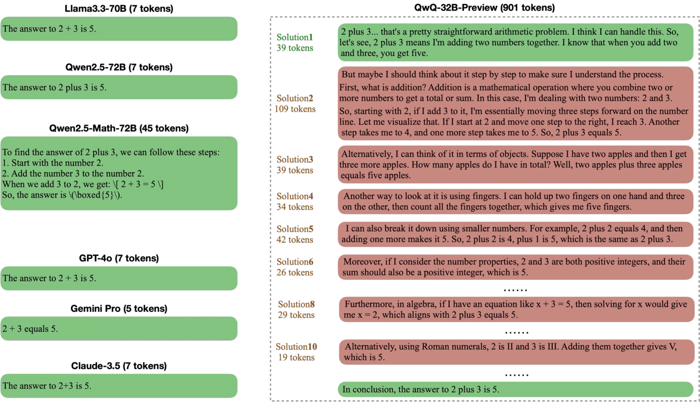
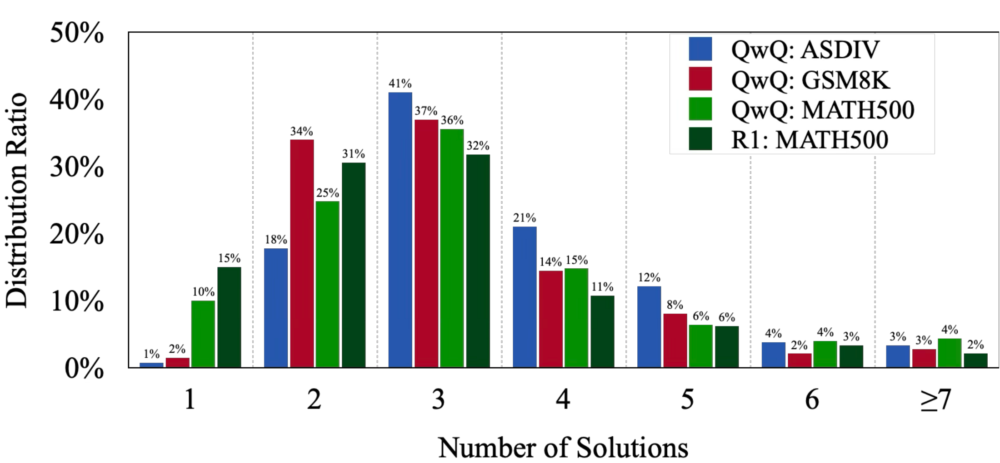
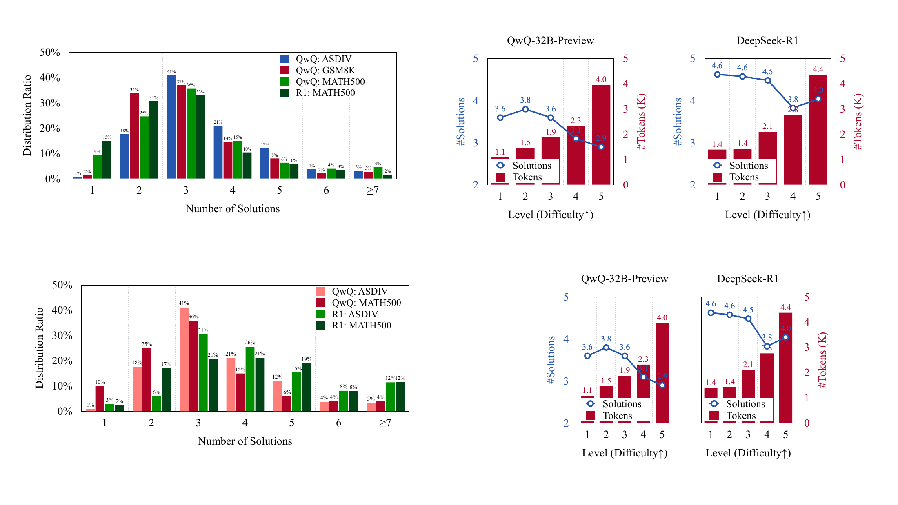
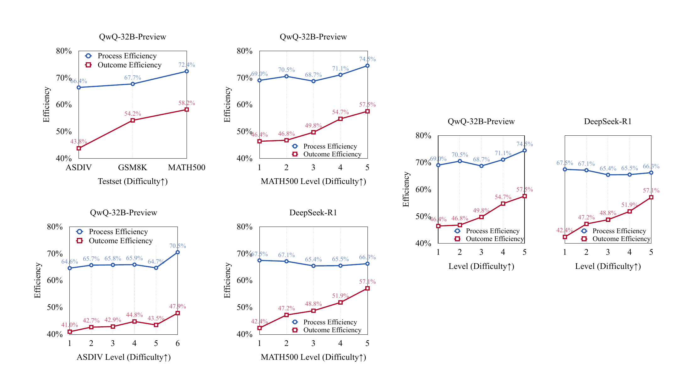
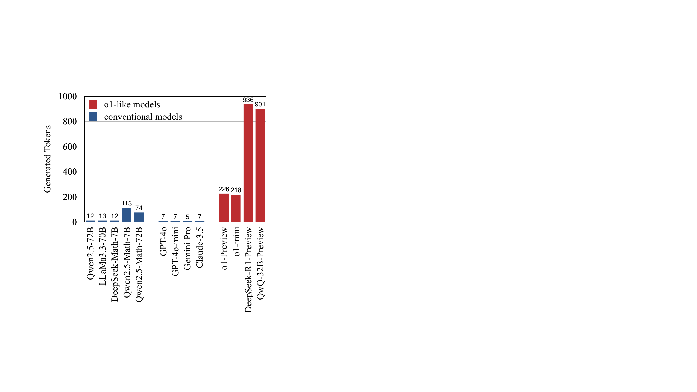

# Do NOT Think That Much for 2+3=? On the Overthinking of o1-Like LLMs：正文级精读

[所属章节](../index.md) · [来源与阅读状态](../../../../sources/papers.json)


**作者**：Xingyu Chen、Jiahao Xu、Tian Liang、Zhiwei He、Jianhui Pang、Dian Yu、Linfeng Song、Qiuzhi Liu、Mengfei Zhou、Zhuosheng Zhang、Rui Wang、Zhaopeng Tu、Haitao Mi、Dong Yu（Tencent AI Lab；上海交通大学） <br>
**年份与固定版本**：2025；arXiv:2412.21187v2（2025-02-01） <br>
**原始链接**：[arXiv:2412.21187v2](https://arxiv.org/abs/2412.21187v2) <br>
**实际阅读范围**：固定缓存的 `source/paper.pdf`、`source/paper.txt` 与 `source/tex/main.tex`；覆盖摘要、正文第 1–5 节、正文表 1–4 和图 1–7，并补读附录中与正文指标复核直接相关的聚类提示。没有把附录案例当作正文主实验。论文 TeX 中的 `Limitation` 段落被 `\iffalse...\fi` 注释掉，因而不属于发表正文；下文会单独指出由正文证据可见的局限。

## 1. 论文在问什么：长思考是否把测试时计算用在了正确的位置

o1、QwQ、DeepSeek-R1 这类模型把更多测试时计算（test-time compute）投入到自然语言链式推理：先拆解问题、尝试多个方案、复核中间结果，再给出答案。增加搜索空间或思考时间确实可能提高困难题准确率，但资源分配应随题目难度变化。本文把一个容易被“准确率仍然很高”掩盖的问题称为 **overthinking**：模型在答案已经得到、或题目本来很简单时，继续生成大量后续解法，而这些 token 对最终正确性和新推理策略贡献很小。

论文的直观例子是“what is the answer of 2 plus 3?”。引言称，在图 1(a) 的平均比较中，o1-like 模型为得到同一答案所用 token 比传统模型多 **1,953%**；图 2 则展示 QwQ-32B-Preview 对这个问题生成了 **13 个 solution rounds**。这里的“solution”是生成文本中明确出现一次答案的片段，不等于一次独立采样，也不等于模型内部真实思维状态。论文因此研究三个可观察现象：后续解法对正确率贡献有限、推理策略重复，以及简单题反而出现更多解法轮次。

本文的主张是：推理质量同时包含 effectiveness（答对没有）和 efficiency（为达到该结果付出了多少可见生成）。作者定义 outcome efficiency 与 process efficiency 两个指标，用 QwQ-32B-Preview 和 DeepSeek-R1 的可见长思考输出做诊断；再用 PRM12K 自训练数据，在可后训练的 QwQ 上学习更短、更有选择性的响应。

## 2. 研究对象、数据和“solution”的定义

正文第 2 节使用三个数学测试集，按作者给出的总体难度排序为 ASDIV < GSM8K < MATH500。

| 测试集 | 正文描述 | 规模/难度信息 |
|---|---|---|
| ASDIV | 英文数学文字题，覆盖基本算术、聚合运算和需要额外领域知识的题型 | 2,305 题；标注小学 1–6 年级难度 |
| GSM8K | 人工编写、语言多样的年级数学文字题，通常只需若干基础计算 | 1,319 题；正文称中学生应能解决 |
| MATH500 | 来自高中数学竞赛的题，涉及 Prealgebra、Algebra、Number Theory 等 7 个科目 | AoPS 难度 1–5；1 较易，5 接近 AIME |

分析模型是可见思考过程的 Qwen-QwQ-32B-Preview（下文简称 QwQ）与 DeepSeek-R1（R1）。传统模型基线是 Llama-3.3-70B-Instruct 和 Qwen2.5-Math-72B-Instruct。抽取 solution 边界由 Llama-3.3-70B 完成；推理策略聚类由 GPT-4o 完成。论文正文没有把这些外部判别器的提示敏感性、人工一致性或 token/延迟开销并入效率指标。

“solution”是一个操作性切分单位：完整生成中“明确包含答案”的一段。例如 2+3 的输出里每个重复说“answer is 5”的段落都算一个 solution。这个定义让作者可以按序号比较解法，但也带来一个重要边界：一段没有重复写出最终答案的长验证过程可能不会被计成新 solution；反过来，重复写答案会增加 solution 数，而不一定表示一次新的搜索。

 <br>
 图 2 显示 13 个解法和传统模型答案。正文给出的可手算摘要是：Solution 1 用 39 tokens 得到正确答案；全响应 901 tokens，因此该样本的 outcome efficiency 是 $`39/901=4.3\%`$。13 个解法按策略被聚成 7 类：直接陈述算术事实（1、6、11）；拆成更小步骤（2、5）；数物体类比（3、4）；用减法反向检查（7）；代数方程验证（8）；二进制/罗马数字转换（9、10）；以及模运算或编程等特定框架（12、13）。这支持“重复解法占据大量后缀”的诊断，但不能据此断言模型内部只有 7 个思维状态。

## 3. 三种“后续轨迹是否值得”的证据

### 3.1 解法分布：简单题的轮次更多，而 token 随难度增加

图 3 的横轴是每条响应中的 solution 数（1、2、3、4、5、6、≥7），纵轴是该数量在数据中的比例。QwQ 在三个测试集上通常有 2–4 个 solution，覆盖 **76%–80%** 的实例；R1 为 **59%–63%**。平均轮数也呈现一个反直觉趋势：QwQ 在 ASDIV 为 3.5、MATH500 为 3.2；R1 分别为 4.5 和 4.3。

图 4（图 3 下方的 MATH500 难度分解）把这一现象与输出长度分开：难度等级 1–2 时，QwQ 平均约 3.7 轮、R1 约 4.6 轮；等级 4–5 时约 3.0 和 3.9 轮。但 token 数随难度级别持续增加。也就是说，简单题的“方案轮次”较多不等于简单题总 token 较多；困难题每轮更长。作者据此把“更简单却更容易重复启动多个答案轮次”视为 overthinking 的一个外显信号。





 图 3/4 的解读重点是“轮次数量”和“token 数量”是两个轴向不同的资源信号，不能把较多轮次直接等同于较高成本或较低准确率。论文没有报告每个难度桶的完整原始数值表，正文图中可直接读取的代表值如上。

### 3.2 首次正确：分母是“响应中至少出现过正确答案”的实例

作者只在模型响应中至少出现一个正确答案的实例上，统计“第一个正确答案出现在哪一个 solution”。这张图的分母不是整个测试集 $`N`$，也不是所有生成轮次。图 5 显示，首次 solution 在各组合中承担了超过 **92%** 的首次正确事件；图中可读的四组首轮比例为 QwQ-ASDIV 93%、QwQ-MATH500 89%、R1-ASDIV 97%、R1-MATH500 90%（其余首次正确分布落在第 2、3、≥4 轮）。正文的概括是“超过 92%”，图中个别组合低于 92%，应以逐柱数字为准。

首轮并不长到占满响应。QwQ 在 ASDIV 的首轮平均 287 tokens，只占全响应平均长度的 **38.7%**。这表明在“模型最终能答对”的条件下，大量后续 token 常发生在正确答案已经出现之后；但它不是因果证明——可能是模型在输出格式、复核或停止决策上仍需要后续文本。

作者定义每实例的 $`σ_i`$：响应中至少有一个正确 solution 时为 1，否则为 0；$`T_i`$ 是该实例完整响应 token 数；$`\hat T_i`$ 是到首次正确答案为止的 token 数（若 $`σ_i=0`$，则按定义取 $`T_i`$）。总体 outcome efficiency 为：

```math
\xi_O=\frac{1}{N}\sum_{i=1}^{N}\sigma_i\frac{\hat T_i}{T_i}.
```

这里有三个必须同时保留的分母条件：外层平均分母是给定测试集的实例数 $`N`$；每个实例的时间/长度比是完整响应 token $`T_i`$；正确实例的分子是首次正确的前缀 token，而非最后一个 solution 的长度。错误实例 $`σ_i=0`$ 的项为 0，尽管 $`\hat T_i=T_i`$。因此 $`ξ_O`$ 既惩罚错误率，也惩罚答对后继续生成的后缀。论文的 2+3 样本给出 $`39/901=4.3\%`$；这是单样本示意，不是模型平均值。

### 3.3 多解法的多样性：分母随 solution 序号变化

作者不把所有相同答案都叫重复，而是让 GPT-4o 按“推理策略”聚类。策略不同的中间步骤、假设、适用范围，或明显不同的复杂度可算 distinct。对第 $`m`$ 个 solution，$`S^m`$ 只包含那些响应实际拥有第 $`m`$ 个 solution 的实例，因此其大小为 $`K`$，不一定等于测试集实例数 $`N`$。定义：

```math
\mathrm{Dis}^{m}=\frac{\sum_{k=1}^{K}\tau_k^m}{K},\qquad
\tau_k^m=\mathbf{1}\left[\Phi(s_k^m)\nsubseteq\{\Phi(s_k^1),\ldots,\Phi(s_k^{m-1})\}\right].
```

$`\Phi`$ 是 GPT-4o 判断的推理策略。对 $`m=1`$，没有前置策略，所以 $`τ=1`$，distinctness ratio 必为 100%；不能把这柱当作模型真正“独立探索”的成功率。图 6 显示随序号增加 distinctness 总体下降；Solution ≥4 相对 Solution 3 的跨数据集平均下降 **11.5 个百分点**。Solution 2 特别低，作者结合样例解释为常在复核 Solution 1，Solution 3 才更可能换策略。图中可读的一组比例包括第 2/3/≥4 轮约 47/46/47%、38/33/34%、32/29/30%、41/24/25%（具体对应模型—数据组合应以图例核对），因此正文更稳妥的结论是“后续轮次常重复”，而非所有模型、所有难度的精确排序。

过程效率把“提供新策略的 solution”中所有 token 视为有效 token。令 $`T_i^m`$ 是第 $`m`$ 个 solution 的 token 数，$`M_i`$ 是实例 $`i`$ 的 solution 数，$`D_i=\sum_{m=1}^{M_i}\tau_i^mT_i^m`$，则：

```math
\xi_P=\frac{1}{N}\sum_{i=1}^{N}\frac{D_i}{T_i}.
```

这里故意没有乘正确性 $`σ_i`$：$`ξ_P`$ 衡量过程多样性，独立于答案是否正确；外层仍按全部实例 $`N`$ 平均，每个实例按其完整 token 数 $`T_i`$ 归一化。2+3 示例中有效 solution 是 1、2、3、7、8、9、12，对应 token 39、109、39、29、29、19、59，总和 323，所以 $`ξ_P=323/901=35.8\%`$。这个指标把整段 distinct solution 都算有效，不能解释“该段的每个 token 都对多样性必要”。

## 4. 表 1：模型效率的主诊断

表 1（TeX 标签 `tab:efficiency_main_results`）同时报告 Accuracy、平均 solution 数、平均 token、$`ξ_O`$（Outcome）和 $`ξ_P`$（Process）。传统基线每个响应只有一个 solution，作者因而令 $`D_i/T_i=\hat T_i/T_i=1`$，其 $`ξ_O`$ 等于 accuracy，$`ξ_P=100\%`$。这一基线是“单一路径、整段都计入”的定义结果，不表示传统模型实际没有隐藏计算。

| 数据集 | 模型 | Accuracy | #Solution | #Token | Outcome | Process |
|---|---|---:|---:|---:|---:|---:|
| ASDIV | Llama-3.3-70B-Instruct | 95.6 | 1.0 | 166.4 | 95.6% | 100.0% |
| ASDIV | Qwen2.5-Math-72B-Instruct | 96.3 | 1.0 | 213.0 | 96.3% | 100.0% |
| ASDIV | QwQ | 96.9 | 3.5 | 741.8 | 41.9% | 66.5% |
| ASDIV | R1 | 97.1 | 4.5 | 845.0 | 45.9% | 64.3% |
| GSM8K | Llama-3.3-70B-Instruct | 92.6 | 1.0 | 220.3 | 92.6% | 100.0% |
| GSM8K | Qwen2.5-Math-72B-Instruct | 95.8 | 1.0 | 317.4 | 95.8% | 100.0% |
| GSM8K | QwQ | 94.8 | 3.1 | 772.8 | 50.7% | 67.6% |
| GSM8K | R1 | 96.4 | 4.3 | 1056.3 | 48.9% | 62.0% |
| MATH500 | Llama-3.3-70B-Instruct | 75.4 | 1.0 | 553.4 | 75.4% | 100.0% |
| MATH500 | Qwen2.5-Math-72B-Instruct | 86.8 | 1.0 | 593.1 | 86.8% | 100.0% |
| MATH500 | QwQ | 93.0 | 3.2 | 2407.9 | 52.3% | 71.2% |
| MATH500 | R1 | 96.4 | 4.3 | 2704.3 | 51.0% | 66.2% |

比较必须按同一数据集和同一指标进行。QwQ/R1 的准确率通常高于传统基线，尤其 MATH500；但 outcome/process efficiency 明显低于 100%，说明这些多解法输出用更多可见 token 换取了有限的额外正确率或新策略。简单 ASDIV 的 QwQ 只有 41.9% outcome、R1 45.9%，而 MATH500 也只有 52.3%/51.0%；因此“困难题需要更深推理”不等于“简单题的后续全部无用”，只是后续的平均边际贡献在作者定义下较低。



 图 7 按 MATH500 难度画出 QwQ 与 R1 的 outcome/process。作者特别指出 Level 1 的 outcome efficiency 低于 50%，与 ASDIV 的低效率一致。图 7 支持“简单题更容易过度生成”的局部结论，但只覆盖两个模型、一个困难度标注体系，不能推导普遍的输入自适应规律。

## 5. 缓解方法：先偏好短响应，再保留最早且有必要的反思

### 5.1 Length Preference Optimization（LPO）数据构造

后训练只在 QwQ 上做，因为该模型可供作者后训练。作者从 PRM12K 生成自训练数据：对训练实例以温度 1.0 采样 10 个响应，丢弃无法生成正确答案的样本。Greedy 是贪心搜索响应；Shortest/Longest 是这 10 个样本中的最短/最长正确响应。表 2 的结果为：

| 响应选择 | #Solution | #Token | Outcome | Process |
|---|---:|---:|---:|---:|
| Greedy | 3.1 | 1434.8 | 55.6% | 72.6% |
| Shortest | 2.5 | 1051.3 | 69.8% | 80.3% |
| Longest | 4.1 | 2258.7 | 46.0% | 66.4% |

Shortest 在作者的这批**已过滤正确样本**中同时拥有更少轮次、更短 token 和更高效率。此处不能把表 2 的差异解释成严格的因果效应：不同长度响应来自同一实例的采样选择，且错误样本已被丢弃。

作者比较四种训练目标：SFT 用短正例做交叉熵；DPO 让正例相对负例概率提高；RPO 在 DPO 上加正例负对数似然，防止正例概率下降；SimPO 使用其长度正则和自适应 margin。SFT 只需正例；DPO/RPO/SimPO 还需要负例。作者预实验发现，用 Longest 而非 Greedy 作为负例更有效，推测前者提供更清晰的对比信号；正文没有给该预实验数字。

### 5.2 三种响应简化

给每个训练实例的 10 个样本分别构造三种正例，再取每种类型中最短的一个，所以三种正例可能来自不同原始响应：

* **FCS（First-Correct Solutions）**：从头保留最早到达正确答案的 solution。
* **FCS+Reflection**：再保留第二个到达正确答案的 solution，避免模型完全退化成只输出一次的传统直接回答；代价是多一轮反思。
* **GDS（Greedily Diverse Solutions）**：按新推理策略贪心加入 solution；如果第二个 solution 没重复第一个，也允许加入更多解法，试图在长度和多样性间折中。

表 3：

| 正例 | #S | #Token | Outcome | Process |
|---|---:|---:|---:|---:|
| Shortest Response | 2.5 | 1051.3 | 69.8% | 80.3% |
| FCS | 1.1 | 681.0 | 99.5% | 99.1% |
| FCS + Ref. | 1.9 | 878.7 | 78.4% | 82.4% |
| GDS | 1.6 | 856.8 | 86.8% | 94.2% |

FCS 在这批正例上效率最高，但只保留最早正确解法会削弱困难题所需的反思；FCS+Reflection 多约一轮，效率下降但保留了一定长思考；GDS 在策略多样性上更积极，但最终效果并不如 FCS+Reflection。

### 5.3 表 4：MATH500 详细比较及跨任务验证

| 数据集/方法 | Accuracy | #S | #Token | Outcome | Process |
|---|---:|---:|---:|---:|---:|
| ASDIV QwQ | 96.9 | 3.5 | 741.8 | 41.9% | 66.5% |
| ASDIV + SimPO(FCS+Reflection) | 96.8 | 2.0 | 381.6 | 77.6% | 86.0% |
| GSM8K QwQ | 94.8 | 3.1 | 772.8 | 50.7% | 67.6% |
| GSM8K + SimPO(FCS+Reflection) | 96.0 | 2.0 | 416.6 | 80.2% | 87.2% |
| MATH500 QwQ | 93.0 | 3.2 | 2407.9 | 52.3% | 71.2% |
| MATH500 + SFT(Shortest) | 93.2 | 3.0 | 2359.5 | 60.4% | 75.6% |
| MATH500 + DPO(Shortest) | 94.0 | 2.7 | 1929.5 | 65.8% | 79.1% |
| MATH500 + RPO(Shortest) | 91.6 | 2.7 | 2015.7 | 64.8% | 79.2% |
| MATH500 + SimPO(Shortest) | 92.4 | 2.5 | 1871.8 | 67.6% | 80.9% |
| MATH500 + SimPO(FCS) | 91.0 | 1.4 | 1016.0 | 88.7% | 98.1% |
| MATH500 + SimPO(FCS+Reflection) | 92.8 | 1.9 | 1330.7 | 80.0% | 89.5% |
| MATH500 + SimPO(GDS) | 91.8 | 1.7 | 1286.1 | 84.3% | 93.6% |
| GPQA Qwen2.5-Math-72B-Instruct | 46.5 | 1.0 | 811.7 | 46.5% | 100% |
| GPQA QwQ | 59.6 | 2.2 | 3228.4 | 51.4% | 84.3% |
| GPQA + SimPO(FCS+Reflection) | 59.1 | 1.7 | 2085.7 | 55.7% | 90.4% |
| AIME24 Qwen2.5-Math-72B-Instruct | 23.3 | 1.0 | 1204.5 | 23.3% | 100.0% |
| AIME24 QwQ | 46.7 | 2.6 | 9480.9 | 38.4% | 84.4% |
| AIME24 + SimPO(FCS+Reflection) | 43.3 | 1.7 | 5154.5 | 39.8% | 92.0% |

在 MATH500，SFT 几乎不缩短；偏好优化均减少 token，其中 SimPO(Shortest) 相对 2407.9 降到 1871.8，减少 **22.3%**，所以作者后续默认使用 SimPO。FCS 的 token 最少（1016.0），但准确率从 93.0 降到 91.0；FCS+Reflection 恢复到 92.8，仅比基线低 0.2 个百分点，token 降到 1330.7（约少 44.7%），process 80.0%/89.5%；GDS 为 91.8、1286.1 token，作者认为其明显不如 FCS+Reflection。引言所说 MATH500 “减少 48.6% 且保持准确率”来自图 1(b) 的 token-accuracy 曲线/另一比较视角；表 4 的基线—FCS+Reflection均值是约 44.7%，不能把两者混成同一数字。

跨任务的作者解释是：ASDIV 与 GSM8K 上，FCS+Reflection 在更少 token 下略升或基本保持准确率（96.8 vs 96.9；96.0 vs 94.8）；GPQA 准确率 59.1 vs 59.6，token 2085.7 vs 3228.4；AIME24 准确率 43.3 vs 46.7，token 5154.5 vs 9480.9。AIME 的 3.4 个百分点下降意味着“保持模型性能”只能算近似结论，不能写成所有困难题无损。作者把 MATH500 上 FCS 失败、FCS+Reflection 回升解释为困难题需要深推理；这是局部实验解释而非内部推理的直接观测。



 图 1(b) 是 MATH500 token-accuracy plot，展示 QwQ 与方法输出长度和准确率关系；应读作预算/前缀效率的可视化，不是端到端 GPU 成本曲线。论文正文没有报告每个方法的 wall-clock latency、FLOPs、KV-cache、训练成本、显存或功耗。

## 6. “后续轨迹效率”应如何严格理解

这篇论文测量的是**可见输出序列**：solution 边界、到首次正确答案的前缀 token、被 GPT-4o 判为新策略的 solution token。它没有测量 hidden CoT、模型内部状态、每 token FLOPs、并行硬件利用率、端到端延迟，亦没有证明删除后缀后模型在同一输入上会立即停止。因而“后续轨迹低效”应具体读成：在给定的生成文本、判定器和截断规则下，后续输出相对于首次正确/首次新策略的平均 token 比例较低。

小例子：若一题响应为三段，token 长度分别是 4、5、6，第一段已经正确，三段策略均不同，则 $`T=15`$、$`\hat T=4`$，单实例 outcome 为 $`4/15=26.7\%`$，process 为 $`(4+5+6)/15=100\%`$。若第三段重复第一段，则 process 变为 $`(4+5)/15=60\%`$；若第一段错误、第二段正确，outcome 为 $`(4+5)/15=60\%`$。这说明两个指标回答不同问题：outcome 依赖正确答案何时首次出现；process 依赖后续策略是否新颖。它们不能合并为一个“真实思考效率”。

困难题反例也很关键：MATH500 上只保留 FCS 把准确率降至 91.0%，而保留第二个正确 solution 的 FCS+Reflection 回到 92.8%；AIME24 仍从 46.7 降至 43.3。后续思考有时不是冗余，而是解决困难实例的必要搜索或纠错。论文的证据支持“简单题平均更容易过度生成”，不支持一个固定的“第一个正确就总该停止”规则。

## 7. 评测局限、归因边界和研究启示

第一，模型覆盖窄：诊断只有 QwQ 和 R1，后训练只在 QwQ；因此无法证明所有 o1-like 模型都遵循相同轮次分布。第二，solution 抽取由 Llama-3.3-70B 完成，策略聚类由 GPT-4o 完成；聚类 prompt 允许“显著更简单/复杂”也算新颖，这会把复杂度变化与策略变化混在一起，且没有报告人工标注一致率、随机种子或判定器成本。第三，所有效率指标按输出 token，不是成本前沿；短 token 可能伴随更高计算密度或更长单 token 延迟，论文未测。第四，训练数据来自 PRM12K，且每实例从 10 个温度 1.0 样本中择优；这可能放大采样候选中已有正确短解的效果，不能等同于在线停止器的普适收益。第五，表 4 的 GPQA、AIME 只有单一 QwQ 对比，AIME 的准确率下降应作为困难反例保留。第六，本文没有报告置信区间、跨随机种子均值或显著性检验；相近的 93.0/92.8、59.6/59.1 等差异不宜作强因果结论。

作者的结论是：用两个效率指标可揭示长响应中有限的正确性/多样性边际贡献；自训练的长度偏好和响应简化能减少生成 token，同时在多个任务上大致保持表现。由公式直接可推出的是指标对错误实例、重复策略和长后缀的惩罚；教学上的“停止在第一次正确”是解释，不是论文证明的内部算法。正文相关工作把该方法放在测试时搜索扩张、CoT/自我反思、token budget、输入自适应 compute、early stopping 和多智能体路线之间，区别在于它试图让 o1-like 模型通过训练学习长度和解法选择，而不是由用户预设 token budget。

对于 token 效率研究，本文最值得复用的设计是把“答对”与“何时答对”拆开，并把“答案正确”与“策略新颖”分成两条轨迹；最需要警惕的是三个分母：首次正确分布只在**最终有正确答案的响应**上归一化，distinctness ratio 对第 $`m`$ 轮只在**存在第 $`m`$ 轮的响应**上归一化，outcome/process 总体指标才按**全测试集实例数 $`N`$**平均。若忽略这些条件，就会把局部后验统计误读为全体样本概率。

## 8. 正文图表索引

| 标记 | 原图/表 | 内容与使用说明 |
|---|---|---|
| `figure-1-token-accuracy` | Figure 1；`figure/overthinking_tall.pdf` 与 `figure/testing_set_token_acc/math500_token_acc_tall.pdf` | 2+3 的生成 token 对比及 MATH500 token-accuracy 曲线；原 PDF 已复制到 `assets/` |
| `figure-2-case-overview` | Figure 2；`figure/case_overview.pdf` | QwQ 13 solution 的具体案例；原 PDF 已复制到 `assets/` |
| `figure-3-solution-distribution` | Figure 3/4；`icml2025/figure/solution_distribution.pdf`、`figure/solution_distribution_*` | 解法轮次分布和 MATH500 难度分解；原 PDF 已复制到 `assets/` |
| `figure-5-first-correct` | Figure 5；`icml2025/figure/solution_contribution.pdf` | 首次正确 solution 的分布；原 PDF 已复制到 `assets/` |
| `figure-6-diversity` | Figure 6；`icml2025/figure/solution_diversity.pdf` | 各 solution 序号的新策略比例；原 PDF 已复制到 `assets/` |
| `figure-7-efficiency-levels` | Figure 7；`figure/solution_efficiency_QwQ_MATH500.pdf`、`...R1...pdf` | MATH500 各难度的 outcome/process efficiency；原 PDF 已复制到 `assets/` |

这些图均来自作者固定版本 TeX 工程，许可证依据缓存 manifest 为 [arXiv nonexclusive-distrib 1.0](http://arxiv.org/licenses/nonexclusive-distrib/1.0/)。`assets/` 中保留原 PDF，没有裁剪或改绘；若公开发布，需保留作者/论文来源与许可证信息。
