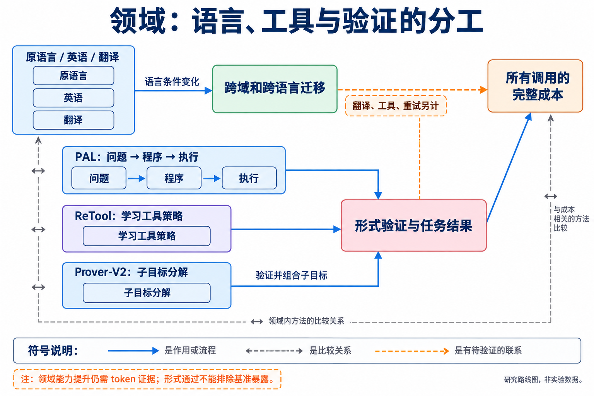
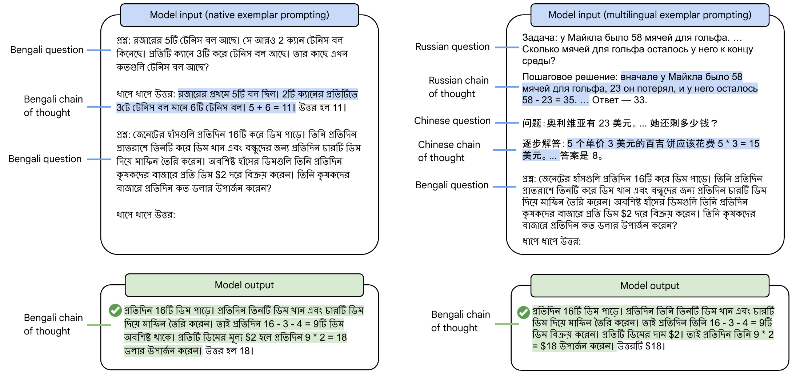

# 13 领域、多语言与科学：效率机制能否跨任务迁移

[上一章：安全与可靠性](../12-safety/index.md) · [总论](../../00-overview.md)

领域任务改变了可用知识、验证器、工具和错误代价。数学里的短链训练，未必直接迁移到代码库修改或科学推断；一种语言里的token预算，也不等于另一种语言里的相同信息量。本章用程序辅助、多语言推理和形式化证明三条代表路线讨论这些关系。

## 本章地图：表达、执行和验证的边界



本图由主代理综合正文关系后使用 GPT-Image 生成；连线表示文中说明的流程、比较或待验证联系，不表示统一性能排名。

| 路线 | 代表方法 | 效率问题 |
|---|---|---|
| 把精确计算交给程序 | PAL、ReTool | 文本推导是否可替换为代码，解释器与重试成本是多少 |
| 改变推理语言 | Multilingual CoT / MGSM | 能力和分词差异能否改善实际预算，翻译是否增加开销 |
| 分解为可验证子目标 | DeepSeek-Prover-V2 | 子问题和验证能否减少无效搜索，训练与高预算成本怎样计量 |
| 专业知识与真实工作流 | 领域适配、RAG、科学工具 | 专业准确性与最终工作流成功不能仅由通用分数替代 |

本次原文覆盖侧重可验证数学/代码、形式化证明及跨语言；其他科学与专业工作流的效率仍需要任务特定证据。领域名称本身不说明采用哪一种学习机制，具体方法应链接回数据、后训练、上下文和Harness。

## PAL：模型表达问题结构，程序执行精确计算

Program-aided Language Models（PAL）让模型生成带变量和程序步骤的解法，再由解释器执行。与只用自然语言CoT相比，模型仍需正确理解条件、抽取变量和选择运算，但不必用逐token生成完成每次数值计算。[原论文](https://arxiv.org/abs/2211.10435)

```python
# 教学题：3袋物品，每袋8件，卖出5件，还剩多少？
bags = 3
items_per_bag = 8
sold = 5
answer = bags * items_per_bag - sold  # 19
```

程序可以精确执行乘减；若模型把“每袋8件”误读为总共8件，解释器仍会忠实计算错误程序。因此PAL将语言理解错误与计算执行错误分开，没有消除前者。


[查看原图，可放大](../../../assets/papers-v3/2211.10435/fig_main_intro_example.pdf) · [论文来源](https://arxiv.org/abs/2211.10435v2)

作者图把自然语言步骤和程序执行并列。prompt示例中的变量名、注释和代码结构为模型提供中间表示，最终结果来自解释器；它不是让模型先完整输出CoT再额外跑一次代码。

原文在GSM8K、数字扰动任务、符号与算法任务中比较CoT、程序提示及其他基线，并用变量命名、程序结构等消融分析有效成分。部分表格与正文数字存在差异，精读保留原始条件。任务能力改善没有同时给出完整输入、输出、工具执行及失败重试成本，因此PAL在本地图中首先提供领域计算分工的机制，不自动构成token前沿左移证据。[精读](reference/2211.10435.md)

它与ReTool的关系是训练位置不同：PAL主要通过程序化提示形成工具辅助解法，ReTool进一步从在线工具反馈中学习策略。若下一步研究要训练模型更早选择代码，应对照PAL类提示、固定工具策略和ReTool，而不把“加一个计算器”视作全新路线。

## 多语言CoT：选择推理语言会同时改变能力与计量

Multilingual CoT研究模型能否在不同语言的问题上进行链式思考，构造MGSM等多语言评测，并比较直接回答、原语言CoT、英语CoT和先翻译到英语等条件。[原论文](https://arxiv.org/abs/2210.03057)

同一道中文问题，可以让模型用中文推导，也可以保留中文题面但用英语推理，或先翻译再推理。这几种程序改变了模型的语言条件，不能只把结果解释为“模型用哪种语言思考”。可见CoT的语言也不直接揭示内部计算语言。

```text
原语言路线：中文题目 → 中文中间过程 → 答案
英语推理路线：中文题目 → 英语中间过程 → 答案
翻译路线：中文题目 → 翻译调用 → 英文题目 → 中间过程 → 答案
```

如果翻译在部署时发生，其输入和输出也属于任务成本；如果只是离线制作数据，成本属于开发账。还需要固定tokenizer或同时报告共同参考分词/字节长度，避免把某种语言更粗的切分误当作更少计算步骤。



[查看原图，可放大](../../../assets/papers-v3/2210.03057/figure3-mgsm-prompts.pdf) · [论文来源](https://arxiv.org/abs/2210.03057v1)

作者提示图展示这些输入/推理语言条件。论文的模型规模、语种和任务实验说明跨语言推理存在可迁移能力，也有语种差异；原文没有报告完整输入/输出token、翻译成本和延迟。因此“英语条件下分数更高”不能自动推出“用英语更省token”。[精读](reference/2210.03057.md)

小团队可以在同一模型和成对翻译题上，固定语义、难度、示例数量和判分，比较语言条件的质量—实际token曲线。需要检查翻译丢失条件、答案格式与低资源语言偏差，而不只汇总跨语言平均分。

## DeepSeek-Prover-V2：子目标分解和形式验证怎样结合

DeepSeek-Prover-V2将自然语言分析、形式化子目标、递归求解和Lean验证串成训练数据构造与证明生成流程。分解能让较小的求解器处理局部问题，也可以让验证结果反馈到后续策略；训练仍包含昂贵的生成、筛选、SFT和RL环节。[原论文](https://arxiv.org/abs/2504.21801)

一个不冒充论文原例的教学分解是证明“两个偶整数之和仍为偶数”：先从 $`a`$ 偶取得整数 $`m`$ 使 $`a=2m`$，从 $`b`$ 偶取得整数 $`n`$ 使 $`b=2n`$，再组合 $`a+b=2(m+n)`$。分解为局部任务能明确每一步需要什么前提，但组合是否符合原目标仍需验证。


[查看原图，可放大](../../../assets/papers-v3/2504.21801/figure-2-overview-decomposition.pdf) · [论文来源](https://arxiv.org/abs/2504.21801v2)

作者图里的自然语言解、形式化骨架、子目标求解和验证各有角色。有效的Lean证明提供形式正确性证据，但基准是否暴露已有证明、工具是否利用了库中的现成目标，以及采样预算是多少，仍影响能力判断。

正文的MiniF2F、ProofNet、PutnamBench及其他证明基准比较包含不同模型规模与采样预算。原文讨论的工具漏洞、错误题目剔除和分母问题应保留；不能把“验证器通过”直接视为新推理能力或更低成本。对完整成本，需要计入候选证明、失败子目标、递归调用和工具检查。[精读](reference/2504.21801.md)

这条路线更接近高预算能力和可验证分解的研究，适合与小团队可承担的局部子目标实验相连接。若希望声称向左移动，应固定目标集合与验证规则，比较达到同样证明成功率需要多少总生成token及验证工作。

## 专业工作流中的证据边界

医疗、法律、金融和科学任务还涉及知识时效、来源、专家评价和真实执行结果。领域考试或文本评分无法完整代表这些工作流；一个看似合理的科学假设也需要外部证据或实验检验。领域适配可能减少知识检索，专业工具可能减少文本计算，但这些联系需要在具体任务中测量。

研究机会应从领域特有的失败出发：代码的跨文件依赖、数学的验证成本、长文的证据遗漏、跨语言的条件损失，分别需要不同最近邻和基线。可迁移的实验原则是同任务、同判分、完整成本及负面结果；能否得到相同的效率机制，应由比较决定，而不是由模型被称为“领域模型”决定。
