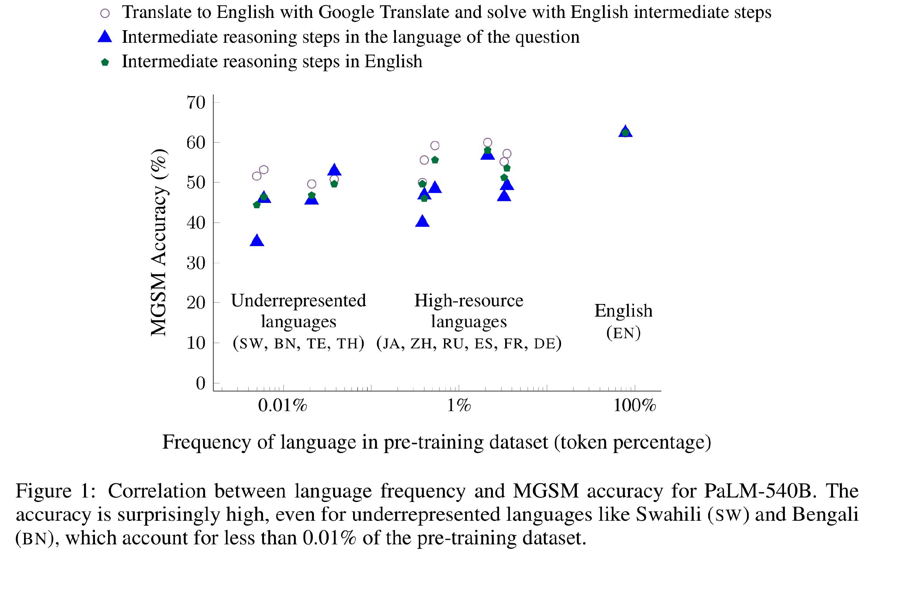
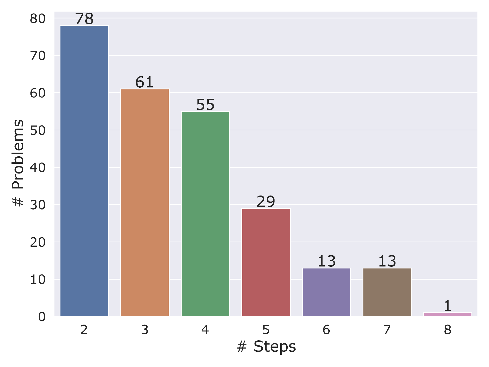
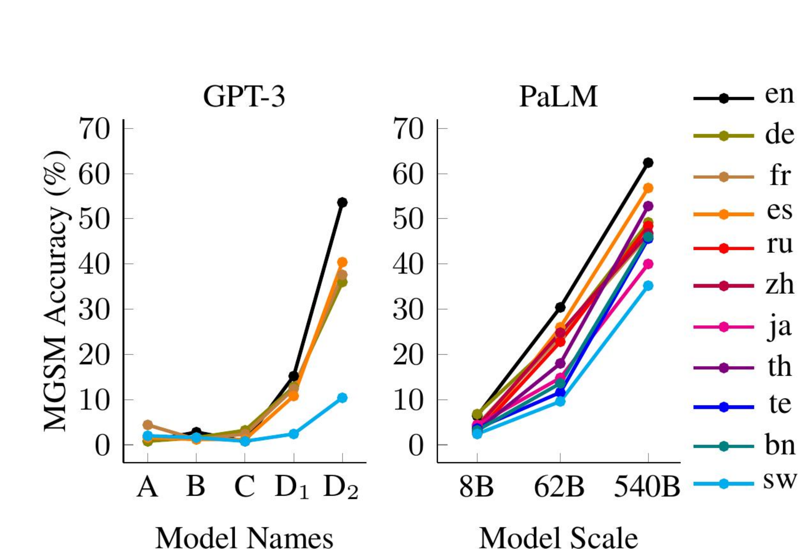
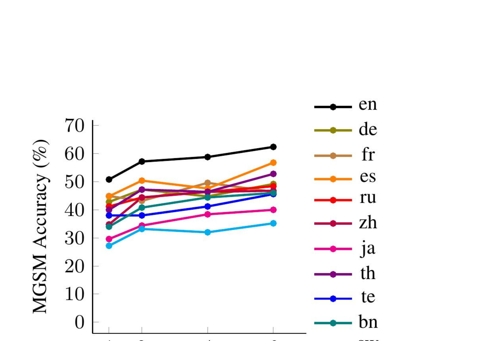
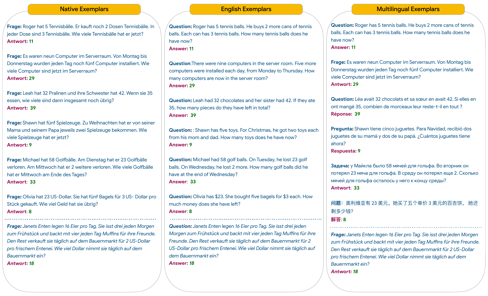
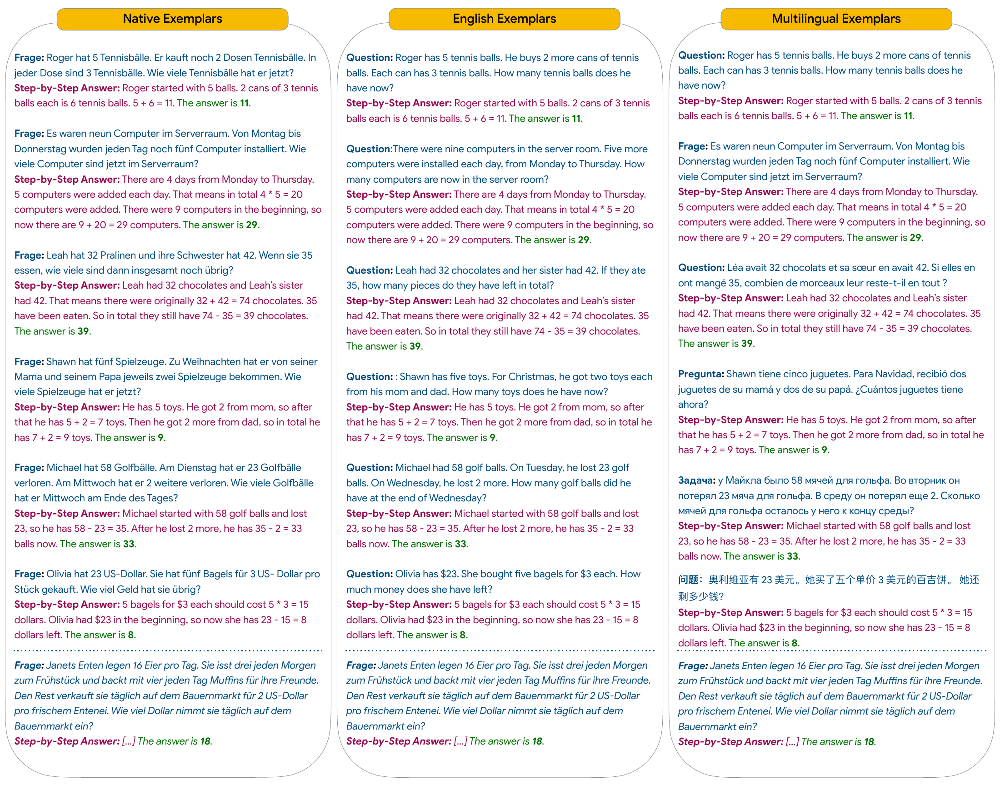
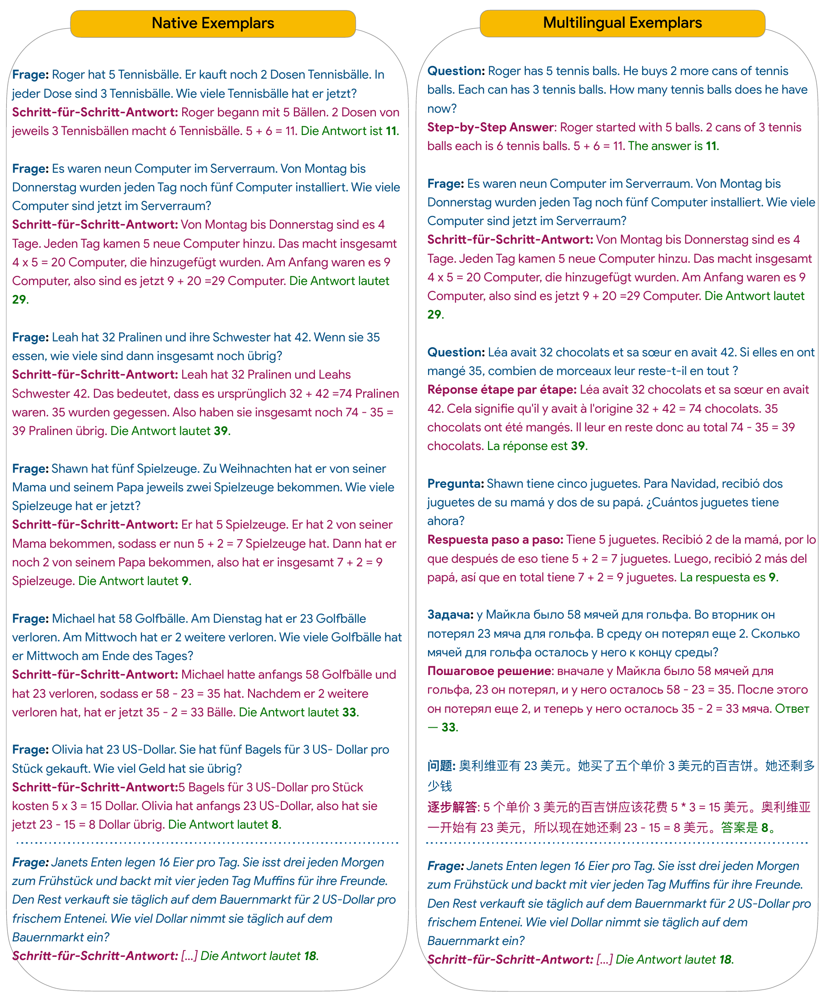

# Language Models are Multilingual Chain-of-Thought Reasoners：正文级精读

[所属章节](../index.md) · [来源与阅读状态](../../../../sources/papers.json)


**作者**：Freda Shi、Mirac Suzgun、Markus Freitag、Xuezhi Wang、Suraj Srivats、Soroush Vosoughi、Hyung Won Chung、Yi Tay、Sebastian Ruder、Denny Zhou、Dipanjan Das、Jason Wei <br>
**年份**：2022（arXiv:2210.03057v1，2022-10-06） <br>
**固定版本**：[arXiv 2210.03057v1](https://arxiv.org/abs/2210.03057v1)；[Google Research 实现/数据仓库](https://github.com/google-research/url-nlp) <br>
**实际阅读范围**：固定版 PDF 全文第 1--9 页正文、参考文献及附录 A--C 中 MGSM 提示和详细数字；阅读了对应 LaTeX 源文件中的 `20-msgm.tex`、`30-methods.tex`、`40-experiments-mgsm.tex`、`41-experiments-others.tex`、相关表格和图文件。未把外部后续论文当作本论文证据。

## 1. 论文要回答什么问题

链式思维（chain-of-thought, CoT）已经显示出：给足够大的语言模型几个“题目—逐步解答”示例，模型可以在最终答案前生成中间推理步骤，从而解决多步数学题。另一方面，多语预训练模型在很多语言的分类、问答和简单推理上表现良好，但此前的多语 benchmark 大多只需要很短、很浅的推理。本文的问题是：**当任务真正需要多步算术推理时，大模型能否在非英语、特别是低资源语言中进行 CoT 推理？推理步骤是否必须写成题目语言？**

作者的核心贡献有三项：

1. 从 GSM8K 官方测试列表的前 250 题建立 MGSM（Multilingual Grade School Math），把它们人工翻译成十种类型学多样的语言。
2. 对 GPT-3 与 PaLM 比较四类解题条件：直接作答、用题目语言写 CoT、用英语写 CoT、先把题目翻译成英语再用英语 CoT。
3. 在 MGSM 之外，用 XCOPA（因果常识）与 XL-WiC（词语在上下文中的词义判断）检查这种多语 few-shot CoT 能否迁移到别的任务。

论文的结论是，规模足够大的模型在十种语言上都能利用 CoT；PaLM-540B 在 Bengali、Swahili 等训练语料占比低于 0.01% 的语言上仍有较强准确率。英文 CoT 通常至少与题目语言 CoT 竞争。这里的“强”是准确率结果，不是 token 成本结果：论文没有测量输入 token、输出 token、总 token、FLOPs、延迟或每题成本，也没有报告 self-consistency 的多样本计算。

## 2. MGSM 如何构造

### 2.1 源数据、题目难度和答案格式

GSM8K 是人工标注的英语小学数学文字题。MGSM 直接取 GSM8K 官方 test example list 的前 250 道题，不是重新抽样，也不是训练集。按 GSM8K 官方解答，每题需要 2--8 个推理步骤；正文 Figure 2 的分布是 2 步 1 题、3 步 29 题、4 步 78 题、5 步 55 题、6 步 13 题、7 步 13 题、8 步 61 题（总计 250）。答案统一保留阿拉伯数字，方便跨语言预测；即使语言使用不同数字书写系统，本文也没有把答案改成相应文字数字。这一处理控制了输出格式，却不测试跨语言数字字形识别。

### 2.2 语言分组

目标语言是 Bengali（BN）、Chinese（ZH）、French（FR）、German（DE）、Japanese（JA）、Russian（RU）、Spanish（ES）、Swahili（SW）、Telugu（TE）、Thai（TH），加上 English（EN）作为原始/比较语言。作者称这些语言覆盖八个语言家族，并在 mC4 等预训练语料中具有不同的出现频率。

正文 Table 3 用 PaLM 训练语料的 token percentage 作为语言频率示意：EN 78.0、DE 3.5、FR 3.3、ES 2.1、RU 0.53、ZH 0.40、JA 0.38、TH 0.04、TE 0.02、BN 0.006、SW 0.005。作者把频率大于 0.1% 的六种语言（EN、DE、FR、ES、RU、ZH）汇总为 high-resource languages（HRL），把 TH、TE、BN、SW 汇总为 underrepresented/low-resource languages（URL；附录表 8 写作 LRL）。这只是按训练数据占比的操作性分组，不等于语言本身的社会资源、标注资源或模型能力的完整定义。

### 2.3 翻译与质量控制

250 道英语题分别由付费专业译者翻译到十种语言：中文和德语各 2 人，俄语 3 人，泰语 5 人，其余每种语言 1 人。译者都是目标语言母语者，且至少有两年英—目标语言翻译经验；开始前签署不使用机器翻译的声明。供应商随机抽取一部分译文交给额外译者核验，并检查与流行机器翻译系统的 n-gram 重叠以确认没有使用 MT 工具。作者把这些人工译文作为 gold translations。

因此，MGSM 的跨语言差异来自同一组问题的语言版本，而不是十个不同题集。仍需注意：单一或少数译者、题目文化背景、数字保持阿拉伯形式等会影响难度；正文没有报告逐题翻译一致率、语言间独立难度校准或翻译后的新答案验证。

## 3. 四种推理条件与提示组合

### 3.1 先区分输入语言、推理语言和 exemplars

设题目为 $`q_L`$，其中 $`L`$ 是题目语言；few-shot exemplar 是若干“题目—答案”或“题目—逐步解答”对。模型自回归地产生答案，准确率按最后的阿拉伯数字与 gold answer 是否相同计算。本文的四种 solution strategy 是：

1. **DIRECT**：输入 $`q_L`$，直接输出答案数字，不要求中间步骤。这衡量没有显式推理轨迹时的 few-shot 解题能力。
2. **NATIVE-CoT**：输入 $`q_L`$，输出也用 $`L`$ 写逐步解答，最后给出答案。它同时测试理解题目语言和在该语言中生成/维持推理。
3. **EN-CoT**：输入仍是 $`q_L`$，但要求用英语写中间推理并给最终答案。它把理解非英语题目与英语推理表达拆开，利用英语可能是模型较强的提示/生成语言这一事实。
4. **TRANSLATE-EN**：先用 Google Translate API 把 $`q_L`$ 翻译成英语，再让模型对英语题目用英语 CoT。模型接收的是翻译后的题目，而不是原题；这近似 translate-test/translate-train 思路。

这四项不是四个训练模型，而是同一类预训练模型的推理时输入—输出协议。作者报告的是 greedy decoding（temperature $`\tau=0`$），没有随机采样多个轨迹。因此论文**没有做 self-consistency**：没有“对同一题采样 $`k`$ 条 CoT、按多数答案投票”的条件，也没有 self-consistency 的额外输出 token 或计算预算。将 EN-CoT 的单条轨迹误称 self-consistency 会改变实验含义。

### 3.2 Exemplar 选择

有三种 exemplar 策略：

- **NATIVE-EXEMPLARS**：示例题和解答都用当前目标语言；这是 Table 3 的主设置。
- **ENGLISH-EXEMPLARS**：全部示例是英语，用于没有目标语言示例时的跨语言迁移。因此论文不把它与 NATIVE-CoT 组合，因为该组合假设没有目标语言提示示例。
- **MULTILINGUAL-EXEMPLARS**：把英语、德语、法语、西班牙语、俄语、中文各放一个示例，作为所有目标语言共用的通用提示。

Table 2 给出允许的组合：DIRECT、NATIVE-CoT、EN-CoT 都可和 native exemplars 组合；English exemplars 主要用于 DIRECT/EN-CoT；multilingual exemplars 可用于 DIRECT/NATIVE-CoT/EN-CoT；TRANSLATE-EN 使用翻译后的目标题目和英语 CoT，示例也用英语。MGSM 主实验尽量采用 6-shot；GPT-3 在部分语言因输入上限只能放较少示例（Table 7：EN/DE/FR/ES/TH/SW 为 6，RU 为 1，ZH/JA/TE 为 5/4/1，BN 为 1；原表排版把语言列压紧，具体可按表头核对）。PaLM 所有语言使用 6-shot。

附录 A.1 明确指出，GPT-3 API 输入最大 2048 tokens；BPE 对非英语、尤其不同字母表语言切出更多 token，导致某些语言放不下 6-shot。这个现象是提示预算/分词限制，不是实测的“非英语 CoT 更省 token”。论文只报告 exemplar 的平均 token 长度（附录 Table 8：按语言约 95--199），没有报告完整输入、输出及四种条件的总 token。

### 3.3 一个可跟踪的无害双语问题流程

以论文 Table 1 的德语网球题为例：`Roger hat 5 Tennisbälle. Er kauft noch 2 Dosen ... In jeder Dose sind 3 ...?`，答案是 11。为避免把提示协议和语言能力混在一起，可以按下列流程理解：

```text
题目 q_DE ──DIRECT──────> 11
       ├─NATIVE-CoT────> 德语：5 + (2×3) = 11；答案 11
       ├─EN-CoT────────> English: 2 cans × 3 = 6; 5 + 6 = 11; answer 11
       └─Google Translate→ q_EN ──TRANSLATE-EN→ English CoT → 11
```

其中，前三项的题目输入仍是德语；只有 TRANSLATE-EN 把题目输入换成英文。示例中的“同一答案”只是说明数据格式，不能据此宣称四种方法 token 成本相同：翻译请求、翻译输出、不同语言分词和生成的 CoT 长度都可能改变成本，但本文没有测量或计价。

## 4. MGSM 主实验：模型、条件与数字

模型是 GPT-3 系列中的 `text-davinci-002`（正文称 GPT-3）以及 PaLM-540B。除规模分析外，主表使用 native exemplars、尽量 6-shot、greedy decoding。指标是 250 题上的 exact answer accuracy（百分比），不是平均推理步数、token、FLOPs 或延迟。

### 4.1 Table 3：主比较

下面保留 Table 3 的关键全量结果（列顺序为 EN、DE、FR、ES、RU、ZH、JA、TH、TE、BN、SW；AVG HRL/URL 是相应语言组平均）。

|模型/条件|AVG|HRL|URL|EN|DE|FR|ES|RU|ZH|JA|TH|TE|BN|SW|
|---|---:|---:|---:|---:|---:|---:|---:|---:|---:|---:|---:|---:|---:|---:|
|GPT-3 DIRECT|11.7|15.1|5.7|16.0|14.8|16.8|17.2|12.4|18.0|11.2|8.8|0.8|4.4|8.8|
|GPT-3 NATIVE-CoT|26.4|34.7|7.2|53.6|36.0|37.6|40.4|28.4|40.0|26.0|10.8|0.4|6.4|11.2|
|GPT-3 EN-CoT|31.6|39.4|13.9|53.6|44.0|46.0|44.8|28.4|40.8|32.4|19.6|5.6|9.6|20.8|
|GPT-3 TRANSLATE-EN|45.6|47.5|40.7|53.6|46.4|46.4|51.6|48.8|47.2|44.8|41.2|42.8|41.2|37.6|
|PaLM-540B DIRECT|18.6|19.3|16.8|22.0|18.8|19.6|20.0|22.0|19.2|16.0|16.8|17.6|17.2|15.6|
|PaLM-540B NATIVE-CoT|48.1|47.9|44.9|62.4|49.2|46.4|56.8|48.4|46.8|40.0|52.8|45.6|46.0|35.2|
|PaLM-540B EN-CoT|51.3|52.3|46.8|62.4|53.6|51.2|58.0|55.6|46.0|49.6|49.6|46.8|46.4|44.4|
|PaLM-540B TRANSLATE-EN|55.0|56.3|51.2|62.4|57.2|55.2|60.0|59.6|55.6|50.0|50.8|49.6|53.2|51.2|

（定位：正文 Table 3，第 5 页。）

直接作答到 CoT 的提升很大：PaLM-540B 的平均准确率从 18.6% 到 48.1%（native CoT），或到 51.3%（English CoT）。GPT-3 也从 11.7% 到 26.4%/31.6%。这支持作者关于“显式中间步骤有用”的判断，但每个条件都把示例和输出格式改成了不同语言，不能把提升全归因到某一项语言能力。

PaLM 的 English-CoT 平均高于 Native-CoT（51.3% vs 48.1%），且在多数非英语语言上不低；但并非每个语言单点都严格提升，例如 EN 两者都是 62.4%，而 TH、TE 等列的差异很小或方向不一。作者的措辞是“competitive or better”，不是逐语言单调改进。TRANSLATE-EN 在 PaLM 上最高（55.0%），但它改变了输入，且使用 Google Translate API；不能把它当作纯 CoT 语言切换的公平成本比较。

低资源语言的结果是本文的重要证据：PaLM-540B 的 English-CoT 在 BN 46.4%、SW 44.4%，Native-CoT 在 BN 46.0%、SW 35.2%；即使 SW 低于高资源语言，仍明显高于 PaLM 直接作答的 15.6%。作者据此说大模型能把部分知识从高资源语言迁移到低资源语言。这里的证据是 250 题、单次 greedy 生成的准确率，不是对所有 Swahili/Bengali 任务的能力证明。

### 4.2 语言频率分析

PaLM 的 Figure 1 把 MGSM 准确率与训练语料中的语言频率画在一起。四个 URL 语言（SW、BN、TE、TH）的平均准确率是 44.9%，六个 HRL 语言平均 47.9%，差 3 个百分点。Thai、Telugu、Bengali 的推理结果与法语、日语、中文大体相当。作者因此认为，多语大模型的复杂推理能力不一定主要由该语言在训练语料中的出现比例决定，并可能存在高资源到低资源的迁移。

这个分析不能建立因果关系：训练频率只是单一相关变量，语言的书写系统、形态、题目翻译质量、分词效率、提示长度和预训练数据质量也会变化；四种低资源语言只有四个组内点，且每种语言只有 250 个测试问题。

### 4.3 模型规模、示例数量和 exemplar 类型

**模型规模（正文 Figure 4，附录 Table 8）**：GPT-3 的 text-ada-001、text-babbage-001、text-curie-001、text-davinci-001、text-davinci-002 按字母顺序代表逐渐增强的系列；参数量未公开。PaLM 比较 8B、62B、540B。Native-CoT 平均准确率为：PaLM-8B 4.0%，62B 20.0%，540B 6-shot 48.1%；540B 的 1/2/4/6-shot 分别为 38.9/43.7/45.1/48.1%。作者观察到，在 GPT-3 的 text-davinci-001 和 PaLM-62B 之前，几乎没有明显 solve rate，故称多语推理是随规模出现的 emergent ability。PaLM 各规模的每语言训练数据量保持不变，因此他们把上升主要与模型规模/训练计算联系起来；但没有给出 token 成本或训练 FLOPs 的完整前沿。

**示例数量（正文 Figure 5，附录 Table 8）**：540B 总体随 1→2→4→6-shot 上升，但不是每种语言每一步都严格递增。以平均值看 Native-CoT 为 38.9、43.7、45.1、48.1；因此 few-shot 示例本身是有效变量，不能把 6-shot 结果与少 shot 结果简单当成纯模型差异。

**示例语言（正文 Table 4）**：PaLM-540B native exemplars + English-CoT 的平均 51.3%，multilingual exemplars + English-CoT 48.7%，English exemplars + English-CoT 34.7%。multilingual exemplars 的平均 HRL/URL 为 50.0/46.3%，显著优于单英语 exemplars 的 39.4/26.6%；它还在未出现在示例中的非英语语言上保持竞争力。因此，当目标语言示例不可得时，跨若干高频语言的通用提示可能比纯英语提示更能触发多语推理。但最佳设置通常仍是 native exemplars + English-CoT；multilingual exemplars 不是全面超过它。

## 5. XCOPA 与 XL-WiC：迁移边界

### 5.1 XCOPA

XCOPA 是多语 COPA 的扩展，要求根据 premise、问题（原因或结果）在两个选项中判断因果常识关系。每种目标语言有 100 个 validation 和 500 个 test 示例；本文以 validation 示例作 few-shot，测试 test。语言包括 Estonian、Indonesian、Italian、Cusco-Collao Quechua、Swahili、Tamil、Thai、Turkish、Vietnamese、Mandarin Chinese（正文列出十种，表中语言缩写按原表）。作者测试 Codex（code-davinci-002）和 PaLM-540B，用四个来自 TR、ZH、TA、QU 的多语示例；DIRECT 示例只有答案，EN-CoT 示例由作者额外写简短英语 rationale。

Table 5 的平均结果：Codex DIRECT 73.3%，EN-CoT 80.7%；PaLM-540B DIRECT 83.7%，EN-CoT 89.9%。PaLM 的 EN-CoT 比当时约 76% 的 RoBERTa Large translate-test 结果高 14 个百分点，作者称其为新 SOTA；PaLM 在 underrepresented 的 ET、TH、SW 等语言尤其强。这里仍是准确率，不是 CoT token 节省；rationale 是额外生成文本，而且没有报告每题 token 或延迟。

### 5.2 XL-WiC

XL-WiC 给出同一语言中的两句话、一个出现在两句中的词，要求判断该词在两句中是否为同一词义。语言有 Bulgarian、Danish、German、Estonian、Persian、French、Croatian、Italian、Japanese、Korean、Dutch、Chinese。本文用四个多语示例比较 DIRECT 与 English-CoT。Table 6 中 PaLM-540B DIRECT 平均 66.7%，EN-CoT 63.2%；EN-CoT 并没有提高平均表现，并在部分语言下降。作者认为可能是提示格式不理想，也可能是 XL-WiC 的 rationale 过于简单、任务不需要能从显式中间步骤获益的真正多步推理。因此，MGSM/XCOPA 的 CoT 增益不能外推为所有多语任务的通用规律。

## 6. 与推理时 token 效率的关系

这篇工作对 token-efficient reasoning 的直接贡献是一个**条件和测量边界**，而非 token 节省方法：

- 实际测量：MGSM/XCOPA/XL-WiC 的答案准确率；MGSM 还比较语言频率、模型规模、shot 数和 exemplar 类型。
- 没有测量：输入 token、CoT 输出 token、总 token、翻译输入/输出 token、失败轨迹长度、FLOPs、推理延迟、训练成本或每正确答案成本。
- 隐含额外计算：NATIVE/EN-CoT 要生成中间步骤；TRANSLATE-EN 还要先调用 Google Translate API；self-consistency 若实现则需要多条采样轨迹，但本文完全未报告该条件。
- 已知的 token 事实：GPT-3 API 有 2048-token 输入上限；低资源语言的 BPE 可能更长，迫使作者减少 GPT-3 的 shot 数。附录 Table 8 报告了 exemplar 平均 token 长度（约 95--199），却没有把它与模型输出合并成总成本。

因此，不能从“English-CoT 准确率更好”推出它“更省 token”，也不能从“低资源语言频率很低仍能解题”推出语言迁移带来 token 经济性。若研究目标是 token 效率，本文可作为后续实验的准确率基线和协议模板：在保持题目、shot 数、解码、答案判定一致的前提下，另行记录每种语言的输入 token、输出 token、翻译 token、调用次数、延迟和 accuracy-per-token；尤其要把单条 greedy CoT 与 self-consistency 的 $`k`$ 条采样预算分开。本文本身没有这些结果。

## 7. 正文范围内的局限与开放问题

1. **测试规模和来源有限**：MGSM 只有 GSM8K 测试列表前 250 题，且十种语言共享题目模板；不代表更广泛数学、文化语境或开放式推理。
2. **翻译和答案协议的影响**：专业人工翻译有质量抽检，但没有逐题翻译一致性、语言间难度等价性报告；统一阿拉伯数字消除了部分跨语言数字负担，也可能低估真实本地数字书写问题。
3. **提示公平性**：GPT-3 不同语言 shot 数受 2048-token 上限约束；TRANSLATE-EN 改变了输入文本并调用外部翻译；不同语言的 exemplar 长度和分词方式不匹配，故 accuracy 比较不能直接解释为等成本比较。
4. **解码和方差**：主实验是 temperature 0 的 greedy decoding；没有 self-consistency、随机种子分布或置信区间。250 题的单点语言差异应谨慎解释。
5. **模型与可复现性**：PaLM-540B、GPT-3 与 Codex 是当时的闭源/受限 API 模型，参数、训练 FLOPs 和精确预训练语言配比不可完全复核；“语言频率”来自作者统计而非公开可复现的完整语料计数。
6. **迁移边界**：XL-WiC 中 CoT 反而不如 DIRECT，说明显式理由并非所有任务都有效；XCOPA rationale 由作者手写，提示设计与任务本身的关系仍可能影响结论。
7. **token 结论缺失**：论文没有给出输入/输出/翻译/隐藏推理 token 或成本曲线，因此不能回答哪种语言或 CoT 形式在达到相同准确率时最省 token。

## 8. 图表和原始资产

下列资产均从固定版本 LaTeX 工程或其 `raw_figs/` 提取，许可证按 source-manifest 为 [CC BY 4.0](http://creativecommons.org/licenses/by/4.0/)。资产不是重新绘制； 是供主代理整合的定位标记。

 Figure 1：PaLM-540B 的 MGSM accuracy 与训练语料语言频率关系。横轴是语言在预训练数据中的 token percentage（对数式跨度），纵轴 accuracy；三种颜色/条件是 Translate-to-English、题目语言 CoT、English CoT。读图重点是 URL 语言并未随频率呈简单塌缩，不能由相关图得到因果证明。源文件 `assets/figure1-frequency-accuracy.tex`。

 Figure 2：250 道 MGSM 题按官方解答所需 2--8 步分布；它说明 benchmark 的任务确实包含多步算术，但不是模型输出步数统计。源文件 `assets/figure2-mgsm-stats.pdf` 与 `assets/figure2-mgsm-stats.tex`。

 Figure 3：native exemplar prompting 下的多语 CoT 示例与模型输出，展示 Bengali 题目/推理与 multilingual exemplar 的组织方式。它解释“题目语言”和“推理语言”如何组合，不是性能图。源文件 `assets/figure3-mgsm-prompts.pdf`。

 Figure 4：GPT-3 系列与 PaLM 8B/62B/540B 的 MGSM accuracy 随规模变化；横向比较受模型系列、提示与闭源模型差异影响，图支持“规模增大通常提升”的观察。源文件 `assets/figure4-scaling-laws.tex`。

 Figure 5：PaLM-540B 在 1、2、4、6 个 few-shot exemplar 下各语言 accuracy。总体趋升但不是每个语言的每个增量都单调。源文件 `assets/figure5-n-shots.tex`。

 Figure 6：DIRECT 的德语 prompt 模板；上方是 exemplars，下方是待解题问题与答案位置。源文件 `assets/figure6-direct-prompt.pdf`。

 Figure 7：EN-CoT 的德语题 prompt，展示德语输入、英语逐步解答。源文件 `assets/figure7-encot-prompt.pdf`。

 Figure 8：NATIVE-CoT 的德语题 prompt，展示德语输入和德语逐步解答。源文件 `assets/figure8-nativecot-prompt.pdf`。

XCOPA/XL-WiC 的 Figure 9--11 是提示模板/示例，不是新的模型结构图；源工程提供 `XCOPA-validation.pdf`、`XL-WiC.pdf`、`XL-WiC-EnCoT.pdf`，本稿未复制它们，因为正文理解只需表 5/6 和附录 prompt 文本，且它们不是 MGSM 主结果图。

## 9. 一句话定位

本文证明的是：在固定 250 题、多语 few-shot、greedy decoding 的准确率实验中，足够大的语言模型可以用题目语言或英语显式推理，并在低资源语言上保持可观表现；它没有证明任何语言/推理协议更省 token，也没有评估 self-consistency 的成本—效果权衡。
