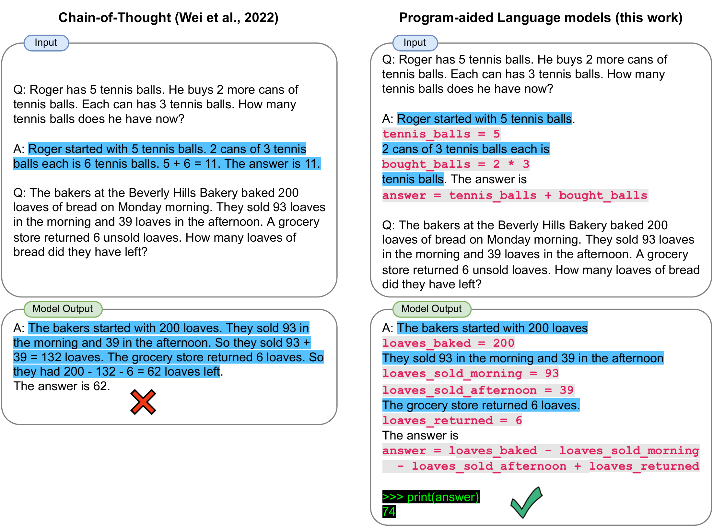
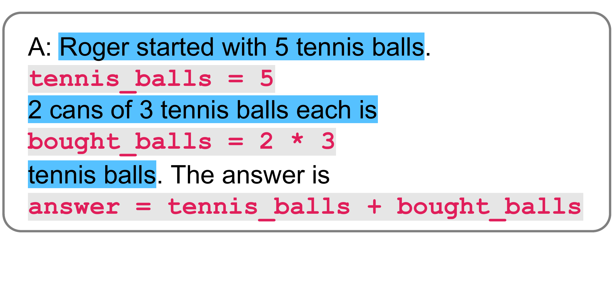

# PAL: Program-aided Language Models

[所属章节](../index.md) · [来源与阅读状态](../../../../sources/papers.json)


**作者**：Luyu Gao、Aman Madaan、Shuyan Zhou、Uri Alon、Pengfei Liu、Yiming Yang、Jamie Callan、Graham Neubig（前三位共同第一作者） <br>
**年份与固定版本**：2023；arXiv:2211.10435v2，2023-01-27 版本 <br>
**原始链接**：[arXiv:2211.10435v2](https://arxiv.org/abs/2211.10435v2)；论文题名为 *PAL: Program-aided Language Models*。 <br>
**实际阅读范围**：固定 PDF 共 34 页；完整读取正文第 1–9 页左右的 Introduction、Few-shot Prompting、PAL 方法、Experimental Setup、数学/符号/算法任务、Results、Analysis、Related Work、Conclusion，并核对正文所引用的表格、方法图和实验图的 LaTeX 源。为解释正文结论，补读了附录中的数据集统计、GSM-HARD 构造与 25 个 CoT 输出分析、Least-to-Most 迁移、若干提示消融、符号任务失败案例和 token-level 小样本分析；没有把附录内容冒充正文主实验。

## 1. 论文要解决什么问题

链式思维（CoT）让语言模型先写出自然语言中间步骤，再继续生成答案。它把一道题拆成“理解题意—列出步骤—执行步骤—写答案”，因此比直接问答案更可靠。但 CoT 中的每一步仍由语言模型以自然语言完成。模型可能正确地拆解“5 个袋子、每袋 3 个”却在最后把 $`5+2\times3`$ 算错；对于日期进位、长整数、列表状态和条件过滤，错误也可能出现在看似合理的文字中。PAL 的核心问题是：能否让 LLM 负责把自然语言问题转成可执行的程序，把精确计算和状态更新交给解释器？

论文因此提出 Program-Aided Language Models（PAL）。它并没有声称程序生成本身消除了理解错误，而是把任务边界重新划分：模型学习自然语言问题到“带语义变量和操作的程序”的映射；Python 解释器负责运行该程序并返回结果。只要程序正确且运行环境、库和格式均符合预期，解释器执行的算术、列表长度、日期运算等部分是确定的。这个“给定正确程序时答案准确”的条件，是结构保证，不是对程序生成准确率的保证。



图 1 是作者对 CoT/PAL 信息流的总览。左侧 CoT 将 Roger 的网球题和面包题都写成自然语言步骤，模型既要理解又要算；右侧 PAL 在每个自然语言说明旁生成变量赋值和表达式，最后把 `answer` 交给 Python。图中面包题还揭示了一个容易被忽略的语义细节：退回的 6 个面包应加回库存，正确表达是 `200 - 93 - 39 + 6 = 74`。图本身的重点不是“代码一定正确”，而是把最终执行权从 LLM 转移给解释器。

## 2. 从 few-shot、CoT 到 PAL

普通 few-shot prompting 给模型 $`k`$ 个输入—输出例子。记第 $`i`$ 个例子的输入、输出为 $`(x_i,y_i)`$，提示为

```math
p = \langle x_1\cdot y_1\rangle \mathbin{\|} \langle x_2\cdot y_2\rangle \mathbin{\|}\cdots\mathbin{\|}\langle x_k\cdot y_k\rangle .
```

测试问题 $`x_{test}`$ 被拼接到 $`p`$ 后，模型直接生成 $`y_{test}`$。CoT 把每个示例扩展为 $`(x_i,t_i,y_i)`$，其中 $`t_i`$ 是自然语言推理链；测试时模型要同时生成 $`t_{test}`$ 和 $`y_{test}`$。CoT 的收益来自显式分解，但最后的求值仍由模型完成。

PAL 将示例改为 $`(x_i,t_i)`$，其中 $`t_i=[s_1,\ldots,s_N]`$，每个 $`s_j`$ 是自然语言（通常写成 Python 注释）或 Python 语句：

```math
p = \langle x_1\cdot t_1\rangle \mathbin{\|}\cdots\mathbin{\|}\langle x_k\cdot t_k\rangle .
```

对测试问题，模型只生成混合的自然语言—程序序列 $`t_{test}`$。系统把注释忽略，把程序整体交给 Python interpreter，执行结果 $`y_{test}`$ 才是最终答案。实验采用一次生成、一次事后执行；论文提到也可以分段执行并把中间结果反馈给模型，但没有把这种交互式方案作为主实验设置。

这与“程序提示”只在表面形式上相似。PAL 的消融显示，写 Python 但仍要求模型自己在代码后生成数字答案，GSM8K 只有 23.2%，接近直接提示的 19.7%，远低于真正执行程序的 72.0%。因此决定性变化是执行闭环，而不是把 CoT 换成更漂亮的代码文本。论文也将 PAL 与同期的 Program of Thought 区分：PAL 的实验证据覆盖数学、符号和算法任务，并尽量复用已有 CoT 的示例，而不是只为代码方法重新挑示例。

## 3. 方法：自然语言问题如何变成变量、程序和解释器结果

### 3.1 变量与中间表示

程序中的变量名要承担自然语言对齐作用。对“Olivia 有 23 美元，买 5 个每个 3 美元的 bagel”，提示示例使用 `money_initial`、`bagels`、`bagel_cost`、`money_spent` 和 `money_left`，而不是无意义的 `a,b,c`。在模型看来，变量名是把题中实体、属性和操作绑定起来的语义锚点；对 Python 解释器而言，变量名本身没有语义，只有赋值和表达式的结果有作用。

一条典型生成链是：

```python
# Olivia has $23.
money_initial = 23
# number of bagels bought
bagels = 5
# price of each bagel
bagel_cost = 3
money_spent = bagels * bagel_cost
money_left = money_initial - money_spent
answer = money_left
print(answer)
```

自然语言注释帮助模型继续生成；解释器忽略注释，运行程序得到 `8`。这条链将一个算式拆成可检查的状态更新，既保留了 CoT 的分解，也把乘法和减法交给确定性程序。

### 3.2 符号任务中的程序化状态

PAL 不限于算术。对于排列对象，模型先将文本转成有序列表，例如 `objects = [('paperclip','purple'), ...]`，再查找 `stress ball` 的索引，并取 `objects[stress_ball_idx+1][1]` 得到右邻对象的颜色。对于“删除 Bernard 后有多少只未满 8 岁企鹅”，程序可以先过滤列表，再对剩余列表做条件筛选和 `len`。这使“过去提到过谁”和“最后状态里还剩谁”成为程序状态，而不是依赖语言模型在长文本中维持一致。

日期任务则使用日期库和相对时间增量：模型从“2001 年 2 月最后一天、16 岁生日”生成日期对象，再加上 16 年和 24 小时；日历库处理月份边界。作者给出的 CoT 失败例把 2017 年 2 月 28 日后一天写成不存在的 02/29/2017，而程序执行可以得到合法日期。这里的保证仍以模型正确抽取初始日期、选择正确库调用为前提。

### 3.3 安全算术教学代码（本文自写，不是论文实现）

下面的短代码只演示“受限表达式—解释器—结果”的教学闭环。它拒绝函数调用、属性访问、索引、变量名和除算术外的语法，避免把不可信模型输出直接交给 Python 的 `eval`。这不是论文的安全实现，也不是论文实验的复现：

```python
import ast
import operator as op

BIN_OPS = {ast.Add: op.add, ast.Sub: op.sub,
           ast.Mult: op.mul, ast.Div: op.truediv}

def safe_arithmetic(expr: str) -> float:
    tree = ast.parse(expr, mode="eval")

    def visit(node):
        if isinstance(node, ast.Expression):
            return visit(node.body)
        if isinstance(node, ast.Constant) and isinstance(node.value, (int, float)):
            return node.value
        if isinstance(node, ast.UnaryOp) and isinstance(node.op, (ast.UAdd, ast.USub)):
            value = visit(node.operand)
            return value if isinstance(node.op, ast.UAdd) else -value
        if isinstance(node, ast.BinOp) and type(node.op) in BIN_OPS:
            left, right = visit(node.left), visit(node.right)
            if isinstance(node.op, ast.Div) and right == 0:
                raise ValueError("division by zero")
            return BIN_OPS[type(node.op)](left, right)
        raise ValueError("unsupported expression")

    return visit(tree)

program = {
    "money_initial": 23,
    "bagels": 5,
    "bagel_cost": 3,
}
program["money_spent"] = program["bagels"] * program["bagel_cost"]
program["money_left"] = program["money_initial"] - program["money_spent"]
assert safe_arithmetic("5 * 3 + 23 - 15") == 23
print(program["money_left"])  # 8
```

教学代码把变量赋值和算术解析分开，是为了显式展示 PAL 的两个层次：语义变量由模型提出，受限解释器只执行允许的运算。论文使用的是标准 Python interpreter，允许更一般的列表、字典、循环和日期库；因此上例的安全限制不能被误解为原方法的实验设置。

### 3.4 提示构造与离线/部署流程

作者在已有 CoT 提示可用时复用同样的 in-context examples；否则为每个 benchmark 随机固定 3–6 个示例，并同时用于 CoT 和 PAL。示例被改写为有意义的变量名、循环和字典。数学任务发现显式自然语言注释额外帮助不大，因此数学示例主要保留语义变量名；符号任务则更常使用注释解释筛选目的。

离线准备阶段是人工制作或改写少量示例提示，不更新 LLM 参数。部署时输入是固定提示加测试问题，模型以温度 0 贪心生成程序；系统随后一次性执行生成的程序，解析 `answer` 或打印值。若程序语法错误、变量未定义、库调用错误或模型把题意映射错，论文主实验没有报告统一的错误恢复协议。作者提出分段执行和反馈作为可行扩展，但其成本与成功率没有纳入本文主结果。

## 4. 实验设置：比较什么，怎样比较

论文覆盖三类共 13 个任务：

| 类别 | 任务 | 数据规模或说明 |
|---|---|---|
| 数学 | GSM8K、GSM-HARD、SVAMP、ASDiv、MAWPS-SingleEq/SingleOp/AddSub/MultiArith | 附录统计分别为 1319、1000、2096、508、562、395、600；GSM-HARD 是把 GSM8K 中一个数字替换为最多 7 位随机整数的压力版本 |
| 符号 | Colored Objects、Penguins in a Table、Date Understanding | 2000、149、369 个样本 |
| 算法 | Object Counting、Repeat Copy | 1000、32 个样本 |

基线为 Direct（立即输出答案）、CoT 和 PAL。除引用的外部结果外，三者使用同一 Codex `code-davinci-002` 后端，贪心解码、温度 0；已有 CoT 提示的数据尽量沿用前作示例，其他数据用同一固定随机示例集。额外比较包括 PaLM-540B、LaMDA-137B、UL2-20B、Minerva-540B 的公开 CoT 结果。不同论文、模型、提示和采样预算的数字不构成严格统一排名。

论文主指标是 solve rate（题目最终答案正确的比例），不是输入 token、输出 token、总 token、FLOPs、延迟、GPU 时间或美元成本。PAL 的“更高效”在本文语境中主要是把计算交给确定性解释器并减少算术错误；不能从 solve rate 直接推断 token 效率或端到端成本优势。

## 5. 主结果与作者如何解释

### 5.1 数学任务

表 1（`tab:math:mainresults`）给出单次 top-1 solve rate（%）：

| 方法 | GSM8K | GSM-HARD | SVAMP | ASDiv | SingleEq | SingleOp | AddSub | MultiArith |
|---|---:|---:|---:|---:|---:|---:|---:|---:|
| Direct-Codex | 19.7 | 5.0 | 69.9 | 74.0 | 86.8 | 93.1 | 90.9 | 44.0 |
| CoT-Codex | 65.6 | 23.1（正文结果段写 20.1，表中为 23.1） | 74.8 | 76.9 | 89.1 | 91.9 | 86.0 | 95.9 |
| CoT-PaLM-540B | 56.9 | — | 79.0 | 73.9 | 92.3 | 94.1 | 91.9 | 94.7 |
| CoT-Minerva-540B | 58.8 | — | — | — | — | — | — | — |
| PAL-Codex | **72.0** | **61.2** | **79.4** | **79.6** | **96.1** | **94.6** | **92.5** | **99.2** |

PAL 在表中八项都最高；相对 CoT-Codex，GSM8K 提升 6.4 个百分点，SVAMP、ASDiv 和 MAWPS 各任务也有提升。GSM-HARD 的差异最大：PAL 从 GSM8K 的 72.0% 降到 61.2%，CoT 从 65.6% 降到 23.1%（正文文字另写 20.1%，这是版本内部定位上的数值矛盾，应以表 1 和标准差表的 23.3% 平均值为主要证据，而不是强行合并）。

作者将 GSM-HARD 的下降归因于大整数算术，而不是主要归因于题意重新理解：25 个配对样本中有 16 个 CoT 思路几乎逐字相同，只有数字被替换，说明模型保留了操作结构却在求值时失败。这个分析是人工检查的小样本，不能证明所有失败都来自计算。将大数字放入 CoT 示例也只从 23.3% 到 23.8%，说明更匹配的示例没有解决问题。



图 2 是 PAL 提示中单个示例的局部放大，展示自然语言句子和对应赋值如何交错。它支持“模型学习变量—操作链”的机制解释，但不报告 token 数或执行时间。

### 5.2 多样本与预算

GSM8K 上，PAL 使用 nucleus sampling（$`p=0.95`$、温度 0.7）抽取 40 个程序并多数投票，solve rate 从单样本约 72.0% 升到 80.4%（表 `tab:math:majority`）；Minerva-540B 的同预算结果为 78.5%。附录图 `fig:gsm:multisample_interpolation` 给出 PAL 在 1/8/15/40 个样本约为 71.4/78.5/79.8/80.4，CoT 的对应曲线来自 1 和 40 点之间的 logistic interpolation，不能当作真实测量的中间预算轨迹。这里的 $`40`$ 次采样是推理样本数，论文没有报告每次生成的 token、程序执行时间、失败重试次数或总计算成本，因此不能称作完整的任务成本前沿。

### 5.3 符号和算法任务

表 2（`tab:date_color_results`）显示：

| 方法 | Colored Objects | Penguins | Date | Repeat Copy | Object Counting |
|---|---:|---:|---:|---:|---:|
| Direct-Codex | 75.7 | 71.1 | 49.9 | 81.3 | 37.6 |
| CoT-Codex | 86.3 | 79.2 | 64.8 | 68.8 | 73.0 |
| CoT-PaLM-540B | — | 65.1 | 65.3 | — | — |
| PAL-Codex | **95.1** | **93.3** | **76.2** | **90.6** | **96.7** |

Colored Objects 要维护有序对象、相对位置和颜色；PAL 比 CoT-Codex 高 8.8 个百分点。Penguins 包含加入和删除记录，PAL 高 14.1 个百分点。Date 涉及月份边界和时间增量，PAL 高 11.4 个百分点。Object Counting 要从文字中筛出蔬菜并求数量，PAL 比 CoT 高 23.7 个百分点；Repeat Copy 则按指令生成序列，PAL 比 CoT 高 21.8 个百分点，但 Direct 反而高于 CoT，说明 CoT 并不在所有任务上稳定受益。

算法任务的程序不是“先验已知算法”自动提供给系统，而是由 LLM 从题面生成。Object Counting 示例把对象和数量放入字典，过滤椅子、桌子和冰箱后求 `sum(values)`；Repeat Copy 则要把词序列和插入的 `quack` 位置编码为程序逻辑。

## 6. 消融、敏感性和失败模式

### 6.1 执行器是否是关键

GSM8K 消融表 `tab:gsm:more_ablations`：Direct 19.7%，CoT 65.6%，PAL 72.0%，把程序压缩成单行的 Succinct Code 47.8%，让 LLM 模拟执行器并直接生成答案为 23.2%。完整多步程序比单行表达式好，说明分解仍然有价值；但只写代码而不执行几乎回到 Direct 水平，支持“解释器执行是主要增益来源”的作者解释。

论文还做了“变量名是否重要”的提示消融。GSM8K 中，语义变量名的 PAL 为 71.8%，换成单字母变量为 59.0%，CoT 为 63.1%；单字母变量加有意义注释为 69.0%。在 Colored Objects、Date、Penguins 上，移除注释但保留语义变量仍略低于完整 PAL，却通常高于 CoT；再同时打乱变量名会明显下降，部分低于 CoT。结论是结构和自然语言语义共同作用，Python 执行器本身不理解变量名。

### 6.2 模型能力依赖

GSM8K 上，code-cushman-001 的 PAL/CoT 为 21.7/19.1，code-davinci-001 为 31.8/26.0，code-davinci-002 为 72.0/60.1。较弱模型绝对准确率低，但仍有相对提升。自然语言模型的结果更能说明“会不会写代码”是门槛：text-davinci-001 的 CoT/PAL 为 26.5/8.6，text-davinci-002 为 46.9/65.8，text-davinci-003 为 65.3/69.8。弱代码能力时，PAL 反而损害性能；代码能力足够时，PAL 才超过 CoT。因此 PAL 不是脱离模型能力的外部魔法。

### 6.3 问题长度与符号失败

Colored Objects 按对象数分桶的图 `fig:count_breakdown` 显示，PAL 在 0–26 个对象各桶约 0.93–1.00，CoT 从 0.85 左右下降并在 24–26 个对象桶约 0.57。作者认为列表索引和过滤使状态跟踪更稳定。人工失败分析中，CoT 会保留已删除的 Bernard，或把过滤条件、计数对象混在文字里；PAL 用列表推导式先删除再筛选，状态转移更清楚。日期失败集中在跨月边界；PAL 的日期库可以执行日历规则，但模型仍可能选择错误的起始日期、库或格式。

### 6.4 token-level 分析的证据范围

作者从 Colored Objects 随机抽 20 题，手工观察 CoT/PAL 生成 token 的低 log-likelihood。CoT 在数字/数量、空间关系词、颜色和对象名上分别有 7、6、2、6 个样本出现低置信；PAL 对 `len(objects)`、列表索引等程序表达通常更有置信，且 `objects[-1]` 比“最后一个/第五个”更统一。这个分析提供机制线索，但不是大规模统计检验，也没有把 log-likelihood 转成 token 节省、延迟或成本。它支持“代码的表达更规范”，不能单独证明 PAL 更 token-efficient。

### 6.5 Least-to-Most 迁移

附录把 Least-to-Most 的问题分解阶段保持为原始自然语言，只把解题阶段改成 PAL 程序。500 个样本上，GSM8K 从 Least-to-Most 的 67.2% 到 72.8%，SVAMP 从 75.2% 到 78.2%。共享变量使前一个子问题的结果可以自然进入后一个子问题。这是对提示范式可组合性的补充证据，不属于正文主表，也未报告 token 或延迟。

## 7. 原图与可复用资产

论文正文重要图示已从固定 LaTeX 源复制到 `assets/`，保留原始 PDF/TeX 资产；论文源文件未提供明确开放许可证，`source-manifest.json` 的 `license_url` 为 `null`，因此下表把 `reuse_allowed` 标为 `unknown`，主代理整合时应遵守 arXiv/作者版权要求并保留来源说明。

| id | 原图编号与用途 | 原始文件 | source_url | license | reuse_allowed |
|---|---|---|---|---|---|
| `fig_main_intro_example` | Figure 1；CoT 与 PAL 的面包/网球示意 | `assets/fig_main_intro_example.pdf` | https://arxiv.org/abs/2211.10435v2 | 未声明（manifest 为 null） | unknown |
| `fig_miniexample` | Figure 2；交错自然语言和程序的局部提示 | `assets/fig_miniexample.pdf` | https://arxiv.org/abs/2211.10435v2 | 未声明 | unknown |
| `fig_colored_objects_prompt` | Figure 4 的 LaTeX 原资产；对象列表、索引和右邻颜色 | `assets/fig_colored_objects_prompt.tex` | https://arxiv.org/abs/2211.10435v2 | 未声明 | unknown |
| `fig_land_cot` / `fig_land_pal` | Appendix Beyond Benchmarks；ChatGPT 示例中 CoT/PAL 的颜色问题 | `assets/fig_land_cot.pdf`, `assets/fig_land_pal.pdf` | https://arxiv.org/abs/2211.10435v2 | 未声明 | unknown |
| `fig_letter_cot` / `fig_letter_cot_2` / `fig_letter_pal` | Appendix Beyond Benchmarks；数单词母的错误与程序修正 | 对应 `assets/` PDF | https://arxiv.org/abs/2211.10435v2 | 未声明 | unknown |

正文实验图中，数学主结果和符号主结果实际由 LaTeX 表格/pgfplots 生成，关键数据已在本文表格转录；附录曲线和敏感性图应以原文图号、坐标和采样说明一并复用，不能把插值点称为实测点。

## 8. 与推理时 token 目标的关系

PAL 对推理时效率的直接贡献是流程级的：它将一部分“精确求值”从 LLM token 生成转为外部程序执行；程序可以把大整数加减、列表过滤、日期运算以常数级或库调用完成，而不必让模型逐 token 写出算术过程。这解释了 GSM-HARD 和日期边界上的准确率收益，也解释了为什么单行代码不如多步代码：中间变量既是模型的语义支架，也是可执行程序的状态。

但论文没有测量输入 token、输出 token、总 token、隐藏思维 token、程序长度、解释器延迟、模型调用次数、失败重试、FLOPs、GPU/CPU 时间或美元成本。因此它证明的是“在固定提示、固定一次生成和固定解释器下的 solve rate 改善”，不是完整 token-efficiency 实证。PAL 的代码可能比 CoT 更长，提示中的变量和注释也会增加输入 token；解释器虽快，模型仍需生成程序，语法错误或运行错误还可能引入重试成本。40 次多数投票尤其扩大推理样本数，不能只看准确率提升就说成本下降。

从研究设计看，真正的 token 效率问题应额外记录每题 prompt tokens、completion tokens、程序执行时间、错误/重试次数和总模型调用，并在同一模型、同一示例数、同一正确率目标下比较 CoT、PAL、直接提示和可选分段执行。本文没有这些测量，所以“程序化推理是 token-efficient”的表述只能作为研究假设或潜在机制，不能写成 PAL 论文已经验证的结论。

## 9. 局限与未解决问题

第一，程序正确性只是条件保证；错误的实体抽取、变量绑定、符号方向和日期起点仍会产生确定但错误的结果。第二，论文使用标准 Python，未讨论不可信代码的沙箱、资源限制、文件/网络访问、库版本、超时和异常恢复；本文教学代码的安全限制也不是原 PAL 系统。第三，PAL 的提示由作者人工构造，变量名质量和示例选择是重要隐变量；虽然作者尽量复用 CoT 示例，仍未把提示工程时间纳入成本。

第四，外部基线来自不同模型和论文，表格缺失值多，不能据此建立统一规模—性能曲线。第五，GSM-HARD 的答案构造部分依赖 PAL 生成的程序：71% 的 GSM 正例直接用正确程序替换数字，另外一部分通过采样和人工标注完成；作者人工检查了 25 个程序，但这种流程仍需警惕程序偶然得到正确答案的情况。第六，token-level 分析只有 20 题，GSM-HARD CoT 对照只有 25 题，不能外推到所有任务。

最后，论文正文没有端到端 token、延迟或算力账本，也没有系统报告语法错误率、执行异常率、重试协议、长程序上下文溢出和恶意代码风险。PAL 因而更准确地被定位为“把可形式化的求解交给解释器的程序辅助推理方法”，其 token 成本优势仍待在相同准确率和完整运行预算下单独测量。

## 参考定位

- 方法和提示定义：正文 §2–§3，`source/sections/method.tex`。
- 数据、基线和解码：正文 §4，`source/sections/experiments.tex`。
- 数学与符号任务：正文 §4.1–§4.3，`source/sections/maths.tex`、`symbolic.tex`、`algorithmic.tex`。
- 主结果：正文 §5，表 `tab:math:mainresults`、`tab:date_color_results`，`source/sections/results.tex`。
- 分析与消融：正文 §6，`source/sections/analysis.tex`；数学提示消融与多样本细节在附录 `more_ablations.tex`。
- 失败、token-level 与 Least-to-Most：附录 `additional_analysis.tex`、`token_level_analysis.tex`、`appendix.tex`。
