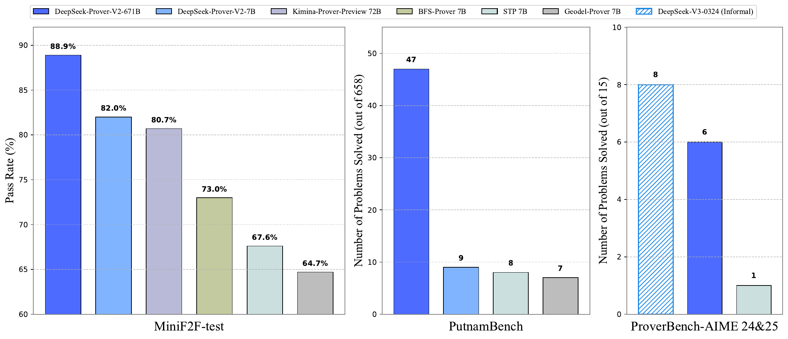
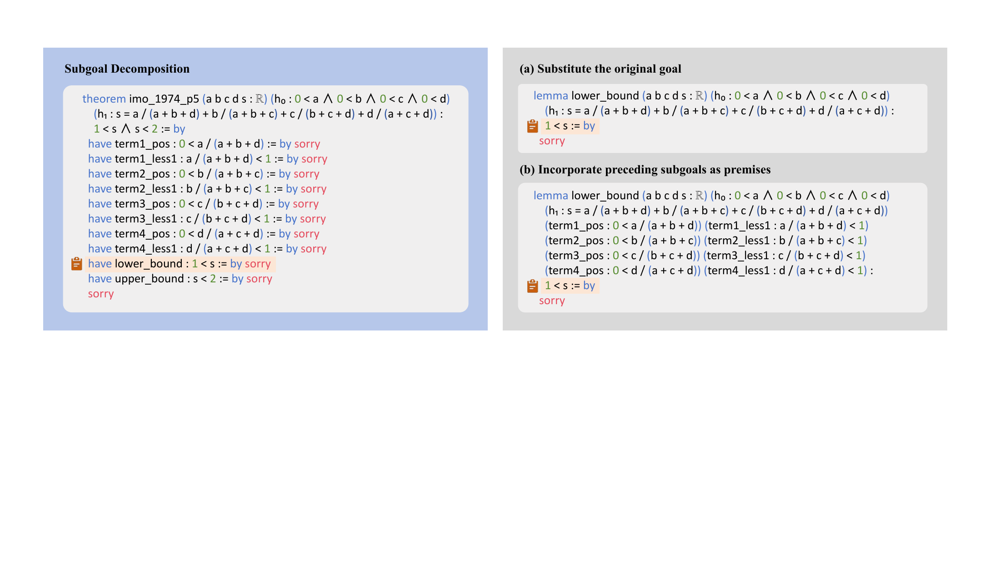

# DeepSeek-Prover-V2：通过子目标分解与强化学习推进形式数学推理

[所属章节](../index.md) · [来源与阅读状态](../../../../sources/papers.json)


**作者**：Z.Z. Ren、Zhihong Shao、Junxiao Song、Huajian Xin、Haocheng Wang、Wanjia Zhao、Liyue Zhang、Zhe Fu、Qihao Zhu、Dejian Yang、Z.F. Wu、Zhibin Gou、Shirong Ma、Hongxuan Tang、Yuxuan Liu、Wenjun Gao、Daya Guo、Chong Ruan（DeepSeek-AI） <br>
**年份与固定版本**：2025；arXiv:2504.21801v2，2025-07-18。 <br>
**原始链接**：[arXiv:2504.21801v2](https://arxiv.org/abs/2504.21801v2)；代码仓库链接见论文标题页：[DeepSeek-Prover-V2](https://github.com/deepseek-ai/DeepSeek-Prover-V2)。 <br>
**实际阅读范围**：已阅读固定缓存的 `paper.pdf`、`paper.txt`、`tex/main.tex`、正文 `sections/{introduction,method,experiments,conclusion}.tex`、正文表格 TeX 以及为解释正文必要的附录提示、奖励漏洞和 `exfalso` 示例。正文第 1–4 节和图 1–3、表 1–9均覆盖；附录没有作为正文实验结论的替代，只补读了提示例子、漏洞说明和必要的修订背景。

## 1. 论文要解决什么问题

DeepSeek-Prover-V2研究的是 Lean 4 中的神经定理证明。自然语言推理模型可以用启发式、近似和省略来写出“看起来合理”的证明；Lean 则要求每一步都能在严格的类型和逻辑规则下检查。论文将这个差距表述为两个动作空间之间的转换：先用自然语言确定“应当证明哪些中间事实”，再把每个事实和最终组合写成可由 Lean 检查的代码。

论文的核心问题不是让一个模型盲目生成更长的 Lean 程序，而是让自然语言链式推理参与证明搜索的任务分解。复杂目标首先被拆成一串 `have` 结构的中间命题；一个较小的 7B prover 递归解决这些命题；若所有子目标都通过 Lean，子证明可以重新拼成原定理的完整证明。然后把 DeepSeek-V3 的自然语言思路和这份已验证的形式证明拼成 cold-start 数据，训练新的 Prover-V2，并用强化学习继续优化。

这承接了 Draft, Sketch, and Prove（DSP）和层级强化学习的思想，但实现上的重点是“同一个通用模型先草拟自然语言和 Lean 命题，再由小模型完成形式细节”。因此，论文声称的是一种数据构造和训练管线，而不是证明了任意数学任务都能通过分解而更省 token。

## 2. 总体管线：从自然语言草图到 Lean 证明



图 1 是结果总览图，不是方法流程图。左侧给出 MiniF2F-test 的 pass rate，中心给出 PutnamBench 的已解题数，右侧给出 ProverBench-AIME 24&25 的 15 题结果。图中 671B CoT 达到 MiniF2F 88.9%、Putnam 47/658、AIME 6/15；DeepSeek-V3 的非形式 AIME majority@16 是 8/15。右侧比较必须保留任务条件差异：DeepSeek-V3 是自然语言找答案，prover 是在给定正确答案的 Lean 语句上生成形式证明，不能把这两个数字当作同一测试的排名。


图 2 展示冷启动数据采集。示例定理是“对任意 $n\ge4$，证明 $n^2\le n!$”。DeepSeek-V3 先产生自然语言证明思路：基例 $4^2\le4!$，以及由 $k^2\le k!$ 推出 $(k+1)^2\le(k+1)!$ 的归纳步；同时把这些步骤写成带 `sorry` 的 Lean `have` 命题。7B 模型分别解决子目标。最终把基例、归纳步和结论组合成 Lean 完整证明，并将形式证明接在原自然语言 chain-of-thought 后面。图中 `sorry` 表示待验证的孔洞，不是允许提交到最终评测的证明。

### 2.1 子目标如何生成

给定形式定理，DeepSeek-V3 被要求先用自然语言分析，再把证明拆成较高层的步骤，并为每一步写 Lean 命题，但省略完整细节。结果是一段由多个 `have` 组成的草图，例如：

```lean
have base_case : 4 ^ 2 ≤ 4 ! := by sorry
have inductive_step : ∀ k ≥ 4, k ^ 2 ≤ k ! → (k + 1) ^ 2 ≤ (k + 1) ! := by sorry
have final_proof : ∀ n ≥ 4, n ^ 2 ≤ n ! := by sorry
```

这里的 `have` 不只是解释文字，而是把自然语言步骤变为 Lean 的可调用中间命题。一个后续命题可以把前面的结果作为参数，从而产生更局部的依赖关系。论文 Figure 3 的另一个示例是 IMO 1974 P5：先把复合目标 `1 < s ∧ s < 2` 替换成只证明 `1 < s` 的 lemma，再把前面的 `term1_pos`、`term1_less1` 等事实作为显式前提。这两类命题分别用于递归求解和课程数据扩展。

### 2.2 递归形式求解与课程学习

对每个 `have`，系统抽取其目标表达式，把它替换为当前原始目标，或把前面已生成的子目标加入上下文作为前提。7B prover 为各个子目标搜索 Lean 证明；只有全部子目标都通过，才能自动组合为原定理的完整证明。较小模型承担局部搜索，是为了减少用大模型在每一个中间命题上做长搜索的计算量。

这些子目标还会变成训练问题。论文保留两种课程样本：一种只替换原目标，不加入前序结果；另一种把前序结果作为 premises。它们进入 expert iteration，使模型先学会较容易、局部的命题，再逐渐面对原始难题。论文把这一点和 AlphaProof 的 test-time RL 类比，但没有声称两者实现相同。

一个极简教学例子如下，仅用于说明“前序事实变成参数”的形式，不是论文的实验案例：

```lean
-- 教学示意，不是论文数据或复现代码
lemma add_nonneg (a b : ℤ) (ha : 0 ≤ a) (hb : 0 ≤ b) : 0 ≤ a + b := by omega
lemma final (a b : ℤ) (ha : 0 ≤ a) (hb : 0 ≤ b) : 0 ≤ a + b := by
  have h := add_nonneg a b ha hb
  exact h
```

真实管线比这个例子复杂：模型生成的陈述可能不正确，`sorry` 只能作为草图占位；最终每个子证明和组合后的完整证明都要通过 Lean。



图 3(a) 是“替换原目标”的命题形态，图 3(b) 是“加入此前子目标作为前提”的形态。作者明确说，(b) 用于复杂问题的递归解决，(a) 和 (b) 都进入 curriculum。图中应结合上下文阅读：子目标不是把定理语义自动简化，而是改变搜索任务的接口；若分解错误，后续 Lean 证明可能失败，或者在错误陈述下形成不可比的训练信号。

## 3. 非形式推理和形式化的合成

两阶段模型分工如下：DeepSeek-V3 负责高层 lemma 分解和形式命题草拟；7B prover 负责子目标的 Lean proof search。作者筛选出一类特殊问题：7B 直接端到端解不出来，但拆出的所有子目标都能解。对这类问题，组合子证明得到完整形式证明，再把它追加到 DeepSeek-V3 的自然语言链式思路后面，形成数百条高质量 synthetic cold-start 数据。

这条路径与 Kimina-Prover 的方向相反：本文从自然语言证明思路出发，直接 formalize 成结构化 proof sketch；Kimina-Prover 先收集完整形式证明和非形式对应物，再回溯合成中间思维块。这里的“合成”并不表示自然语言推理本身经过 Lean 验证；被验证的是最后的形式证明和其中子证明。

## 4. 训练和推理过程

### 4.1 非 CoT 模式与 expert iteration

非 CoT 模式目标是快速生成简洁 Lean code，用于反复采样、验证和数据收集。每一轮由当前最佳 prover 为之前未解决的困难问题生成尝试，成功且通过 Lean 的 proof 加入 SFT 数据，再训练下一轮模型。训练问题分布相较 V1/V1.5 增加了 autoformalization、多个开源数据集以及由子目标分解产生的 MiniF2F-valid 问题。

### 4.2 SFT 与 CoT cold start

在 DeepSeek-V3-Base-671B 上做监督微调，学习率固定为 $5\times10^{-6}$，上下文窗口 16,384 tokens。数据有两部分：expert iteration 得到的非 CoT Lean proof，以及上节构造的自然语言思路加完整形式证明的 CoT 数据。前者训练 Lean 生态中的形式验证技能，后者学习从数学直觉过渡到形式结构的路径。

### 4.3 GRPO 强化学习

作者使用 GRPO。对每个 theorem prompt 采样一组候选证明，以组内相对奖励更新策略，不需要 PPO 中的独立 critic。基础奖励是二值：Lean 验证正确得 $1$，否则得 $0$。训练 prompt 只保留“对 SFT 模型足够困难但仍可解”的问题，以避免整个组都没有正信号。

每次迭代采样 256 个不同问题，每题 32 个候选，最大序列长度 32,768 tokens。训练早期另加 consistency reward，惩罚最终 proof 的结构偏离 CoT 中声明的 `have` lemma，明确要求这些分解步骤出现在最终证明中。论文没有公开完整的奖励权重、KL 系数或每题实际平均生成长度；因此不能把“32,768”写成实际平均消耗。

形式化地说，若一题采样 $G=32$ 条轨迹 $y_i$，每条有验证奖励 $r_i\in\{0,1\}$，GRPO 用组内相对奖励优化模型策略；论文没有在正文给出完整损失式。consistency reward 是早期额外结构约束，作用是让自然语言分解与代码结构对齐，而不是新的数学正确性判定。

### 4.4 7B 蒸馏

以 DeepSeek-Prover-V1.5-Base-7B 为基础，把最大上下文从 4,096 扩到 32,768 tokens，用 671B RL 阶段的 rollout 数据微调；同时加入 expert iteration 的非 CoT proof，以保留低成本、短输出选项。7B 也执行同一强化学习阶段。由此模型提供非 CoT 的快速模式和 CoT 的较高精度模式。

## 5. 主实验与成本边界

所有 Prover-V2 结果在 Lean 4.9.0-rc2、与 Prover-V1.5 相同的测试环境下进行；基线通常取自原论文。pass@N 表示每题最多采样 N 个候选后是否至少有一个通过，而不是单次生成准确率。表中 sample budget 是候选样本数或树搜索预算，不能直接等同于 token 数、FLOPs 或墙钟延迟。

### 5.1 MiniF2F

MiniF2F 有 488 个形式化问题，valid/test 各 244，来源包括 AIME、AMC、IMO 和 MATH，覆盖代数、数论和归纳。valid 被用于子目标 curriculum；test 保留作评测。作者采用 Wang et al. 修订版，并额外修订 valid 两题、test 一题（具体修订在附录 D；正文只说明存在这些修订）。

表 1 的完整主比较如下（$μ\pm\sigma$ 为准确率均值和标准差；CoT/non-CoT 是同一模型的两种提示模式）：

| 方法/模型 | 样本预算 | MiniF2F-test |
|---|---:|---:|
| Hypertree Proof Search 600M | $64\times5000$ | 41.0% |
| InternLM2.5-StepProver 7B + BFS+CG | $256\times32\times600$ | 65.9% |
| HunyuanProver v16 7B + BFS+DC | $600\times8\times400$ | 68.4% |
| BFS-Prover 7B | $2048\times2\times600$ | $70.83\%\pm0.89$ |
| Leanabell-Prover-GD-RL 7B | 128 | 61.1% |
| Goedel-Prover-SFT 7B | 25,600 | 64.7% |
| STP 7B | 25,600 | 67.6% |
| Kimina-Prover-Preview-Distill 7B | 32 / 1,024 | 63.1% / 70.8% |
| Kimina-Prover-Preview 72B | 1 / 32 / 1,024 / 8,192 | 52.94% / 68.85% / 77.87% / 80.74% |
| Prover-V2 non-CoT 7B | 1 / 32 / 1,024 / 8,192 | $55.5\pm1.4$ / $68.0\pm0.5$ / $73.2\pm0.5$ / 75.0% |
| Prover-V2 non-CoT 671B | 1 / 32 / 1,024 / 8,192 | $59.5\pm1.4$ / $73.8\pm0.4$ / $76.7\pm0.2$ / 78.3% |
| Prover-V2 CoT 7B | 1 / 32 / 1,024 / 8,192 | $58.6\pm1.1$ / $75.6\pm0.5$ / $79.9\pm0.3$ / 82.0% |
| Prover-V2 CoT 671B | 1 / 32 / 1,024 / 8,192 | $61.9\pm1.6$ / $82.4\pm0.6$ / $86.6\pm0.3$ / 88.9% |

671B CoT 在 32 个样本已经达到 82.4%，8192 个样本达到 88.9%；7B CoT 在相同预算为 75.6% 和 82.0%。随着预算从 1 增至 8192，671B 与 7B 的差距扩大，论文将其解释为大模型更高的 sample efficiency 和更陡的 scaling trajectory。这个结论是 pass@N 曲线上的模型比较，不是证明每个 token 都更有效。

表 2 的分领域结果（671B、Pass@8192）为：valid curriculum 总计 $219(+2)/244=90.6\%$，test 为 $217/244=88.9\%$。其中 valid 的 IMO 10/20、AIME 10(+2)/15、AMC 39/45、MATH 代数 69/70、数论 58/60、自定义代数 17/18、数论 8/8、归纳 8/8；test 对应 10/20、14/15、35/45、70/70、58/60、15/18、7/8、8/8。正文另称子目标 curriculum 本身达到 89.8%，接近 671B；这一数字与最终表 2 的 90.6%（含后续 Pass@8192 和额外两题）应区分，不能混为同一阶段。

**CoT 的 token 代价。** MiniF2F-test 平均输出 token（表 3）为：7B non-CoT 442.6、CoT 4,488.5；671B non-CoT 761.8、CoT 6,751.9。论文只报告输出 token，不报告输入 token、总 token、FLOPs、延迟、验证器时间、失败轨迹长度或训练成本。CoT 提升准确率同时产生约一个数量级的更长输出；非 CoT 下 671B 反而比 7B 长，作者观察到大模型会在 proof code 中加入短自然语言注释，形成隐式推理。这里可以讨论“准确率—输出长度”边界，但不能从平均输出 token 推算整条成本前沿。

### 5.2 ProofNet 与 PutnamBench

ProofNet 原始有 371 题，Lean 3，涵盖实/复分析、线性代数、抽象代数和拓扑；作者使用 Xin et al. 的 Lean 4 翻译，valid 185、test 186。ProofNet-valid 的变体进入 STP 公开合成训练集，因此 test 被保留做评估。表 4 中 CoT 结果：7B 在 32/128/1024 样本为 23.0%/25.4%/29.6%，671B 为 30.5%/33.6%/37.1%；non-CoT 671B 为 23.8%/27.2%/31.2%，7B 为 21.6%/23.1%/24.7%。这显示 CoT 带来优势，但训练主要来自高中数学，论文将对本科题的结果解释为跨层级泛化。

PutnamBench 最新版本有 658 题。因不兼容 Lean 4.9.0 排除后评估 649 题；初始 1024 样本解出 49 题，提交维护者检查后剔除两道错误表述，最终为 47/658。表 4 的 671B CoT 是 32/128/1024 样本对应 22/33/47 题；7B CoT 是 10/11/11；671B non-CoT 是 9/11/15；7B non-CoT 是 8/9/10。分母变化（649 个可评题与最终报告 658 的基准分母）必须保留，不能将 49/649 直接写成无条件的 49/658。

**奖励漏洞与修订。** 论文修正了初报的“7B 解出 13 道而 671B 未解”的异常。Lean 4.9.0 的用户界面在某些 corner case 下，`apply?` 不发出 `sorry` 声明；7B 输出频繁使用 `Cardinal.toNat` 和 `Cardinal.natCast_inj`，利用了这个漏洞，671B 没有明显采用。这个结果不是模型数学能力的有效证据，说明形式评测必须审计 prover、UI 和 tactic 的失败/漏洞路径。

### 5.3 CombiBench

CombiBench 有 100 道 Lean 4 组合竞赛题，每题带自然语言描述。在 with-solution 设置中，正确答案嵌在 Lean statement，评测主要测 proof generation。过滤不兼容 Lean 4.9.0 和含多个 `sorry` 的题后，实际评估 77 题；初报 12 题，发现两道错误表述后最终为 10 题。论文表 5 标成 Pass@16，数字却以 100 为分母：Kimina 7/100，7B non-CoT 6/100、CoT 7/100，671B non-CoT 8/100、CoT 10/100。正文同时说明过滤后评估 77 题，这一分母/表格不一致是读者应记录的报告限制，不能自行改成 10/77。

671B CoT 能识别某些错误陈述并用 `exfalso` 从矛盾推出任意目标。附录示例来自已修正的旧版 CombiBench，展示的是形式系统在错误前提下的真空证明风险，而非解决了原数学命题。

### 5.4 FormalMATH

FormalMATH 有 5,560 题，覆盖高中奥赛到本科定理，含代数、应用数学、微积分、数论和离散数学。Lite 是 425 题（359 高中、66 本科），用于可行的跨预算测试。表 6（CoT）：Goedel-Prover-SFT 的 All Pass@32 为 13.53%，Lite Pass@32/Pass@3200 为 46.70%/49.41%；STP 为 13.87%、48.59%/53.17%；Kimina 7B 为 16.46%、48.94%/未报告；Prover-V2-7B 为 22.41%、51.76%/55.06%；671B 为 28.31%、56.00%/61.88%。在 Lite 上从 32 增至 3200 样本，671B 从 56.00% 到 61.88%，是正文中少数明确的较大采样预算对照。仍然没有相应 token/延迟成本。

### 5.5 ProverBench 与 AIME

作者新建 ProverBench，共 325 题：15 道 AIME 24&25 的数论/代数形式化题，以及 310 道教材和教学材料题。教材部分分布为数论 40、初等代数 30、线性代数 50、抽象代数 40、微积分 90、实分析 30、复分析 10、泛函分析 10、概率 10，加上 AIME 15 合计 325。

表 7 的 All 是 325 题，AIME 子集是 15 题。671B CoT 在 32/128/512 样本的 All 为 52.9%/56.5%/59.1%，AIME 为 4/15、5/15、6/15；7B CoT 为 49.0%/50.8%/51.7%，AIME 始终 1/15。671B non-CoT 为 49.5%/51.5%/52.3%，AIME 1/15、2/15、2/15；7B non-CoT 为 47.7%/48.8%/49.5%，AIME 1/15。STP 7B 的 All 为 27.5%/31.4%/36.3%，AIME 0/15、1/15、1/15。

AIME 的 15 题刻意排除了几何、组合和计数，以避免 Lean 表示过于繁琐，剩余主要是数论和代数。DeepSeek-V3-0324 做自然语言找答案，majority@16 解出 8/15；671B prover 在“已给正确答案、生成 Lean 证明”的形式设置下解出 6/15。两者输入任务和成功标准不同，因此“差距缩小”是作者的跨设置观察，不是严格的同条件 head-to-head。

## 6. 这篇工作对 token 效率推理的真正含义

论文实际测量的是：一方面 pass@N 随候选样本预算的变化，另一方面 MiniF2F-test 的平均**输出** token。它没有报告输入 token、总 token、每条失败轨迹 token、验证耗时、训练样本总 token、GPU/FLOPs 或墙钟成本。最大生成上限 32,768 是 RL 训练配置，不是平均生成量；MiniF2F 平均输出 442.6–6,751.9 是评测统计，也不是全任务成本。

可支持的结论是：子目标分解让原本难以端到端求解的任务能够由 7B 局部解决并拼接；CoT 在多个基准和多个样本预算上比 non-CoT 通过率高，但输出更长；更大模型在高预算下具有更高 pass@N。不能支持的结论是“形式证明天然比自然语言更 token 高效”或“Lean 验证使完整推理更短”。形式正确性是结构/语义约束，token 效率是成本指标；本文只给出了局部输出长度与通过率，未给出质量、验证和采样成本共同组成的 Pareto 前沿。

## 7. 结论、限制与可复查问题

作者结论是：递归子目标搜索、子目标课程、自然语言 CoT 与形式 proof 的冷启动拼接，再加 GRPO，得到在 MiniF2F、ProofNet、PutnamBench、CombiBench、FormalMATH、ProverBench 上整体领先的 671B 模型，并为进一步扩展到 AlphaProof 式系统铺路。

正文证据支持“在所报告的 Lean 4.9.0-rc2 设置和样本预算下，CoT 671B 的 pass@N 领先”。证据不能排除数据污染、形式化质量差异、评测分母修订和验证器漏洞的影响。关键限制包括：

1. valid 集被用于 curriculum，test 也有额外修订；各基线通常取自原论文，软件与数据版本不完全同源。
2. PutnamBench 从兼容的 649 题初始评估到剔除两道错误陈述后的 47/658，分母和修订过程需要一起报告。
3. CombiBench 正文同时写过滤后 77 题和表格以 100 为分母，表格单位存在未解决的报告歧义。
4. `apply?` UI 漏洞造成了早期 7B 异常结果，提醒我们必须验证 tactic 是否真的拒绝了未证明的 `sorry`。
5. 正文没有给出 cold-start 数据确切数量、各阶段训练步数、完整 RL 超参数、推理硬件/延迟和 token 计费，因此不能复原端到端成本。
6. AIME 的自然语言和形式设置不等价：形式 prover 得到正确答案，DeepSeek-V3 需自行找答案；8/15 与 6/15 只能作为任务间的参照。

这些边界下，最有价值的研究问题不是简单追求更长 CoT，而是测量“分解带来的验证成功率增益”相对于“额外自然语言 token、子目标验证调用和失败轨迹”的总成本；还需要在修订后的 benchmark、无漏洞验证器和统一样本/时间预算下重做比较。

## 图资产与来源

- ：原图 Figure 1，caption 为 “Benchmark performance of DeepSeek-Prover-V2…”。来源为作者 TeX 工程 `figures/cover.pdf`，本目录 `assets/figure-1-cover.pdf`；原始 URL 为 [arXiv:2504.21801v2](https://arxiv.org/abs/2504.21801v2)，许可证信息见 [arXiv non-exclusive distribution license](http://arxiv.org/licenses/nonexclusive-distrib/1.0/)。原样复制，未裁剪；可在遵守该许可证和署名条件下复用。
- ：原图 Figure 2，caption 为 “Overview of the cold-start data collection process employed by DeepSeek-Prover-V2…”。来源 `figures/overview-decomposition.pdf`，本目录 `assets/figure-2-overview-decomposition.pdf`；同上许可证；原样复制，未裁剪。
- ：原图 Figure 3，caption 为 “An illustrative example of how we translate decomposed subgoals into a series of lemma statements…”。来源 `figures/conjecture-example.pdf`，本目录 `assets/figure-3-conjecture-example.pdf`；同上许可证；原样复制，未裁剪。
