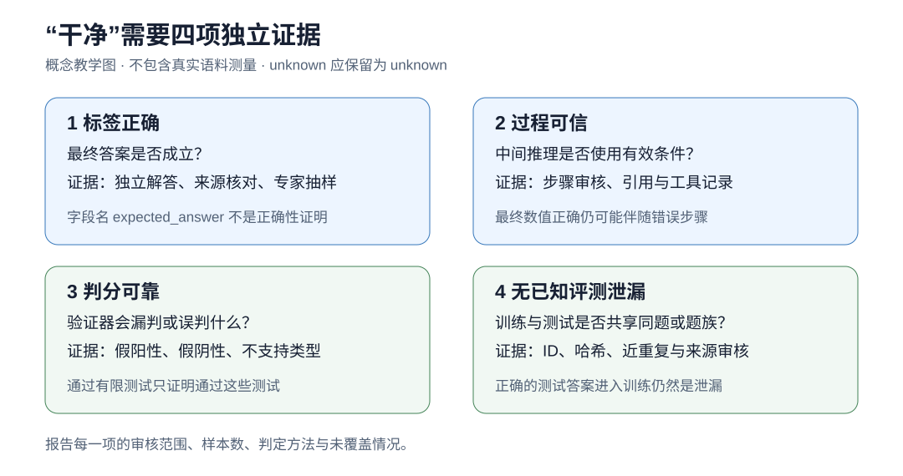

# 01 数据：先弄清模型在向什么学习
> 第一版技术专题：保留公式推导、教学算例和程序说明。领域现状与路线关系请以[新版对应章节](../01-data.md)为准；本页不承担第二版综述结论。

[返回总览](../../README.md) · 下一章：[预训练](02-pretraining.md)

## 学习目标

读完本章，你应该能够判断一份数据适合哪个训练阶段，区分题目数、轨迹数和训练 token 数，给“干净数据”写出可检查的定义，并解释为什么一份更短的数据集未必产生更省 token 的模型。练习只使用自己构造的微型数据，不需要下载大模型。

本教程把 token 效率定义为：**在相同任务分布和评测规则下，性能 $`y`$ 对一次完整任务的全部推理 token 消耗 $`x`$ 的曲线向左上移动。** 数据工作可以间接促成这种变化，例如让模型一次答对、少查一次资料、少重试一次；清洗了多少行、少训练多少 token，本身不能证明部署曲线改善。

## 1. 先沿着一条样本走完训练流水线

假设有一道教材题，题干是“一个物体以恒定速度运动，给定时间和速度，求位移”。对不同阶段，这条数据的用途不同。

预训练可以把整页教材当作普通文本，学习公式、单位和语言的联合分布。中训练可以提高这类领域文本在混合数据中的比例，让已有模型更熟悉该领域。监督微调则通常整理成输入问题和目标回答，明确要求模型在这个条件下给出什么。偏好训练需要同一问题下可比较的回答及选择依据。强化学习可以只提供问题与判分器，让模型自己生成回答后取得奖励。如果还要教模型调用计算器，则必须保留工具请求、返回值及其顺序。

这里不存在一个通用的“高质量 JSONL”能自动满足所有阶段。

| 阶段 | 最小学习对象 | 额外需要核实什么 |
|---|---|---|
| 预训练 | 连续文本、文档边界 | 来源混合、重复、语言与格式、tokenizer |
| 中训练 | 领域或能力相关文本 | 与旧数据比例、长度分布、旧能力保留 |
| SFT / 蒸馏 | 问题与目标回答，可含过程 | 条件完整性、目标来源、loss mask |
| 偏好训练 | 同条件下的回答对或排序 | 偏好标准、长度偏差、评审一致性 |
| 可验证奖励训练 | 问题、环境或参考答案、验证器 | 判分范围、错误类型、超时与不支持情况 |
| Agent 训练 | 观测—动作—反馈序列 | 环境版本、动作合法性、终态、可重置性 |
| 评测 | 固定任务与评分协议 | 与所有训练阶段隔离、独立题族、预算日志 |

表中列的是理解这些学习问题所需的共同要素；具体数据格式、过滤阈值和混合比例是方法选择，需要实验支持。

## 2. “干净”至少要拆成四项

**标签正确**：最终答案是否正确，或者偏好标注是否符合声明的标准。“标准答案”是字段名，不能证明正确性。教材答案、论坛答案、模型多数投票答案的来源约束不同。

**过程可信**：中间步骤是否有效，是否引用了题目没有给出的条件。最终数值碰巧正确，可以与错误推理同时出现；正确步骤也可能伴随末尾抄写错误。过程的“合理解释”与模型内部真正使用的计算机制，也是不同研究问题。

**判分可靠**：评分程序有没有把正确答案判错，或把错误答案判对。代码通过三个公开样例，只说明它通过这三个样例；数学字符串不相同也可能表示同一个数。证明题则不能依靠数值比较器完成验证。

**评测无已知泄漏**：训练和评测之间是否有同题、翻译、改写、同源代码或共享轨迹。它与前面三项正交：一道答案完全正确的测试题进入训练集，仍然会破坏独立评估。



*图 1：本教程自制概念图。每个维度都需要自己的证据；四项没有经过同标准审计时，不给数据集排“最干净”名次。图中没有真实语料的质量测量。*

具体地说，一次审核可以给每个维度使用 `pass / fail / unknown / unsupported`，并保留审核方式。`unknown` 表示没查清，`unsupported` 表示现有方法不支持；把它们直接变成错误或正确，都会改变训练和评测对象。

## 3. 三个真实数据集教会我们什么

这些例子用于说明如何读数据卡，**不构成三个数据集的正确率排名**。数量和字段会更新，复用时应锁定仓库 revision 与文件哈希。

**OpenMathReasoning（OMR）**：官方卡说明题目经过模型整理，解答由模型生成；`expected_answer` 在 `has_answer_extracted` 类型中来自抽取，在其他类型中来自生成结果的多数投票。后者具有模型之间共同出错的风险。卡片还更正过流水线起点题数与最终带解答题数混淆的问题。因此应同时看 `problem_type`、题目数和轨迹数，不能只看一个总行数。[OMR 官方数据卡](https://huggingface.co/datasets/nvidia/OpenMathReasoning#dataset-fields)

**OpenCodeReasoning（OCR）**：这里的缩写指编程推理数据集，不是光学字符识别。v1 的 `output` 是生成回答，`solution` 是抽出的代码，发布字段未直接附齐所有题的测试。论文讨论了执行过滤和错误轨迹，不能把整个库理解成逐条通过充分单元测试的正确过程。拿它做 SFT 与接上可执行奖励，是两个不同的准备任务。[OCR 官方数据卡](https://huggingface.co/datasets/nvidia/OpenCodeReasoning/blob/main/README.md)、[原论文](https://arxiv.org/html/2504.01943v1)

**TextbookReasoning（TBR）**：教材来源提供了较强约束，但流程还包括模型抽取、DeepSeek-V3 改写题目与完善答案、补充推理、模型过滤和去污。论文未报告三者同标准人工错误率审计；全量训练优于进一步筛选子集，是下游效用证据，不能证明每条答案正确。公开字段也不足以逐条恢复原书页码。[论文 §2](https://arxiv.org/html/2507.16812v1#S2)、[§3.3](https://arxiv.org/html/2507.16812v1#S3.SS3)、[数据卡](https://huggingface.co/datasets/MegaScience/TextbookReasoning)

可操作的做法是按来源和验证方式分层抽样，分别记录标签、过程、判分错误；质量结论应带分母。不要用“来源于教材”替代样本审核，也不要因为存在生成过程就预先判定整个数据集无效。

### 3.1 把质量说法落实到可复核的样本

截至 2026-09-09，OMR 的维护者确实推荐 `has_answer_extracted`，但讨论中的“16 / 2048”是用户用 GPT-4.1-mini **两次判分不一致的比例**，不是标签错误率；“约 50 步崩溃”也是特定混合数据与训练设置下的用户报告。维护者后来推荐了 7,732 条训练样本的 Nemotron-RL-Math-v2，其质量检查仍包含模型判定，不能改称人工金标。[原讨论](https://github.com/NVIDIA-NeMo/Skills/issues/1092)、[新版数据卡](https://huggingface.co/datasets/nvidia/Nemotron-RL-Math-v2)

OCR 第二版已经公开 `pass_rate`：`1` 表示通过被执行的测试，`-1` 表示没有完成有效验证。执行子集覆盖约 60% 数据，每题至少有 5 个测试，最多抽取 50 个。它允许构造“通过这些测试”的子集，仍不能证明完整程序或每步推理正确。原论文中错误轨迹的收益来自 SFT 消融，也不能直接推广成 RL 奖励标签可以不可靠。[OCR-2 数据卡](https://huggingface.co/datasets/nvidia/OpenCodeReasoning-2#data-fields)、[OCR-II 论文](https://arxiv.org/html/2507.09075v1)

TBR 的两个答案字段也不是独立证据：官方流水线用 Llama3.3-70B-Instruct 从详细 `answer` 中抽出 `reference_answer`。详细过程算错时，简短答案可能忠实地保留同一个错误。[官方抽取配置](https://raw.githubusercontent.com/GAIR-NLP/MegaScience/main/data_process/vllm_inference/task_config/extract_reference_answer.yaml)、[抽取提示词](https://raw.githubusercontent.com/GAIR-NLP/MegaScience/main/data_process/vllm_inference/prompt/extract_reference_answer.prompt)

下面两条实际存在于本次读取的官方 train 预览中，行号从 0 开始；其详细答案与简短答案都包含所述错误。这些是存在性反例，不是随机抽检，不能用于估计总体错误率。[官方数据预览](https://huggingface.co/datasets/MegaScience/TextbookReasoning/viewer/default/train)

| 行号 | 题意与发布答案 | 可以独立复算的检查 |
|---:|---|---|
| 2 | 将 f(x)=2−x，−2<x<2，展开为 Fourier 级数；实数形式被写成“4 加正弦项之和” | 在 x=0，所有正弦项都是 0，但原函数为 2；常数项错误 |
| 3 | A、B、C、D、E 分别有 2、3、2、4、1 张纸条，不放回抽两张，第一张字母顺序先于第二张的概率被写成 61/132 | 有利有序对为 20+21+10+4=55，总对数为 12×11=132，正确概率为 55/132=5/12 |

这就是为什么候选数据的总量、答案一致率、判分一致率和经过独立验证的可用规模必须分别报告。

## 4. 数学上，我们到底在估计什么

令任务 $`q\sim P_{\rm test}`$ ，系统策略为 $`\pi`$ ，预算控制为 $`b`$ 。一次完整运行的轨迹记为 $`\tau\sim\pi(\cdot\mid q,b)`$ ，包括所有模型调用和工具交互。评分函数 $`S(q,\tau)\in[0,1]`$ 已事先固定。对第 $`j`$ 次模型调用，记录输入和输出 token 数 $`I_j,O_j`$ ，运行有 $`K(\tau)`$ 次调用。定义：

```math
C(\tau)=\sum_{j=1}^{K(\tau)}(I_j+O_j),\qquad
x(b)=\mathbb E[C(\tau)],\quad y(b)=\mathbb E[S(q,\tau)].
```

期望同时覆盖任务抽样和系统随机性，假定成本的期望有限。输入包含实际发送给模型的历史与工具反馈；同一段历史发送两次就计两次。多智能体的调用也要累加。缓存费用、墙钟时间和视觉编码成本可以另报，不能悄悄改成不同的 token 口径。无法观测的内部生成成本应标为缺失，不能填零。

给定 $`n\gt 0`$ 次运行，样本均值估计曲线上的一个点。若同一道题采样多次，它们不是新的独立题目；比较置信区间时应考虑题目或题族层面的相关性。测试集重复会同时扭曲性能分布和成本分布，例如背过题的模型更容易短答，造成虚假的左上移动。

判分器本身也能制造这种错觉。设真正成功事件为 $`Y=1`$ ，判分结果为 $`J=1`$ ，真实成功率 $`p=P(Y=1)`$ 。当正负样本均存在时，定义假阳性率 $`a=P(J=1\mid Y=0)`$ 、假阴性率 $`d=P(J=0\mid Y=1)`$ 。由全概率公式：

```math
P(J=1)=(1-d)p+a(1-p),\qquad
P(J=1)-p=a(1-p)-dp.
```

于是两个判分器的总分相同，不代表判错的是同一些题；假阳性与假阴性甚至可能互相抵消。如果长回答与短回答的判分错误率不同，优化“短而正确”之前必须先检查判分器是否对格式或长度有偏好。这个等式是概率恒等式，不是对任何真实数据集错误率的估计。

## 5. 实现一个最小审核，而不是宣称完成去污

从仓库根目录运行：

```bash
python3 examples/data_audit.py
```

[完整代码](../../examples/data_audit.py)只用 Python 标准库。它构造八条样本，保留四个题族，展示四件事：规范化后的完全重复、同题答案冲突、翻译同族泄漏，以及末尾短回答掩盖重试总成本。

程序会找到 `a1/a2` 的完全题面重叠；依靠合成数据中已知的题族编号，还会找到中文改写 `a3`。五条剩余候选的含义是“排除了已知保留题族”，不是“通过了正确性与过程审核”。数值比较器把 `0.5` 与 `1/2` 判为相等，对证明返回不支持。它不会执行数据里的任意代码。

最后一个示例有意构造两种调用日志：一次调用的平均总成本是 170 token；最终回答更短但发生重试的方案是 285 token。它们没有实际任务得分，因此只能展示记账错误，不能据此宣称第一种策略性能更好。

真实流水线可以先按来源 ID 建立题族，再查标准化完全重复，随后用近重复检索提出候选，最后人工或独立模型复核。标准化应保守：代码大小写、负号、单位和不等号可能决定答案。用整个答案字符串建去重索引也要谨慎，许多不同数学题的答案都可能是“0”。

划分应先作用于源文档、题族或仓库，再向每条轨迹传播。同一题生成十条过程，并随机把八条放训练、两条放测试，并没有产生一个独立的测试集。测试清单还必须覆盖中训练、蒸馏和奖励模型训练；底座不可见的预训练污染通常无法完全排除，应与本轮可控制的泄漏分开报告。

## 6. 局限与下一步实验

清洗会改变数据分布。只留下短题会让平均长度降低，也可能丢掉多步规划；只留下教师答对的题，可能删掉最需要学习的困难样本。质量分类器同样有语言、学科和风格偏好。一个可靠的消融要在固定训练 token、相同底座和相同优化设置下比较数据方案，并同时报告筛掉多少题、损失哪些覆盖范围；如果要研究总训练成本，则另做达到同等性能所需训练预算的比较。

最终仍应把训练好的模型放回同一套完整任务，测多个预算下的 $`x(b),y(b)`$ 。清洗数据的价值是一个需要连接上下游的假设，不能由过滤通过率代替。

## 练习

1. 给代码加入“不同题但同答案”的样本。说明为什么按答案去重会删错。
2. 删除 `family_id`，只做哈希检测。程序还剩哪些不能识别的泄漏？写出输出应该使用的限定措辞。
3. 把合成判分器改成更偏爱短回答。构造真实成功率不变、观察成功率上升的例子。
4. 为一个开放数据集设计 100 条分层审核。明确四个维度各自的分母，保留 `unknown`，不要将小样本结果外推为零错误证明。

## 主源参考

- [OpenMathReasoning 数据卡](https://huggingface.co/datasets/nvidia/OpenMathReasoning)：题目与轨迹来源、答案字段及数量更正。
- [OpenCodeReasoning 数据卡](https://huggingface.co/datasets/nvidia/OpenCodeReasoning/blob/main/README.md)与[论文](https://arxiv.org/html/2504.01943v1)：代码轨迹来源与执行过滤边界。
- [MegaScience / TextbookReasoning 论文](https://arxiv.org/html/2507.16812v1)与[数据卡](https://huggingface.co/datasets/MegaScience/TextbookReasoning)：抽取、改写、过滤及额外数据选择实验。
- [FineWeb 论文](https://arxiv.org/html/2406.17557v1)：数据处理决策需要控制变量实验，下一章继续讨论。

下一章：[预训练：从预测下一个 token 到理解样本效率](02-pretraining.md)。
