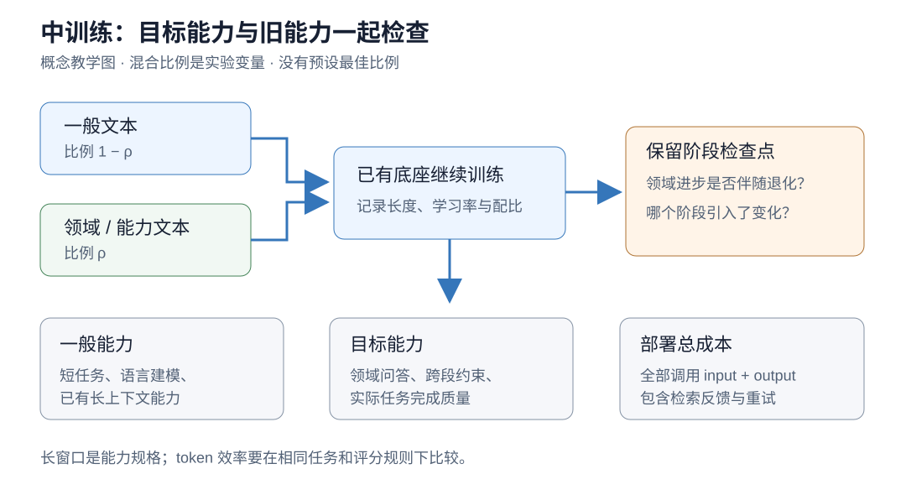

# 03 中训练：让现有底座适应领域和上下文
> 第一版技术专题：保留公式推导、教学算例和程序说明。领域现状与路线关系请以[新版对应章节](../03-midtraining.md)为准；本页不承担第二版综述结论。

上一章：[预训练](02-pretraining.md) · [返回总览](../../README.md) · 下一章：[SFT 与蒸馏](04-sft-distillation.md)

## 学习目标

读完本章，你应该能够区分继续预训练、领域适配、任务适配和长上下文扩展，解释为什么训练目标不变而模型行为仍会改变，并用一个可计算的例子理解适配与遗忘的取舍。我们还会把中训练的收益重新接到完整任务的 token 成本上。

“中训练”没有跨论文统一的边界。本教程用它指大规模基础预训练之后、面向最终交互行为的后训练之前，为特定领域或通用能力安排的继续训练阶段。作者可能把推理语料、长上下文训练、领域文本学习放在这里，也可能使用其他名称。比较方法时要检查训练目标、数据和 loss mask，不能只看阶段标签。

## 1. 为什么会需要中间这一段

已有底座可以读懂语言，却可能不熟悉某个领域的符号、文档结构和知识组合。例如编程助手需要理解同一仓库中相距很远的接口定义，科学助手需要读懂一篇论文中跨章节引用的变量。直接增加提示中的背景资料能帮助模型，但每次重复附上大量材料会增加输入成本。

中训练的研究假设是：将一部分稳定而反复使用的规律学入参数，或提高模型有效利用上下文的能力，可以减少部署中的解释、检索与返工。这个假设需要通过真实任务验证。模型更熟悉领域之后也可能生成更长的专业说明；长上下文能力增强后也可能鼓励系统塞入更多资料。两种情况都可能让总 token 成本上升。

因此，中训练首先是一种能力适配工具。它是否提高 token 效率，取决于适配后系统在同等任务表现下是否减少全部调用成本。

## 2. 继续预训练、DAPT 与 TAPT

继续预训练（continued pretraining）表示从已有参数出发继续优化语言建模目标。领域自适应预训练 DAPT（domain-adaptive pretraining）使用目标领域的未标注文本，例如某学科论文；任务自适应预训练 TAPT（task-adaptive pretraining）进一步接近具体任务的输入分布。

Gururangan 等人的经典研究在多个领域与分类任务上比较了 DAPT 和 TAPT。研究对象包括 RoBERTa 式掩码语言建模，而非当代所有自回归推理模型；它支持领域与任务适配值得实验，不支持对任何 LLM 保证同样收益。[原论文与正式出版页面](https://aclanthology.org/2020.acl-main.740/)

对自回归模型，继续训练通常仍可使用上一章的 NTP 目标。变化的是初始化参数、采样分布、长度和优化日程。SFT 则经常把输入与目标回答明确分开，并只在选定的回答位置计算损失。真实配方也可能混用文本与对话，阶段命名不能替代这项检查。

TAPT 的“未标注”也不等于允许拿测试集输入训练。若评测目标是严格未见任务泛化，应只使用训练或开发侧允许的输入。某些研究允许无标签测试分布适配，那是另一种明确声明的设定，需要单独报告。



*图 1：本教程自制流程图。目标领域数据与一般数据可以混合采样；训练后分别检查新能力、旧能力和完整请求成本。图中是教学实验结构，没有真实模型的增益数字。*

## 3. 数据分布改变，最优解也会改变

设底座参数为 $`\theta_0`$ ，一般文本分布为 $`P_g`$ ，领域文本分布为 $`P_d`$ 。用 $`\rho\in[0,1]`$ 表示领域采样权重，构造混合分布：

```math
P_\rho=(1-\rho)P_g+\rho P_d.
```

这里先把“样本”定义为固定长度的有效 token 块，避免一篇长文档与一篇短文档的采样权重混淆。令 $`\ell(\theta;z)`$ 是这个块的平均 NTP 损失，则：

```math
\mathcal L_\rho(\theta)
=(1-\rho)\mathbb E_{z\sim P_g}[\ell(\theta;z)]
+\rho\mathbb E_{z\sim P_d}[\ell(\theta;z)].
```

如果实现按文档抽样再做 packing，实际 token 配比通常不同于文档配比，应从加载器日志重新统计。重复阅读有限领域数据也会增加训练 token，但不会产生同等数量的新文档。

混合可以让旧分布继续提供训练信号。它不是免费保险：固定训练预算下，每增加一部分一般数据，就减少了领域数据的曝光；旧数据还可能获取不到。使用公开替代语料只能近似旧分布，其保留效果仍需要测量。

还可以用正则化约束模型偏离底座。一个教学形式是在一般前缀分布 $`\mu_g(c)`$ 上惩罚条件分布变化：

```math
\mathcal L_{\rm reg}(\theta)
=\mathcal L_d(\theta)
+\beta\mathbb E_{c\sim\mu_g}
D_{\rm KL}\!\left(p_{\theta_0}(\cdot\mid c)\Vert p_\theta(\cdot\mid c)\right),
\quad\beta\ge0.
```

这要求模型共享可比较的词表，并能取得底座在这些前缀下的分布。KL 的方向写在公式中；调换方向会改变目标。这个式子表达一种保留旧行为的设计思路，**不是本教程声称行业统一使用的中训练配方**。它增加参考模型计算，也无法保证未覆盖前缀上的能力保留。

## 4. 遗忘为何可能发生：看一次梯度更新

令一般域损失为 $`\mathcal L_g`$ ，领域损失为 $`\mathcal L_d`$ ，在当前参数处可微。只沿领域目标更新一步，学习率为 $`\eta\gt 0`$ ：

```math
\theta'=\theta-\eta\nabla\mathcal L_d(\theta).
```

如果一般域损失在附近具有有界二阶导数，做局部 Taylor 展开：

```math
\mathcal L_g(\theta')-\mathcal L_g(\theta)
=-\eta\left\langle\nabla\mathcal L_g(\theta),
\nabla\mathcal L_d(\theta)\right\rangle+O(\eta^2).
```

当两个梯度内积为负且步长足够小时，领域方向的一步更新可能提高一般域损失。两者方向一致时则可能同时改善。这个局部分析解释一种相互干扰机制，不能预测大模型长期训练必然遗忘，更不能把损失变化直接换算成任务正确率变化。

工程上可监控一般文本 loss、短上下文任务、长上下文任务以及目标领域任务，保存阶段检查点并比较。降低学习率、混合回放、改变顺序或使用参数约束都是可尝试的控制手段，每一种都需要自己的成本和消融。所谓“灾难性遗忘”应对应明确的大幅能力下降，不能把任何轻微波动都如此命名。

## 5. 长上下文课程：能放进去与能用起来

长上下文训练会改变序列长度与位置信息的覆盖。假设模型训练时大多见到短片段，部署时突然给它非常长的文档，即使推理引擎允许输入，模型也未必能正确使用远处条件。课程式扩展可以逐步提高训练长度，但位置编码调整、长文档选择、packing 与注意力实现需要共同匹配。

一个公开例子是 SmolLM3：作者将长上下文扩展和推理适配称作 mid-training；长上下文分两阶段推进，后续推理中训练却使部分长上下文评测下降。这是检查旧能力保留的真实动机，不能从这个例子推出“推理训练一定损害长上下文”。作者还报告特定长文本上采样在他们的设置下没有进一步提高相应长上下文指标。[SmolLM3 官方训练说明](https://huggingface.co/blog/smollm3#mid-training)

从计算角度，标准稠密自注意力在一个长度 $`L`$ 的序列上涉及约 $`L^2`$ 对 token 位置关系。把总有效训练 token 数固定为 $`B`$ ，并假定都切成等长块，序列数约为 $`B/L`$ ，注意力关系总量约为 $`BL`$ 。因此固定 token 数不意味着固定训练计算量。这里忽略边界取整、因果三角常数、前馈网络与具体 kernel，只用于说明长度的影响。

部署时也要测两类问题。一类是单段检索：能否找出远处的一条信息；另一类是组合使用：能否把几处条件连接起来完成任务。前者通过，不能代替后者。进一步要与检索短片段、分步处理等系统方案比较相同任务的总成本；“支持更长窗口”是能力规格，不能自动解释为更省 token。

## 6. CPU 实验：固定总量，改变领域权重

运行：

```bash
python3 examples/tokenization_lab.py --mode adaptation
```

[完整代码](../../examples/tokenization_lab.py)构造一般文本和领域文本，使用二元模型重新拟合加权计数。一般文本经常出现 `model reads`，领域文本经常出现 `model proves`；因此两个分布在共享前缀后有不同偏好。

对领域权重 0、0.25、0.5、0.75、1，程序都保持加权训练总量相同，打印一般与领域保留句子的 NLL。你会看到提高领域权重有利于领域拟合，却可能降低一般文本拟合。这是合成分布上的精确计数实验，没有使用测试句子更新计数。

需要强调：程序每次都重新拟合一个平滑二元模型，**并未模拟神经网络从旧参数连续更新的轨迹**。它说明混合目标的取舍；上一节梯度公式说明局部参数干扰。两者互相补充，但都不提供真实 LLM 遗忘幅度的测量。

继续做实际中训练前，可以写一张小型实验表。保持底座、tokenizer、有效训练 token 数和优化日程相同，只改变一般/领域混合比例；另把序列长度作为独立变量。每隔固定训练 token 保存检查点，评估目标域、一般能力与成本曲线。若同时改数据、长度和学习率，即使效果提高，也很难知道应保留哪一项。

## 7. 怎样判断它是否值得用于 token 效率研究

最有解释力的假设需要指向一个部署瓶颈。例如“模型反复要求补充稳定领域定义”，可以测试适配后在减少这部分提示时是否保持性能；“模型常因远处约束遗漏而重试”，可以测试长上下文适配是否降低重试率。不要仅以目标域 loss 降低作为终点。

训练成本还可以单独做摊销分析。令追加训练成本为 $`C_{\rm train}\gt 0`$ ，每次部署在相同性能下节省的成本为 $`\Delta c\gt 0`$ ，两者必须使用同一单位，例如实际货币或估算计算量。那么超过 $`M\gt C_{\rm train}/\Delta c`$ 次部署后，累计节省才可能覆盖追加投入。这个关系假设任务分布、使用量与单位成本稳定，且没有计入维护成本；它是条件估算，不是实际回本结论。训练 token 与推理 token 的计算代价不同，不能直接相除充当这个比值。

## 练习

1. 在合成领域语料中加入与一般语料相同的转移，观察取舍是否减弱。解释何时两个目标可能一致。
2. 如果按文档一半一半采样，但领域文档平均长四倍，估计领域 token 的实际占比；再列出 packing 会使估计失准的条件。
3. 设计一个“找得到信息但用错了条件”的长上下文题。解释为什么单次 needle 检索不能覆盖它。
4. 给“领域适配减少检索”写出可证伪假设。你的成本日志需要记录哪些调用，才能发现检索减少却回答变长的情况？

## 主源参考

- [Don’t Stop Pretraining: Adapt Language Models to Domains and Tasks](https://aclanthology.org/2020.acl-main.740/)：DAPT、TAPT 与原始实验对象。
- [SmolLM3 官方技术说明](https://huggingface.co/blog/smollm3#mid-training)：中训练命名、长上下文与推理适配、能力退化观察。
- [Effective Long-Context Scaling of Foundation Models](https://arxiv.org/abs/2309.16039)：长上下文扩展与数据策略的代表研究；本教程未复现实验。

下一章：[SFT 与蒸馏：把目标行为写进监督信号](04-sft-distillation.md)。
